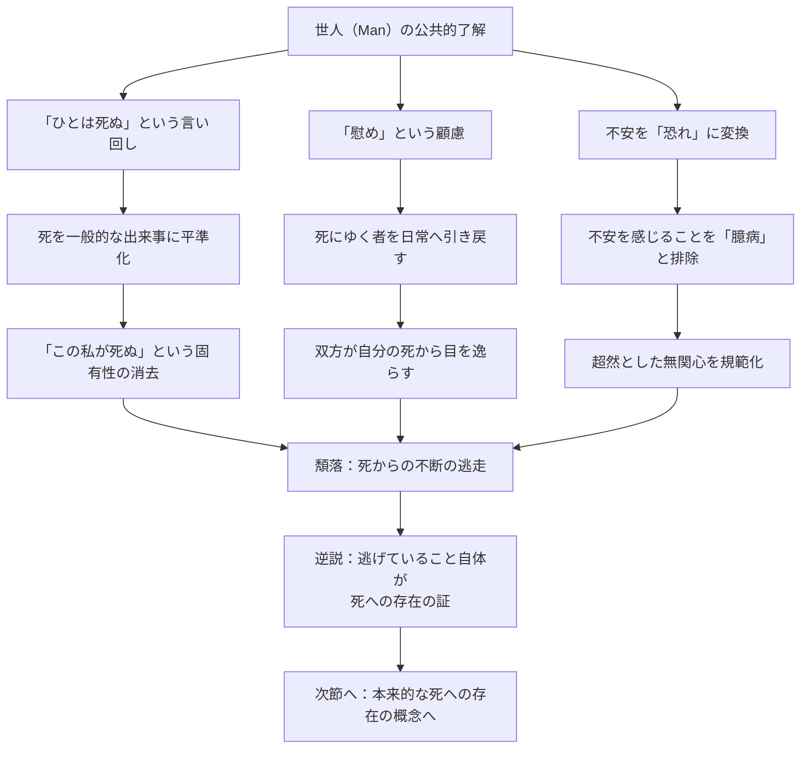

## 「§51」は何だと言っているのか

*ハイデガー『存在と時間』第51節*

---

### この節の結論を先に言う

この節が言いたいことは一言でまとめられる。**「ふつうの人間は、死から目を逸らすことを日常の作法にしている」**。しかもそれは偶然の怠慢ではなく、「世人（Man）」——誰でもあり誰でもない匿名の「みんな」——が組み上げた構造的な逃走だ、とハイデガーは主張する。

そのうえでこの節は、逃走の解剖が終わったからこそ、**「本当の意味での死への存在とは何か」を次のステップで問える**、という橋渡しで締める。

---

### 前提：なぜ「日常性」から分析するのか

ハイデガーが目指しているのは「死への存在」の実存論的な構造を明らかにすることだ。しかし私たちは普段、哲学者として死を論じているのではなく、ごく平均的な日常を生きている。だから分析は**平均的・日常的な死との関わり**から始めなければならない。

日常を動かしているのは「世人（Man）」だ。世人とは要するに**「みんなそう言っている」「一般的にはそういうものだ」という匿名の主体**で、特定の誰かではない。そして世人が死についていかに語り、いかに了解しているかが、まずこの節の俎上に載せられる。

> 日常的な共同存在の公共性は、死を、たえず起こりうる出来事として、「死亡例（Todesfall）」として「知っている」。

---

### 第一の手がかり：「ひとは死ぬ（man stirbt）」という言い回し

世人が死について語るとき、典型的な表現は **「ひとは死ぬ」** だ。ここでのポイントは、この文の主語が「私」でも「あなた」でもなく、誰とも特定できない「ひと（man）」であることにある。

この言い回しは三つのことを同時にやっている。

| 効果 | 内容 |
|------|------|
| ①拡散 | 死を「誰か」に起こる出来事にする。「私の死」ではなく「一般的な死」にする |
| ②猶予 | 「さしあたっては自分には関係ない」という安心感をつくる |
| ③覆い隠し | 死が「まさに私が、代わりなく、必ず向き合う」可能性だという性格を消す |

> 「ひとは死ぬ」という語りにおいて死は、まず何処かからやって来なければならない不確定な何ものかとして、しかしさしあたっては自分自身にとってはまだ現前しておらず、それゆえ脅かすものではないものとして、了解されている。

ハイデガーが問題にしているのは、この言い回しが嘘だということではなく、**「誰もが死ぬ」という一般的事実を強調することで「この私が死ぬ」という固有の可能性から目を逸らさせる**、その仕組みにある。

---

### 第二の手がかり：「慰め」という名の覆い隠し

世人の逃走戦略は個人の内面だけに留まらない。他者との関係にまで及ぶ。

臨終の床にある「死にゆく者」に対して、周囲の人々は「きっと良くなる」「もうすぐ普段の生活に戻れる」と言い聞かせる。これは「顧慮（Fürsorge）」、すなわち他者への気遣いとして現れる。しかしハイデガーの見方は厳しい。

> このような「顧慮」は、そうすることで「死にゆく者」を「慰める」つもりでいる。それは彼を自らの固有の、無関係的な存在可能をことごとく覆い隠すよう手助けすることによって、彼をダザインへと引き戻そうとするのである。

つまりその「慰め」は、**相手が自分の死と正面から向き合う機会を奪っている**、とハイデガーは言う。しかもそれは「慰める者」自身が自分の死から目を逸らすためでもある。慰めは双方向の逃走だ。

---

### 第三の手がかり：不安を「恐れ」に変換する

ハイデガーは「不安（Angst）」と「恐れ（Furcht）」を区別する。

- **恐れ**：特定の対象（病気、事故など）に向けられる感情。対処可能だという前提がある
- **不安**：特定の対象がない。「死そのもの」「私の存在が終わること」という漠然とした底なしの感覚

死への正直な向き合い方は「不安」であるはずだが、世人はこれを処理しやすい「恐れ」に変換しようとする。さらに一歩進んで、死への不安を感じることそのものを「臆病」「暗い厭世主義」と名指し、社会的に排除する。

> 世人の公的な被解釈性の支配は、死に対する態度を規定すべき気分についてもすでに決定を下してしまっている。

こうして「死に対して超然としていること」が「大人として相応しい態度」とされ、不安を持つことが恥とされる。これはハイデガーにとって、**疎外**——自分の最も固有な存在可能から引き離されること——にほかならない。

---

### 全体の構造をまとめる

---

### 「頽落」という診断

誘惑・安堵・疎外——これら三つはハイデガーが「頽落（Verfall）」と呼ぶ存在様式の特徴だ。頽落とは堕落という道徳的非難ではなく、**「本来の自分から滑り落ちていく構造的な傾向」**を指す。

重要な逆説がここにある。**死から逃げようとする身振りそのものが、ダザインが死への存在であることを裏側から証明している**。逃げるためには、逃げるべき何かが感じられていなければならない。日常的な安堵の絶え間ない努力は、死の圧力が常にそこにあることを逆照射している。

> 死への日常的な存在は、頽落するものとして、死からの不断の逃走である。

---

### この節が次に向けて何を準備しているか

節の末尾でハイデガーは方向を示す。死からの逃走の構造を精密に記述し終えたからこそ、**「何から逃げているのか」が逆に明確になった**。逃走の「逃げる前方（Wovor）」——すなわち逃走が向き合いを避けている当のもの——から、**本来的な死への存在の姿を描き出せる**、というわけだ。

> 現象的に十分なかたちで可視化された逃走の前方から、逃避するダザイン自身がその死をいかに了解しているかを現象学的に投企させることができるはずである。

言い換えれば、§51 は「日常の中の死の隠蔽」の解剖であると同時に、次節以降で展開される**「本来的な死への存在」への助走**でもある。

---

### 要点の整理

| 概念 | 説明 |
|------|------|
| 世人（Man） | 「みんな」という匿名の主体。特定の誰かではない |
| 「ひとは死ぬ」 | 死を一般化することで「私の死」の固有性を隠す言い回し |
| 不安と恐れの違い | 恐れは特定の対象への感情、不安は死そのものへの根拠なき感覚 |
| 顧慮（慰め） | 他者を助けるように見えて、双方が死から目を逸らすための行為 |
| 疎外 | 自分の最も固有な可能性（死）から引き離されること |
| 頽落 | 本来の自分から滑り落ちていく構造的傾向。道徳的非難ではない |
| 逃走の逆説 | 逃げていること自体が、ダザインが死への存在であることを証明する |
