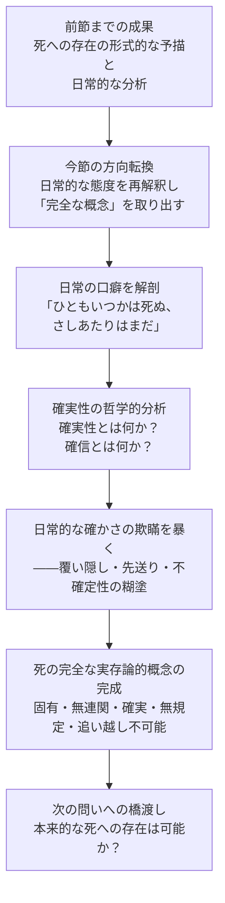

## 「§52」は何だと言っているのか

*ハイデガー『存在と時間』第52節*

---

### この節でハイデガーが言いたいこと（結論から）

この節のゴールは一文で言える。

> ダザインの終わりとしての死は、ダザインの最も固有的で、無連関的で、確実であり、かかるものとして無規定的で、追い越し不可能な可能性である。

ここで言う「ダザイン（Dasein）」とは、ハイデガーが人間の存在のあり方を指すために使う言葉だ。「死への日常的な態度」を丁寧に解剖することで、逆説的に「死を本当に理解するとはどういうことか」という正確な輪郭が浮かび上がる——それがこの節の構造である。

---

### 節の地図：どういう順番で議論が進むか



---

### ①「ひともいつかは死ぬ、さしあたりはまだ」という日常の口癖

ハイデガーはまず、日常的な人間（「世人（das Man）」：特定の誰かではなく、世間一般の「みんな」のこと）が死についてどう語るかを取り上げる。

> 「ひともいつかは死ぬが、さしあたりはまだそうではない」

この言い回しには、死の「確実性」が一応は認められている。誰も死を疑いはしない。しかしハイデガーは言う——この「確かに知っている」は、死が**自分自身の固有の可能性として迫ってくる**という確実性とは全然別物だ、と。

日常的な「確かさ」は、むしろ死を覆い隠すために機能している。死を「いつか来る出来事」として遠ざけ、今の日常の忙しさの中に自分を埋め込む。「さしあたりはまだ」という言葉は、単なる時間の記述ではなく、**死から目を背けるための自己解釈**なのである。

---

### ②「確実性」とはそもそも何か——哲学的な分析

日常的な確かさが偽物だと言うためには、「本物の確実性」が何であるかを明らかにしなければならない。ここでハイデガーは哲学的な分析を挟む。

| 概念 | 意味 |
|------|------|
| **真理（根源的）** | ダザインが世界を「開示している」ありさまそのもの |
| **真理（派生的）** | 特定の存在者が「開示されている」状態 |
| **確実性（根源的）** | ダザインの存在様式としての「確信しつつあること」 |
| **確実性（派生的）** | 確信された対象が「確かなもの」と呼ばれること |
| **確信（Überzeugung）** | 開示された事柄そのものによって自分の理解が規定されること |

要するに、本物の確実性とは「対象が開示される仕方に正確に対応した」確かさであり、対象の存在様式によって確実性の**種類**も変わる。数学の確実性と、対人関係の確実性と、死の確実性は、それぞれ別種の確実性でなければならない。

---

### ③日常的な「確かさ」の二つの偽り

ハイデガーはここで、日常の確かさがどこで道を踏み外すかを二段階で示す。

**第一の偽り——他人の死という「経験事実」への逃げ込み**

「ひとは毎日他人の死を見ている。死は否定しがたい経験事実だ」——これが日常的な確かさの根拠だとされる。しかしハイデガーは言う。他人の死亡例（「臨終」という出来事）を経験することと、**自分自身の死を自分自身の可能性として把握すること**は、まったく別のことである。「ひとは死ぬ」という確かさは、死を**外側から見た出来事**として処理しており、自分がその当事者であるという確かさではない。

**第二の偽り——「いつかのちに」という先送りによる不確定性の糊塗**

死が確実であることは一応認めても、「しかしさしあたりはまだ」と付け足すことで、**いつ来るかわからない**という死の本質的な不確定性を、「まだ遠い」という仮の確定性に置き換えてしまう。

> 「世人は確実な死を知りながら、しかも『それ』をほんらいの意味では確実なものとしていない」

死の確実性と、**いつでも来うるという無規定性**は、セットで死の本質を構成している。日常はこの「無規定性」に直面する勇気を持てず、目の前の忙しさで視界を塞ぐ。こうして確実性も無規定性も同時に覆われる。

---

### ④逆説——逃げること自体が死の本質を証明する

ここでハイデガーの面白い論法が出てくる。

「死から逃げること自体が、何かから逃げているのであり、その『何か』は逃げるに値するほど確実で、いつでも来うるものである」——つまり、**逃げるという行動は、逃げ対象の存在を現象として証示する**。

> 「しかしこの逃避は、それが逃避するものから現象的に証示する——死は、固有の、没連関的な、追い越しえない、確実な可能性として把握されねばならない、と。」

逃げ方の丁寧な観察から、本来の死のあり方が逆照射される。これがこの節の方法論的な核心である。

---

### ⑤死の完全な実存論的・存在論的概念

以上の分析を総合して、ハイデガーは死の定義を完成させる。

| 死の特徴 | 意味するもの |
|----------|-------------|
| **最も固有な（eigenste）** | 誰かに代わってもらえない、自分だけの可能性 |
| **無連関的な（unbezügliche）** | 死においてダザインは他者との関係から切り離される |
| **確実な（gewisse）** | 必ず来る——しかし出来事としてではなく可能性として |
| **無規定的な（unbestimmte）** | いつ来るかは分からない——確実さと無規定性はセット |
| **追い越し不可能な（unüberholbare）** | 先に行って向こう側から戻ってくることができない |

これら五つが揃って初めて、死の「完全な概念」となる。

---

### ⑥「未だ非」の問題——全体的な存在への橋渡し

節の後半では、「ダザインはまだ死んでいない、つまり未完成なのだから全体をつかめない」という反論が先取りされ、退けられる。

ハイデガーは言う。死は「最後にようやく到達する何か」ではなく、**つねにすでにダザインの中に組み込まれている最極の「未だ非」**である。死へと向けてある存在として、ダザインはすでに全体として存在している——終末に達したとき初めて全体になるのではない。

> 「自らの死へとある存在として、他のあらゆる〔未だ非〕に先行するダザイン自身の最極の『未だ非』は、つねにすでにダザインへと組み込まれている。」

これは、「死を見据えた自己理解がそもそも人間の存在の構造だ」という主張である。

---

### ⑦節の末尾——次の問いへの橋渡し

節の最後はこう結ばれる。

> 「ダザインは自らの最も固有的で……無規定的な可能性を、本来的に了解すること……すなわち本来的な終わりへの存在においてみずからを保持することができるのであろうか。」

日常は死を覆い隠す。では、覆い隠さずに死へと向き合う——「本来的な死への存在」——は実際に可能なのか。これが次節以降のテーマとして設定される。この節は、その問いを正確に立てるための準備として機能している。

---

### まとめ：§52 が一節でやっていること

```
日常の語り口を解剖する
　　↓
「確実性」の哲学的分析を挟む
　　↓
日常的な確かさの二重の偽りを暴く（他人の死への逃げ込み／先送り）
　　↓
逃げること自体が死の本質を証示すると示す
　　↓
死の完全な概念（固有・無連関・確実・無規定・追い越し不可能）を確定する
　　↓
「本来的に死へと向き合うことは可能か」という次の問いへ
```

この節はいわば「日常という鏡に映して、死の正体を浮き彫りにする」作業である。ハイデガーは死を外から定義するのではなく、人間が実際にどう死を扱っているかを観察することで、死のあり方そのものを取り出そうとしている。
