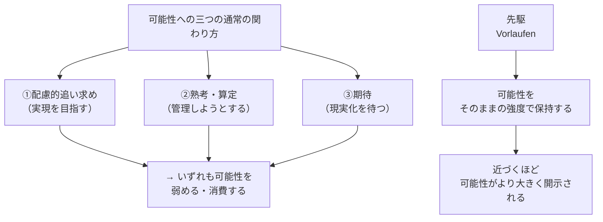
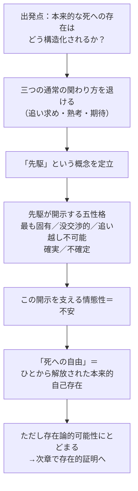

## 「§53」は何だと言っているのか

*ハイデガー『存在と時間』第53節*

---

### この節のいちばん大事なこと

§53 の結論はひと言で言えば、こうなる。

> 死への本来的な存在とは、死という可能性へと「先駆」すること——逃げず、ごまかさず、その可能性をありのままの可能性として耐え忍ぶこと——であり、その先駆こそが、ダザインを「自分自身」へと目覚めさせる唯一の道である。

節の課題は「本来的な死への存在がどういう構造をもつかを、思弁ではなくダザインの分析から引き出すこと」。ハイデガーはその作業を段階的に積み上げ、最後に「死への自由」という言葉で締めくくる。

---

### 前提：何が「分かっている」状態から始まるのか

節の冒頭で、ハイデガーはすでに手元にある材料を確認する。

| 確定済みの事柄 | 内容 |
|---|---|
| 死の実存論的概念 | 死とは、ダザイン（人間の存在様式）自身の「最も固有で、他者と共有できない可能性」 |
| 非本来的な死への存在 | 「死はいつか来るもの」として先送りし、逃げ回る日常の態度 |
| 禁止的な予示 | 本来的な死への存在は、この逃走・ごまかしの反対でなければならない |

つまりこの節は「ゼロから考える」のではなく、§50〜52 で積み上げた分析の続きとして、「では本来的な態度はどんな構造をもつのか」を組み立てる。

---

### ステップ１：「可能性に関わる」とはどういうことか

ハイデガーはまず、「可能性への存在」一般を三つの様式に分けて整理する。

**①　配慮的な追い求め（ふつうの道具使用）**

部屋を片付けるとか、バスを手配するとか——「可能性」を見た瞬間に「現実化すること」へと飛びかかる関わり方。可能性を"消費"して実現した途端、可能性ではなくなる。

**②　熟考・算定（「死について考える」こと）**

「死はいつか来る。準備しておこう」という態度。死から可能性の鋭さを奪い、スケジュールの中に収める。

**③　期待（Erwarten）**

「来るかな、来ないかな」と構えながら待つ。これも結局、「来たときどうなるか」という実現の側へ引っ張られている。

ハイデガーが言いたいのは、死への本来的な関わりはこの三つのどれでもない、ということだ。

> 死への存在がその「実現」を意味しないとするならば……可能性は弱められることなく可能性として了解され、可能性として育み、そしてそれへの態度のうちで可能性として堪え忍ばれなければならない。

---

### ステップ２：「先駆」という術語の登場

三つの様式をすべて退けたうえで、ハイデガーは新しい術語を置く。

> 可能性への存在としての死への存在……可能性へのこのような存在を、われわれは術語として**可能性への先駆**（Vorlaufen in die Möglichkeit）と把握する。

**「先駆」とは何か**

先駆を「走って逃げる」でも「覚悟を決める」でもないことに注意が必要だ。ハイデガーの説明では、先駆とは「可能性に近づけば近づくほど、可能性がより大きくなる」という関わり方だ。

普通の接近——たとえばバス停に近づけば、バスがより確実に「もの」として現れてくる——とは逆に、死という可能性に向かって先駆すればするほど、「実存そのものが丸ごと不可能になる可能性」という深淵がより純粋に現れてくる。足場がなくなる、ということ自体が露わになる。

---

### ステップ３：先駆が開示する五つの性格

先駆という関わりを通じてはじめて、死の可能性が持つ特有の性格が見えてくる。ハイデガーはそれを一つずつ展開する。

| 性格 | 意味 | 先駆によって何が起こるか |
|---|---|---|
| **最も固有** | 誰かに代わってもらえない、自分だけの可能性 | 「ひと（das Man）」の分別から引き離され、自分自身に戻る |
| **没交渉的（無関係的）** | 他者との繋がりが通用しない | 配慮や顧慮（他者の世話）が根底から揺らぎ、単独化が起きる |
| **追い越し不可能** | これを越えた先に別の可能性はない | 硬直した「勝利」への執着を打ち砕き、事実的な可能性を本来的に選べるようにする |
| **確実** | 死は必ず来る | しかしその確実性は、物体の確実性（見て確認する）とは種類が違う。先駆の中でのみ保たれる |
| **不確定** | いつ来るかは分からない | この「不確定さ」が脅威を絶えず開いたままにし、逃げることを許さない |

ここで特に大事なのは「確実だが不確定」というセットだ。「死が来ることは確か、いつ来るかは分からない」という組み合わせが、ダザインを「今この瞬間も脅かされている状態」に置き続ける。

---

### ステップ４：不安（Angst）の位置づけ

> ダザインの最も固有な孤立化された存在から立ち上がるみずから自身へのたえざる端的な脅威を開かれたまま保持しうる情態性、それが**不安**（Angst）である。

§29・§40 で別途分析された「不安」が、ここで死への先駆と結びつく。不安は「何かを恐れる」という対象のある感情（恐れ）ではなく、「実存そのものが丸ごと無くなるかもしれない」という根底からの揺らぎの情態だ。

死への先駆が「不確定に確実な可能性」へと自らを投げ込む以上、その開示を可能にする情態（気分・気の置かれ方）は不安以外にあり得ない——それがハイデガーの主張だ。

> 死への存在は本質的に不安である。

---

### ステップ５：節のまとめ——「死への自由」

ハイデガーはこれらの性格をすべて束ねて、節の結論を出す。

> 先駆は、ダザインに対してひと自身へと迷い込んでいることを暴露し、ダザインを……みずから自身であるという可能性の前へと連れ出す——しかしそれはまさに、ひとの幻想から解き放たれ、事実的で、みずから自身に確実であり、不安げなる、情熱的な**死への自由**のうちにおいてである。

「死への自由」とは、死を支配する自由でも、死を恐れない超然とした態度でもない。死という可能性を逃げずに引き受けることによって、「ひと（世間一般）」に流されていた自分から解放され、自分の有限な実存を自分自身のものとして生きる自由のことだ。

---

### 節の末尾：次章への橋渡し

ただし、ハイデガーはこの結論を「実存論的可能性」（構造としての可能性）として示したにすぎないと自ら但し書きをつける。

> 実存論的に「可能な」この死への存在は、実存的には依然として一つの幻想的な要求であり続ける。

つまり「論理的には本来的な死への存在が可能だと分かった」が、「実際にダザイン自身がそれを要求しているという根拠はまだ示されていない」。次章（§54 以降）では、良心・負い目・決意性を通じてその「存在的な証明」が試みられる。§53 はその橋頭堡にあたる節だ。

---

### 全体の流れ（まとめ）

