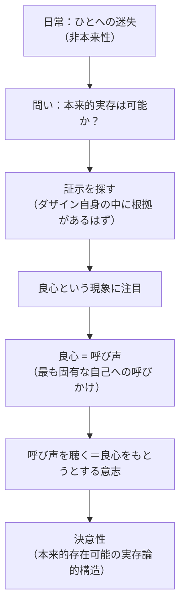

## 「§54」は何だと言っているのか

*ハイデガー『存在と時間』第54節*

---

### この節が言いたいこと、一言で

「人間（ダザイン）が本当の意味で自分自身として生きること（＝本来的実存）は可能なのか？　可能なら、それを示す証拠はどこにあるのか？」──この問いに対してハイデガーは、**「良心」こそがその証拠だ**と主張する。そして第54節は、この主張を展開するための「出発点の整理」と「この章全体のロードマップ」を担っている。

---

### 問題の背景：ダザインはどこへ迷い込んでいるか

「ダザイン」とは、ここでいう**人間存在のこと**だと思ってほしい。ただし普通の「人間」という言葉ではなく、「自分の存在そのものを気にかけながら生きる存在」というニュアンスを含む術語である。

ハイデガーが前の節までで描き出してきたのは、ダザインのごく普通の日常のすがただった。日常では、わたしたちは「ひと（Man）」という匿名の流れに飲み込まれている。「ひと」とは特定の誰かではなく、「世間一般」や「みんなそうしているから」という空気のようなものである。

> たいていの場合わたし自身ではなく、ひと‐自身（Man-selbst）である。

つまり、ふつうに暮らしているとき、「選んでいる」と思っている選択のほとんどは、実は「ひと」が代わりに選んでいる。しかも「誰が実際に選んでいるのか」は曖昧なままで、その曖昧さ自体も隠蔽されている。これがハイデガーの言う「非本来性」の状態である。

---

### 問い：その状態から抜け出せるのか

非本来性が日常の姿だとすれば、「本当に自分自身として生きる（本来的実存）」は可能なのか。もし可能だとするなら、それは**単なる理想ではなく、ダザイン自身の中に根拠があるはず**だ、とハイデガーは考える。

> 証示は……ダザインの存在に根を有するはずである。

「証示（Bezeugung）」とは「本来的実存が可能だという証し・証拠」のことだ。哲学者がでっち上げた理想ではなく、わたしたち自身の存在の中にすでにある、その手がかりを探す。

---

### 答えの先取り：良心という現象

ハイデガーは、その証拠を**「良心（Gewissen）」**に見出す。

ここで言う「良心」は、道徳的な「悪いことをするな」という声とは少し違う。もっと根本的な、「本当の自分」へと呼びかけてくる声のことだ。

重要なのは、良心の位置づけをめぐる三つの「線引き」である。

| 立場 | 良心をどう扱うか | ハイデガーの評価 |
|---|---|---|
| 心理学 | 良心体験を記述・分類する | この分析はその前に立つ |
| 生物学 | 脳や本能で「説明」する | この分析の外にある |
| 神学・神存在証明 | 神の声として援用する | 等しく距離を置く |

ハイデガーがやろうとしているのは、良心を**ダザインの存在構造そのもの**から解明する「実存論的・存在論的分析」である。

---

### 良心の存在論的な特殊性

良心は「ときどき起きる出来事」ではない。

> 良心は「ある」のであって、ただダザインの存在様式においてのみあり……

たとえば「今日は良心が働いたが、昨日は働かなかった」というような出来事的な現象ではない。良心は、ダザインが存在している限り、その存在の仕方そのものに組み込まれている。それゆえ、「良心が普遍的に確認できない」という批判も、「帰納的・経験的に証明せよ」という要求も、どちらも的外れだとハイデガーは言う。

---

### 良心の構造：「呼び声」として

良心をより詳しく見ると、それは**「呼び声（Ruf）」**の構造をもつ。呼ぶことは「語り」の一様態であり、良心の呼び声はダザインを**「最も固有な自己存在可能」**へと呼びかける。

良心の呼び声に「応じること」、すなわちそれを聴こうとすることが、**「良心をもとうとする意志」**として現れる。そしてその中にこそ、「自己存在の選択」が宿っており、ハイデガーはこれを**「決意性（Entschlossenheit）」**と呼ぶ。

---

### 第54節のもう一つの役割：この章全体の地図

第54節は内容の解明であると同時に、これから続く分析の**目次**でもある。

| 節 | 主題 |
|---|---|
| 第55節 | 良心の実存論的・存在論的基礎 |
| 第56節 | 良心の「呼び声」としての性格 |
| 第57節 | 配慮の呼び声としての良心 |
| 第58節 | 呼び声の了解と「負い目」 |
| 第59節 | 実存論的解釈と通俗的良心解釈の対比 |
| 第60節 | 良心が証示する本来的存在可能の実存論的構造 |

---

### まとめ

第54節の骨格は次のとおりだ。

1. **問い**：本来的実存が可能だという証しは、ダザイン自身の中にあるか。
2. **背景**：日常の人間は「ひと」に飲み込まれ、自分自身の選択を「ひと」に委ねている。
3. **手がかり**：良心──ただし心理学的・神学的に解釈する前の、生の現象としての良心。
4. **予告**：良心は「呼び声」であり、それを聴く意志が「決意性」につながる。以下の節でこれを段階的に解明する。

ハイデガーはここで結論を言ってしまわず、「こういう順序で進む」という地図を丁寧に広げてみせる。その地図そのものが第54節の内容である。
