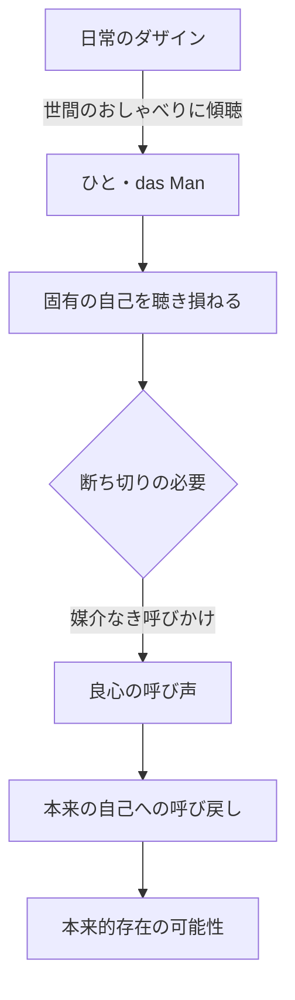

## 「§55」は何だと言っているのか

*ハイデガー『存在と時間』第55節*

---

### この節の結論を先に言う

良心とは、「魂の能力」でも「感情」でもなく、**自分自身へと呼び戻す"呼びかけ"という語り**である。私たちはふだん「世間（ひと）」の声に聴き入ることで自分自身を聴き損ねている。良心はその流れを断ち切り、本来の自己へと私たちを引き戻す。この節は、そのことを「実存論的・存在論的」に、つまり人間存在の根本構造から説明するための出発点を示す。

---

### 「実存論的・存在論的」とはどういう意味か

まず、この節に出てくる重要な言葉を整理しておこう。

| 用語 | 本節での意味 |
|---|---|
| **ダザイン** | 「そこにいる」という意味の、人間の存在様式。「自分がここにいる」と気づいている存在 |
| **現（Da）** | ダザインが「そこに開かれてある」こと。世界と自分が同時に照らし出される場 |
| **開示性** | 世界や自己が「見えてくる」こと。単なる知識ではなく、存在のあり方そのもの |
| **情態性** | 気分・感情のこと。ただし単なる感情ではなく、自分が「どんな状況に投げ込まれているか」を感じ取る構造 |
| **ひと（das Man）** | 「世間」「みんな」のこと。誰でもない匿名の他者たちの集合 |
| **被投性** | 自分では選ばずにそこに投げ込まれていること（生まれた時代・文化・状況など） |

> 良心は開示し、それゆえ、現（Da）の存在を開示性として構成する実存論的諸現象の圏域に属する

つまり良心は、単に「悪いことをしたと感じる気持ち」ではない。人間の存在構造の中心である「開示性」に深く関わる現象だ、とハイデガーは言う。

---

### ふだんの私たちはどういう状態か

私たちは日常、**「世間（ひと）」の声に従って生きている**。流行の話題、常識的な解釈、みんなが言っていること——こうしたものに耳を傾けながら、自分が何者かを「世間が与える可能性」によって理解している。

> ひとの公共性とそのおしゃべりのなかへと自己を喪失しつつ、ダザインはひと自身へと聴き従うことのなかで、固有の自己を聴き損ねる

「聴き損ねる（überhören）」という言葉が重要だ。自分が本来どういう存在かという声を、世間のおしゃべりの騒音の中で聴き損ねてしまっている——それが日常の状態だとハイデガーは言う。

---

### 良心はその騒音を断ち切る

ではどうすれば自己を取り戻せるか。ハイデガーによれば、**世間への聴き従いを断ち切る別の「聴き」が必要**だ。

> このような断絶の可能性は、媒介なき呼びかけられること（Angerufenwerden）のうちにある

「媒介なき」というのがポイントだ。世間の声は常に何かを通じて届く——ニュースや噂や評判を経由して。しかし良心の呼び声は、そのような回路を通らない。静かに、一義的に、直接届く。

> 呼び声は喧騒なく、一義的に、好奇心の足掛かりなく呼ばなければならない

---

### 「呼びかけ」は比喩ではなく語りの一形態だ

日本語で「良心の声」と言うとき、私たちはそれをある種の比喩として扱いがちだ。しかしハイデガーはここで明確に言う——これは比喩ではない。

> 呼びかけを、われわれは語りの一様態として把握する

「語り（Rede）」はハイデガーにとって、存在の開示性を分節する根本的な構造だ。言葉で声に出すことだけが語りではない。

> 語りにとって、したがって呼びかけにとっても、声による発声は本質的ではない

だから「良心の声」における「声」とは、実際に音として聞こえるものではなく、**何かを了解させること**（Zu-verstehen-geben）として理解されるべきだ、とハイデガーは言う。

---

### 「魂の能力」への還元を拒否する

最後にハイデガーは、伝統的な心理学・人間学的な良心の説明を退ける。

> 良心を魂の諸能力のいずれか、知性・意志・感情のいずれかへと還元するか、あるいはそれらの混合産物として説明するか、という道を

「良心は理性の働きか、感情か、それとも意志か」——こういう問い立ては、そもそもダザインの存在構造を捉えていないとハイデガーは言う。良心を「心の部品の一つ」として説明しようとする限り、その現象の根本を見逃す。

---

### この節が準備するもの

§55 はそれ自体で完結した分析ではない。これは後続の節で展開される**良心の詳細な実存論的分析のための地平を確保する節**だ。

| この節が示すこと | この節が示さないこと |
|---|---|
| 良心は開示性の構造に属する | 良心は具体的に「何を」呼びかけるか |
| 良心は語りの一様態（呼びかけ）である | 呼び声の内容・意味 |
| 日常の「世間への傾聴」との対照 | 本来的存在とは具体的に何か |
| 魂の能力論への還元を退ける | 良心の道徳的・神学的意味 |

この節を読んで浮かぶ問い——「では誰が誰を呼ぶのか」「何のために呼ぶのか」——は、ハイデガーが次節以降で正面から取り上げる問いになる。§55 はいわば、その問いをきちんと立てるための「場の整理」だ。
