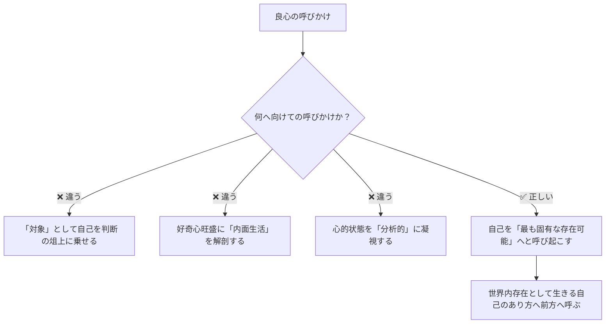

## 「§56」は何だと言っているのか

*ハイデガー『存在と時間』第56節*

---

### まず結論から

この節でハイデガーが問うのは、「良心の呼びかけ」という現象を、*語り（Rede）* の構造から分析すると、いったい何が「語られ」ているのか、ということです。

結論を一言で言えば：

> 良心は「ひと自身」に向けて呼びかけるが、内容は「何もない」——ただ、自分自身の最も固有な可能性へと呼び起こすだけだ。

この一見逆説的な答えを、ハイデガーはステップを踏んで積み上げていきます。

---

### 前提：「語り」には構造がある

ハイデガーは「良心の呼びかけ」を一種の *語り（Rede）* として扱います。語りには必ず三つの要素があります。

| 語りの要素 | 問い | 良心の場合の答え |
|---|---|---|
| 語られるもの（テーマ） | 何についての語りか？ | ダザイン（人間的存在）自身 |
| 呼びかけの宛先 | 誰に向けて？ | 「ひと自身（Man-selbst）」の自己 |
| 語られた内容 | 何が伝えられるか？ | 厳密には「何も」 |

「ダザイン」とは、ここでの議論における「人間の存在」のことです。「ひと（Man）」とは、特定の誰かではなく「世間一般の人々」として自分を理解しているあり方を指します——「みんながそう言っている」「世間ではこうするものだ」という形で生きている状態です。

---

### 第一段階：誰が呼びかけられるのか

最初の問いは「呼びかけられるのは誰か」です。

答えは「ダザイン自身」ですが、これだけでは漠然としすぎています。ハイデガーはここを丁寧に絞り込みます。

> 「ひとり「ひと」（Man）自身の自己だけが呼びかけられ聴取へともたらされることで、「ひと」は内に崩れ落ちる。」

日常的に私たちは「世間」や「みんな」の中に紛れ込んで生きています。良心の呼びかけは、その「世間の中の自分」を捉えます。しかし捉えることで、世間の評判や公共的な解釈を一切素通りし、純粋な「自己自身」だけをあぶり出すのです。

---

### 第二段階：「自己へ」とはどういう意味か

次の問いは「自己へ呼びかけるとは、何に向けてか」です。

ここでハイデガーは、誤解されやすい三つの「内省」と区別します。

「内省しろ」「自分を見つめ直せ」という話ではない、とハイデガーははっきり言います。呼びかけは自分を内側に閉じ込めるのではなく、あくまで世界の中で生きている自己を、自分自身の可能性へと「前へ」引き出すのです。

---

### 第三段階：何が語られているのか——「何もない」の意味

ここが節の核心です。

> 「厳密に言えば──何も。呼びかけは何事も言い表さず、世界の出来事についての情報も与えず、語るべき話も持たない。」

「何も語らない」のに「呼びかけ」なのか？　矛盾しているように見えますが、ハイデガーの論理はこうです。

- 呼びかけは情報を届けない
- 対話を開こうともしない
- それでいて「暗くも不規定でもない」
- 呼びかけは**沈黙の様式**においてのみ語る

そして：

> 「呼びかけられた自己には「何も」呼びかけられるのではなく、むしろそれは自己自身へ、すなわち最も固有な存在可能へと呼び起こされるのである。」

「内容がない」のではなく、「命題的な情報伝達の形をとらない」ということです。良心は言葉で説明するのではなく、自分の最も固有な可能性へと引き戻す、という働きをするだけなのです。

---

### 第四段階：沈黙して語るという逆説

良心の呼びかけには「声の発出」がありません。言葉にもなりません。

しかしそれは神秘的な曖昧さとは別物です。

> 「良心はひとえに絶えず沈黙の様式においてのみ語る。それによって良心は聞き取られやすさを少しも失わないばかりか、呼びかけられ起こされたダザインを自己自身の沈黙へと強制するのである。」

「言語化できない」から「不明瞭」なのではなく、言語化を必要としないほど直接的に自己を捉える——それが良心の呼びかけの特徴です。

また「良心の錯誤」についても重要な指摘があります。

> 「良心における「錯誤」は、呼び声が見誤ることから生じるのではなく、はじめて呼び声が聴かれる仕方から生じる」

良心が間違えるのではありません。聴く側の「ひと自身」が、呼び声を「世間との交渉の道具」として引き込んでしまうとき、呼びかけの向きが逆転するのです。

---

### この節の到達点と残された問い

この節で確認されたことを整理すると：

| 問い | 答え |
|---|---|
| 誰が呼びかけられるか | 「ひと自身」としての自己 |
| 何へ向けて呼びかけられるか | 自己自身の最も固有な存在可能 |
| 何が語られるか | 厳密には「何も」（情報・対話ではない） |
| どのように語られるか | 沈黙の様式において |
| 呼びかけの「錯誤」の原因は | 「ひと自身」による聴き方の転倒 |

しかしハイデガーは最後に、この節だけでは不十分だと率直に述べます。

> 「良心のオントロギッシュに十分な解釈をわれわれが獲得するのは、はじめて次のことが明確にされうる場合においてのみである。すなわち……呼ぶ者自身が誰であるか……」

「呼びかけられる者」は分かりました。しかし「呼ぶ者」は誰なのか——これが次節以降へ持ち越される問いです。良心の呼びかけが自己から発するのか、外から来るのか、あるいは別の何かなのかは、まだ答えられていません。

---

> ひと言でまとめると：良心は「世間に紛れ込んだ自分」に向けて、言葉ではなく沈黙で、「お前自身の最も固有な可能性へ戻れ」と呼び起こす——それだけを語り、それ以上は何も語らない。
