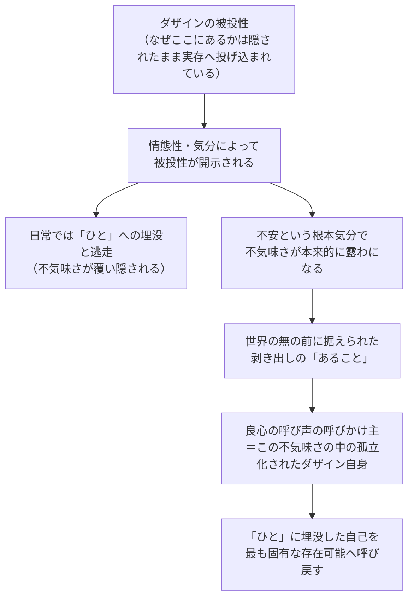

## 「§57」は何だと言っているのか

*ハイデガー『存在と時間』第57節*

---

### この節の結論を先に言う

良心の声の「呼びかけ主」は、外から差し込んでくる神でも超自然的な力でもない。**不気味さのなかで自分自身へと孤立化されたダザイン自身**が呼びかけているのだ――そしてその呼びかけは、日常の「みんな（ひと）」に埋没した自己を、最も固有な存在可能（自分本来の生き方の可能性）へと呼び戻すものである。これが「良心は配慮の呼び声である」という節タイトルの意味だ。

> 「ダザインは呼び掛ける者であると同時に呼び掛けられる者である」という命題は、いまやその形式的な空虚さと自明性を失った。

前節までは「ダザインが呼ぶ側でも呼ばれる側でもある」と形式的に述べるにとどまっていた。この節は、その中身を存在論的に満たすことを目指す。

---

### 第一歩：呼びかける「声」の奇妙な性格を確認する

良心の声には、最初から奇妙な特徴がある。

- **呼びかけられた側**（自己）は名指しされているが、「何者として」は空白のまま。
- **呼びかける側**も、名前・身分・出自を一切教えてくれない。
- 声は自分で計画したり意志したりできない――「**それ**が呼ぶ」としか言いようがない。
- しかし声は「世界にいる他者」からではなく、「私から、私を超えてやってくる」。

> 呼び声は私から来て、しかも私を超えてやって来る。

この「私から来るが私の意志ではない」という逆説的な所見が、この節の出発点になる。

---

### 第二歩：二つの「逃げ道」を退ける

この逆説的な所見に対して、人々はふつう二方向に逃げる。

| 逃げ方 | 内容 | ハイデガーの批判 |
|---|---|---|
| **超自然化** | 声は神や外部の人格的な力だと解釈する | 現象をいきなり飛び越えている |
| **生物学的無化** | 良心などただの本能・錯覚だと片づける | 同様に現象を飛び越えている |

どちらも根底に同じ先入観がある。「本当に存在するものは**手前に置かれた物体**（眼前存在）でなければならない」という独断だ。客観的に確かめられないものは存在しないと決めてかかることで、声の現象そのものを消去してしまう。

ハイデガーはここで方法論的な主張をする。声の現象を確保するだけでなく、**ダザインという存在者の構成そのものを手引きにして**、「それが呼ぶ」という様式を解釈しなければならない、と。

---

### 第三歩：ダザインの「被投性」と「不気味さ」を鍵にする

ここで、これまでの分析で積み上げてきた概念が呼び込まれる。

**被投性（Geworfenheit）**とは、自分がなぜここに存在するかの「なぜ」は隠されたまま、とにかく実存へと投げ込まれているという事実のこと。ダザインは「浮遊する自由な自己投企」ではなく、この被投性に貫かれている。

被投性は**情態性（気分）**を通じてダザインに露わになる。しかし日常では気分がこれを覆い隠し、ダザインは「みんな（ひと）」の安心感の中へ逃れ込む。

そこで立ち現われるのが**不気味さ（Unheimlichkeit）**――文字通り「家にいない感じ（Un-zuhause）」。不安という根本気分のなかで、ダザインは世界の「無（Nichts）」の前に据えられる。故郷から切り離され、自己への委ねられた存在として剥き出しになる。

> 呼びかける者はダザインであり、その不気味さにおける、根源的な、投げられた世界内存在としての非故郷性（Un-zuhause）であり、無のうちの剥き出しの「あること」である。

「みんな」に溶け込んで配慮の日常に迷い込んだ自己にとって、この不気味さのうちで孤立化された自己ほど「異質」なものはない。だからこそ、良心の声は「よく知らない何か」のように聞こえる。

---

### 第四歩：「声は沈黙という様態で語る」という逆説

良心の声は何かを報告しない。出来事を告げず、言表を持たない。

> 呼び声は何の出来事も報告しない、それはいかなる言表も伴わずして呼び掛ける。呼び声は、沈黙という不気味な様態において語る。

なぜか。声が呼びかける先は「みんなの公的なおしゃべり」の世界ではないからだ。声は逆にそこから引き戻し、**実存的な存在可能の沈黙**のうちへと呼び戻す。「おしゃべりの言葉」では届けられないものを伝えるからこそ、沈黙の様態をとる。

また、声が「冷ややかな確実性」をもって届くのも説明できる。不気味さのなかで自己へと孤立化されたダザインは、自分自身に対して絶対的に取り違えようのない存在だからだ。自己への委ねられた被棄（Verlassenheit）こそが、声が他の何とも混同されない確実性の根拠である。

---

### 第五歩：「世界良心」という逃げ道も退ける

「声を客観的に認めたい」という動機から、良心を「みんなに通じる一般的な声」＝「世界良心」として格上げする解釈もある。しかしハイデガーはこれも良心からの逃避だと診断する。

「世界良心」を名乗るその声の正体は結局、**ダス・マン（das Man）＝「みんな」の声**にすぎない。

> この「公共的良心」とは、ダス・マンの声以外の何であろうか。

良心が「世界良心」にまで高められうるのは、そもそも良心が根底においてつねに「私のもの」だからだ。声は私自身という存在者から来る、だからこそ逆説的に「世界的な」装いをまとうことができる。

---

### 第六歩：「自然的経験」から遠すぎないか、という懸念を受け止める

節の終盤でハイデガーは予想される反論を列挙する。

> 良心はまず初めにしかもたいていの場合もっぱら譴責し警告するにすぎないとすれば、いかにして良心は最も固有な存在可能への呼び掛け者として機能しうるのか。

「悪い良心」「よい良心」はどうなるのか。具体的な過ちへの呵責はどこへ行ったのか。「不規定な空虚な呼びかけ」では日常経験とずれすぎないか――これらは正当な懸念だ、とハイデガーは認める。

しかし彼の答えはこうだ：これらの問いは「**次の分析が準備できていない段階での時期尚早な問い**」である。この節の仕事はあくまで良心をダザイン自身の存在構成へと還元すること、すなわち「良心がダザインにとって何の証言になりうるか」を解明するための土台を作ることだ。

「負い目（Schuld）」という概念の実存論的分析は次に続く。

---

### この節の論点を整理する

| 問い | この節の答え |
|---|---|
| 呼びかける者は誰か | 不気味さの中で自己へ孤立化されたダザイン自身 |
| なぜ「私から来るが意志できない」のか | 被投性という受動性が声の根拠にあるから |
| なぜ声は「異質」に聞こえるのか | 「みんな」に埋没した日常の自己にとって、不気味さの自己は最も遠い存在だから |
| なぜ声は沈黙の様態をとるのか | おしゃべりの世界ではなく、固有の存在可能の沈黙へと呼び戻すから |
| 超自然的解釈・世界良心はなぜ退けられるか | どちらもダザインの不気味さを抹消し、「眼前存在」という独断か「ひと」の声への逃走にすぎないから |

---

### まとめ：良心は「配慮の呼び声」として開示される

この節の結論を三つの「者」の関係でまとめると次のようになる。

- **呼びかける者**：不気味さ・被投性・不安のなかにあるダザイン（「すでに……のうちにあること」）
- **呼びかけられる者**：まさにそのダザイン（「自己を先んじて……」）
- **呼び起こされる場所**：「ひと」への頽落（配慮された世界への埋没）から引き剥がされた固有の存在可能

良心はダザインの外から差し込む神でも本能でもなく、ダザインがその存在の根底において「配慮（Sorge）」であるという事実そのものに存在論的可能性をもつ。「それが私を呼びかける」というダザイン固有の語りは、こうして初めて存在論的な内実を得る。
