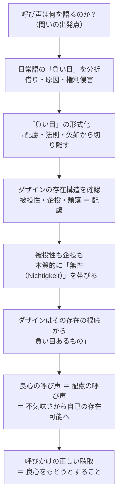

## 「§58」は何だと言っているのか

*ハイデガー『存在と時間』第58節*

---

### この節の結論を一言で

良心の呼び声が呼びかけているのは「負い目を犯したぞ」という警告ではなく、「おまえはそもそも存在の根底から負い目ある者だ」という事実の了解への呼びかけである。そして、その呼びかけを正しく聴き取ることは「良心をもとうとすること（Gewissen-haben-wollen）」と等しい――これが§58の核心である。

---

### 全体の進み方を先に見ておく

---

### ①「負い目（Schuld）」という言葉の整理から始まる

ハイデガーはまず、日常語の「負い目」が少なくとも三つの意味をもつことを確認する。

| 日常語の「負い目」の意味 | 内容の要点 |
|---|---|
| 借りをもつ（借財） | 誰かに何かを返さなければならない状態 |
| ～について負い目をもつ（原因・起因） | ある出来事の引き金になったこと |
| 自らを有責にする（権利侵害） | 上の二つが重なり、他者のダザインを傷つけること |

三番目の「他者に対して負い目を負うようになること」を形式的に定義すると、

> 他者のダザインにおける欠如の根拠であること——しかもこの根拠存在自体が「欠如したもの」として規定されるような根拠であること。

しかしハイデガーはすぐに釘を刺す。これらの意味はすべて「配慮（Besorgen）」の圏内、つまり日常的なやりくりの場面に属している。そこに実存論的な「負い目あること」の概念を求めても、意味を歪めるだけだ、と。

---

### ②「負い目」の概念を日常的な用法から解放する

次に行われるのは概念の「形式化」である。ハイデガーは日常語の三つの意味から「配慮」「借り勘定」「法則からの逸脱」という要素をすべて取り除く。

なぜ「法則からの逸脱」も取り除くのか。逸脱による負い目は、「あるべき状態がある」のに「それが欠けている」という構造をとる。「欠け」とは手元にあるはずのものがない（手元存在の無）ということだ。だがダザインの存在は、物が「そこにある／ない」という手元存在とは根本的に異なる。実存（生きること）には、物と同じ意味での「欠如」は本質的にありえない。

> 実存には本質的に何も欠けていることはありえない——それが完全であるからではなく、その存在性格がすべての手元存在性とは区別されたまま留まるからである。

それでも「負い目がある」という観念の中には「非（Nicht）」の性格が宿っている。そこでハイデガーは「負い目があること」の形式的・実存論的な定義を次のように固める。

> **「非」によって規定された存在の根拠であること、つまり無性（Nichtigkeit）の根拠であること。**

ここが§58の理論的な要である。「負い目あること」は欠如でも罰でもなく、ダザイン自身の存在構造に由来する「無性の根拠であること」だとされる。

---

### ③なぜダザインは根底から「負い目ある」のか

この定義がダザインにどう当てはまるかを理解するには、ダザインの存在構造（配慮）を確認する必要がある。

**被投性（Geworfenheit）の「非」**

ダザインは自分でそこへ放り込まれた「現（Da）」を自ら選んだわけではない。それは自分が措定したわけではない根拠の上に立っている。

> ダザインは実存しつつ自らの存在可能の根拠である——たとえその根拠をそれ自身が措定したわけではないとしても。

自分が設けたわけでない根拠の上に立たざるをえない——これが被投性に宿る「非」である。

**企投（Entwurf）の「非」**

ある可能性を選ぶことは、つねに他の可能性を選ばないことでもある。

> 自由とは、一方を選ぶことにおいてのみ、すなわち他方を選ばなかったこと、および他方をともには選びえないことを担うことにおいてのみ存する。

選ぶという行為そのものが、選ばれなかったものへの「非」を帯びている——これが企投に宿る「非」である。

**まとめ：配慮は無性によって貫かれている**

被投性にも企投にも本質的に「非」が宿るなら、それらを統合する配慮（＝ダザインの存在全体）もまた、無性によって根底から貫かれている。

> ダザインの存在としての配慮は、被投的な企投として——ある無性の根拠存在であること。ダザインはそれ自体として負い目あるものである。

---

### ④良心の呼び声はこの「負い目あること」を呼びかける

呼び声の正体がここで明らかになる。

> 呼び声は配慮の呼び声である。

不気味さ（Unheimlichkeit）――自分がどこにも安住できない、世界に「なじんでいない」という感覚――の中で、ダザインは自分の覆いなき無性の前に連れ出される。そこからダザインは「世人（Man）」として埋没した自分を、自己の固有な存在可能へと呼び戻す。

> 呼びかけ（Anruf）は、前へと呼びかけつつ後へと呼び戻す呼び声である——前へとは：可能性へ；後へとは：被投性へ。

この二重の呼びかけをまとめると、良心は「おまえは罪を犯したぞ」と警告するのではなく、「おまえは存在の根底から負い目あるものとして、その事実を引き受けつつ可能性へと向かえ」と呼びかける声だということになる。

---

### ⑤正しく聴き取るとはどういうことか

呼び声への正しい応答は「了解」であり、その了解の内実は「良心をもとうとすること（Gewissen-haben-wollen）」である。

これは三つの誤解を排除しながら説明される。

| 誤解 | ハイデガーの答え |
|---|---|
| 「やましいところのない良心」を目指すことか | 違う。それは呼び声の意味を狭める |
| 事実的な過失を積極的に探し求めることか | 違う。呼び声は具体的な罪状を告げない |
| 根源的な「負い目あること」から解放されることへの傾向か | 違う。その解放は存在論的に不可能である |

正しい聴取とは、呼びかけられることへの**備え（Bereitschaft）**そのものである。

> 呼びかけを正しく聴くことは、おのれ最固有の存在しうることにおける自己了解に、すなわちおのれ最固有の本来的な負い目ある者となりうること（Schuldigwerdenkönnen）への自己投企に、等しい。

そしてここに逆説が生じる。行為するダザインはつねにすでに他者との共存在の中で負い目を負ってしまっており、あらゆる行為は事実的に「良心なき」ものである。ゆえに「良心をもとうとする意志」は、**本質的な良心なさの引き受け**へと転ずる。そしてその良心なさの内においてのみ、「善」であるという実存的可能性が成立する。

---

### この節の位置づけ――次の問いへの橋渡し

§58の末尾でハイデガーは自己批判的な問いを立てる。「良心の現象は、ここで存在構造から一方的に演繹されてしまったのではないか。日常的な良心経験との連関はどこにあるのか」と。これは次の節へ向けての問題提起であり、§58は「良心の呼び声が何を呼びかけているか」の存在論的解明を完成させつつ、その解明と日常経験との橋渡しを次節に委ねる、という構成になっている。

---

### §58の論点を一表に

| 問い | §58の答え |
|---|---|
| 呼び声は何を語るか | 具体的な情報や知識ではなく、存在可能への呼びかけ |
| 「負い目」の実存論的意味は何か | 無性の根拠であること（欠如でも法則違反でもない） |
| なぜダザインは根底から「負い目ある」か | 被投性・企投いずれにも本質的に「非（Nicht）」が宿るから |
| 良心の正しい聴取とは何か | 良心をもとうとすること＝呼びかけられることへの備え |
| その帰結の逆説は何か | 行為はつねに「良心なき」ものだが、その引き受けの内にのみ「善」が可能 |
