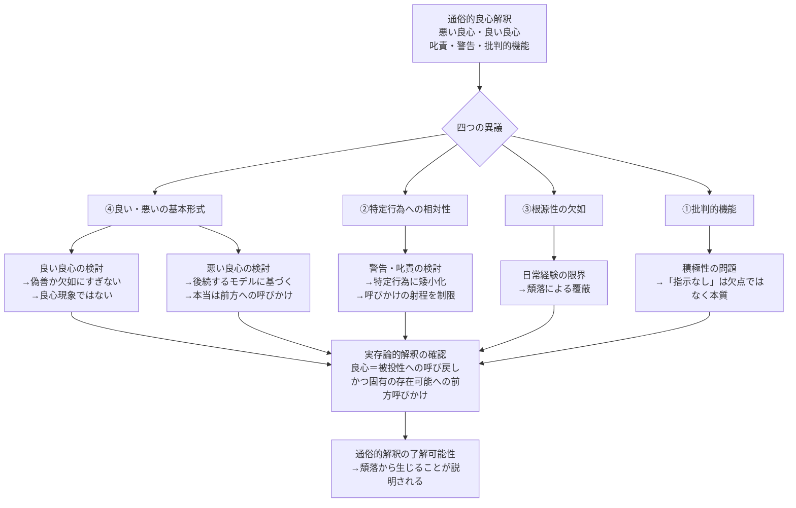

## 「§59」は何だと言っているのか

*ハイデガー『存在と時間』第59節*

---

### この節の結論を最初に一言で

この節でハイデガーが言いたいことは、次の一点に尽きる。

> 通俗的な良心解釈（「悪い良心」「良い良心」「叱責する」「警告する」といった日常的な理解）は、良心という現象を表面でしか捉えておらず、**良心の呼びかけの本当の射程を覆い隠している**。

ただし、それは日常的な良心経験を「間違いだ」と切り捨てることではない。通俗的な解釈も現象に「何らかの仕方で触れて」はいる。問題は、**それが根源的な了解かどうか**、つまり良心の呼びかけをどこまで汲み取れているかである。

---

### 前提：なぜ実存論的解釈は通俗的解釈とぶつかるのか

ハイデガーはここまでの議論で、良心を次のように定式化してきた。

> 良心とは、世界内存在の不気味さから湧き出る配慮の呼び声であり、ダザインをその最も固有な負い目ありうること（Schuldigsein-können）へと呼びかけるものである。

- **ダザイン**：「人間存在」のこと。単なる人間ではなく、「自分の存在が問題になっている存在者」というニュアンス。
- **配慮（Sorge）**：ダザインの存在の根本構造。常に何かに関わり、先を気にしながら、すでに世界に投げ込まれているあり方。
- **負い目ありうること（Schuldigsein-können）**：特定の行為の罪ではなく、存在の根底にある構造的な「負い目」。

この定式化は、「悪いことをしたから後ろめたい」という日常感覚とは明らかにズレる。そのズレを、ハイデガーはこの節で正面から論じる。

---

### 通俗的解釈からの四つの異議

通俗的良心解釈は、実存論的解釈に対して四つの点で反論する。

| 異議の番号 | 内容 |
|-----------|------|
| ① | 良心は本質的に「批判的な機能」を持つ（責め・警告をする） |
| ② | 良心はそのつど特定の行為（過去の罪・これからの行為）に相対して語る |
| ③ | 声は存在そのものへの呼びかけなどではない（経験的にそんな根源性はない） |
| ④ | 「悪い良心」「良い良心」「叱責」「警告」という基本形式を無視している |

ハイデガーはこれらを順に検討し、すべて退けていく。

---

### 「悪い良心」「良い良心」の問題

#### 「悪い良心」について

通俗的な理解では、良心は**行為のあと**に浮かび上がり、過去の罪を指し示すものだとされる。つまり声は「後から来る」。

しかしハイデガーはここで問い返す。

> 声が後からやってくるという「事実」は、呼びかけが根底においては前方への呼びかけではないことを、果たして排除するだろうか。

「声が後続する」という印象は、**ダザインを体験の継起として理解するモデル**（過去の出来事→その後に良心の声）に依拠している。だがこのモデル自体が、良心の現象を見誤る「先持ち（Vorhabe）」——つまり解釈の前提——になっている。

ハイデガーの主張は次のようなものだ。

> 声はたしかに指し戻す。しかし、起きてしまった行為を越えて、いかなる有責性よりも「以前の」、被投的な負い目存在へと呼び戻す。

つまり「悪い良心」は**回顧的な叱責**ではなく、根底では**被投性（自分が世界に投げ込まれているという事実）へと呼び戻しながら、前方の自己存在の可能性へと呼びかける**構造を持っている。

#### 「良い良心」について

「悪い良心」が根源的な現象を捉えていないなら、「良い良心」はさらに捉えられない。

もし良心が「善であること」を告知するとしたら、それは自己満足（偽善）に堕する危険がある。

> 良心は人間に「わたしは善い」と言わせることになる——しかし誰がそう言えるのか。

また「良い良心」を「悪い良心が鳴らない状態（欠如）」と定義しようとする試みも斥けられる。

> その「確知」は、良心を持とうとすることの……安堵をもたらす抑圧を内に秘めている。

「何も後ろめたくない」という確知は、**そもそも呼びかけられうる可能性から退出すること**であり、良心現象ではまったくない、というのがハイデガーの判断だ。

---

### 「警告する良心」「叱責する良心」の問題

「警告する良心」（これからやろうとすることを思いとどまらせる声）は、「呼びかけが前を向いている」点で実存論的解釈に近いように見える。

しかしハイデガーはそれも仮象だと言う。

> 警告する良心の経験は、その声をふたたび、それが守ろうとする意図された行為へとのみ方向づけられたものとして見ている。

「警告する良心」は**特定の行為を止める**ことに声の意味を限定してしまう。それは「責めを免れたままでいることを瞬間ごとに調整する機能」にすぎない。

本当の呼びかけは、特定の行為の損得を超えて、**ダザインの存在可能そのもの**（自分が自分の最も固有な可能性において存在できるかどうか）に向かっている。

---

### 良心は「否定的」か「積極的」か

通俗的な観点からは、良心が「具体的に何をすべきか」という指示を与えないので、「否定的・批判的な機能しかない」と見える。

ハイデガーはこれを逆転させる。

> 良心がこのような仕方では明らかに「積極的」でありえない以上、しかし同時に、同じ仕方で「単に消極的」に機能するわけでもない。

良心の呼びかけが「具体的な行動指示を与えない」のは、欠点ではなく**本質**だ。良心は「気遣いの計算」の次元で動く存在者ではなく、**実存（自分自身の最も固有な存在可能）の次元**で語りかけているからだ。

> 呼び声は、気遣われうるものとして積極的あるいは消極的でありうるものを何も開示しない。なぜなら呼び声は、存在論的にまったく別種の存在、すなわち実存を意味しているからである。

実存論的な意味では、良心の呼びかけは**「最も積極的なもの」**——そのつど事実的な自己でありうること——を与える。

---

### 論証の流れ：全体図

---

### 「存在論的批判」は「道徳的判断」ではない

節の末尾でハイデガーは重要な補足を加える。

> 存在論的に不十分な良心理解によって実存が必然的かつ直接的に損なわれることがないのと同様に、良心の実存論的に適切な解釈によって呼び声の実存的了解が保証されるわけでもない。

つまり「通俗的な良心経験の人のほうが不誠実だ」とも、「実存論的に正しく理解している人のほうが誠実だ」とも言っていない。

これは**存在の構造を分析する話（存在論）**であって、**誰がより良い人間かという話（道徳的評価）ではない**という線引きだ。ただしその上で、より根源的な解釈は**より根源的な了解の可能性**を開く、とは言える。

---

### まとめ：§59 の核心

| 問い | ハイデガーの答え |
|------|----------------|
| 「悪い良心」は回顧的な叱責か | 否。声は被投性へ呼び戻しながら、前方の存在可能へと呼びかける |
| 「良い良心」は独立した良心の形式か | 否。それは良心現象ですらなく、呼びかけ可能性からの退出にすぎない |
| 「警告する良心」は根源的か | 否。特定行為への矮小化であり、呼びかけの本来の射程を見ていない |
| 良心が指示を与えないのは「否定的」か | 否。気遣いの次元と実存の次元を混同した誤解。実存論的には最も積極的 |
| 通俗的解釈はなぜ現象を見損なうのか | ダザインの頽落（日常的な自己喪失）が、存在の地平を「気遣い・計算」の次元に固定するから |

通俗的な良心解釈は、良心の呼びかけを「過去の罪への反応」または「行動の損得計算」の枠に押し込める。しかし良心の声は、そうした気遣いの地平をそもそも超えて、**「あなたはいま自分自身の最も固有な存在可能において存在しているか」** と問いかけている。それがこの節の中心にある主張だ。
