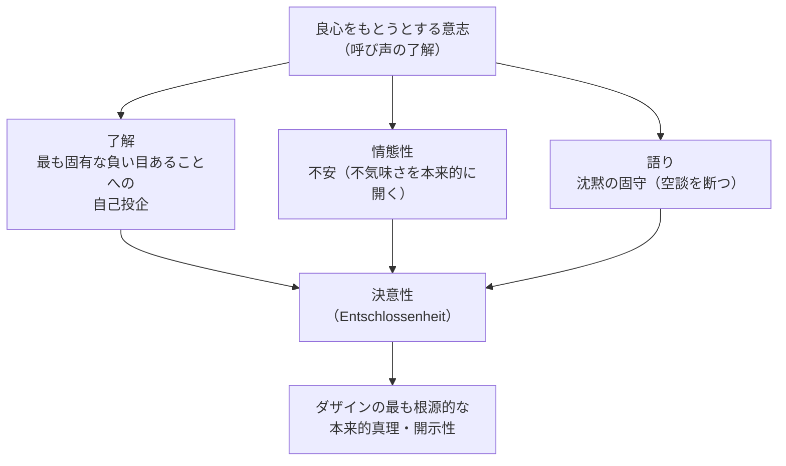

## 「§60」は何だと言っているのか

*ハイデガー『存在と時間』第60節*

---

### この節の結論を先に言う

良心の呼び声をきちんと聴き取る、という態度――ハイデガーがここで「**決意性（Entschlossenheit）**」と呼ぶもの――は、ただの心構えでも抽象的な理想でもない。それは、不安に備えながら、自分の負い目を引き受け、沈黙して自分自身の可能性へと向かう、という「ダザイン（人間の存在のあり方）の実存の根本構造」だ、とハイデガーは言う。この節は、その「決意性」という概念を丁寧に解体し、それが何を意味するかを確定する章である。

---

### ① 出発点：「良心をもとうとする意志」は何をしているのか

前節までの議論を受けて、ハイデガーはまず整理する。良心の呼び声を聴くことを、彼は「**良心をもとうとする意志（Gewissen-haben-wollen）**」と呼んでいた。これは単に「良心的でいよう」という心構えではない。

> 固有の自己をその負い目あることにおいて自己自身から自己のうちで行為させること

つまり、自分が「負い目ある（Schuldig）存在だ」という事実から目を逸らさず、それを自分自身に突きつけて引き受けることだ。この引き受けが、「本来的に存在すること」の現象的な核心だとハイデガーは見る。

---

### ② 開示性の三つの柱：了解・情態性・語り

ハイデガーの議論では、ダザインが何かを「開く（開示する）」とき、その開き方は必ず三つの要素から成り立つ。

| 構成要素 | 一般的な意味 | §60 での具体的な姿 |
|---|---|---|
| **了解（Verstehen）** | 自分の可能性へと向けて自己を投げる | 最も固有な負い目あることへの自己投企 |
| **情態性（Befindlichkeit）** | そのつど気分として「どこにいるか」を感じること | **不安（Angst）** ――不気味さの開示 |
| **語り（Rede）** | 分節的に意味を分かち合う | **沈黙の固守（Verschwiegenheit）** |

それぞれを順に見ていく。

---

### ③ 了解：「最も固有な負い目」へと自己を投げること

了解とは「自分の可能性へと向かう動き」だ。良心の呼び声が開示する了解は、一般的な可能性や社会的な目標へと向かうのではなく、「自分が根本的に負い目ある存在だ」という、もっとも引き受けにくい可能性へと向かう。誰かに指定された目標を受け取るのではなく、自分自身の存在の重さに向き合うことが、ここでいう「了解」の内実である。

---

### ④ 情態性：不安が「不気味さ」を本当に開く

良心の了解に伴う気分は何か。ハイデガーは明言する。

> 良心の不安というこの事実は、ダザインが呼び声の了解において自己自身の不気味さへともたらされているということの現象的な証明である。

「**不気味さ（Unheimlichkeit）**」とは、文字通り「家のなさ（Un-heimlichkeit）」――どこにも本当には属していない、という感覚だ。日常の「ひとびと（ダス・マン）」の世界に埋没しているとき、この不気味さは隠れている。良心の呼び声は、その隠れていた不気味さを「不安」という気分によって剥き出しにする。

**「良心をもとうとする意志は、不安への準備となる」** という一文は、良心がただ罪悪感を生むのではなく、自分の根本的な立ち位置のなさに目を向けさせる、ということを言っている。

---

### ⑤ 語り：沈黙こそが最も適切な「語り」だ

通常、語りとは声に出して言葉を交わすことだ。しかし良心の呼び声は「無音」で来る。なぜか。

> 呼び声は常住の負い目あることの前へとおき出し、かくして自己をダス・マンの了解性の喧しい空談から呼び戻す。

「**ダス・マン（das Man）**」とは「世間一般のひとびと」という匿名の力――「みんなそう言っている」「普通はこうだ」という声のことだ。ダス・マンの世界は「空談（Gerede）」、つまりうわべだけの賑やかな言葉で満ちている。良心の呼び声は、その騒がしさに逆らって、静けさへと呼び戻す。

だからこそ、呼び声をきちんと聴くことに対応する語りの様式は、**沈黙の固守**でなければならない。沈黙は無言ではなく、空談に言葉を渡さない積極的な構えだ。

> 良心はただ沈黙しつつ呼ぶ。

なお、「良心は確認できない、存在しない」という日常的な反論についても、ハイデガーはここで一刀両断する。

> 大声の空談のみを聴き了解している者が、いかなる呼び声も「確認」できないということが、良心へと押しつけられ……この解釈によってダス・マンは、みずからに固有な呼び声の聞き過ごしをただ覆い隠すばかりである。

「聞こえない」のは良心がないからではなく、聴く耳が空談に塞がれているからだ。

---

### ⑥ 三つが合わさって「決意性」になる

この三つが揃ったとき生まれる現象を、ハイデガーは「**決意性（Entschlossenheit）**」と名づける。

> 沈黙して不安に備えた、最も固有な負い目あることへの自己投企

これが決意性の定義だ。「決意」という日本語は「何かを決めること」に聞こえるが、ハイデガーの決意性は「何かを決める」に先立って、そもそも自分の実存に向けて「開かれている」こと自体を指す。

---

### ⑦ 決意性は世界から切り離さない

重要な誤解を防ぐために、ハイデガーは繰り返す。

> 決意性は、本来的な自己存在として、ダザインを世界から切り離しも、自由浮遊する自我へと孤立化させもしない。

決意したダザインは、相変わらず手元の道具を使い、他者と共に生きる。変わるのは「誰として」そこにいるか、だ。決意したダザインは、他者を「本来的な存在可能において存在させる」こともできる――他者の「良心」になりうる。

---

### ⑧ 「状況」という概念：決意性が初めて状況を開く

決意性と切り離せないのが「**状況（Situation）**」という概念だ。

> 状況とは、決意性においてそのつど開示された現であり……

日常語の「状況」は、外側から眺められる「事情の集まり」に聞こえる。しかしハイデガーにとって状況は、決意性によって初めて開かれる。ダス・マンのうちに埋没しているあいだは「一般的な状況」しか見えない。決意性のうちで初めて、「いま・ここで・自分が何をなしうるか」という具体的な場が浮かび上がる。

| 比較 | ダス・マンのあり方 | 決意性のあり方 |
|---|---|---|
| 状況の見え方 | 「一般的な状況」しか見えない | そのつどの具体的な状況が開かれる |
| 偶然への態度 | 打算的に処理し、自分の功績にする | 偶然が「到来するもの」として受け取られる |
| 他者との関係 | 空談・馴れ合いの兄弟づきあい | 相手の本来的な存在可能を共に開く |

---

### ⑨ 決意性は「行為」か「理論」かという問いを超える

ハイデガーはあえて「行為」という言葉を避ける。決意性を「理論より実践が大事」という話に落とし込もうとするのは誤りだ。なぜなら、**配慮（Sorge）**――ダザインの根本的な存在構造――は、理論と実践を分ける以前にそれらを支えている。決意性は「理論か実践か」という区別の手前にある、**配慮それ自身の本来性**にほかならない。

---

### ⑩ この節で達成されたこと、残された問い

節の末尾でハイデガーは、この分析が何を達成し、何が残るかを整理する。

> ダザインの本来性はいまや空虚な表題でも作り出された理念でもない。

「本来的に生きる」とは掛け声ではなく、決意性という具体的な実存構造として描かれた。しかし、とハイデガーは続ける。**死への存在として演繹された「本来的な全体存在能力」は、まだダザイン自身によって証示されていない**。つまり「こういうあり方が可能だ」と論理的に示しただけであって、それが本当にダザインのうちに根拠をもつかどうかは、まだ確かめられていない。

この問いが次章（第三章：時間性）への橋渡しとなる。

---

### まとめ：§60 が言っていること

| 問い | §60 の答え |
|---|---|
| 良心をもとうとする意志の構造は何か | 了解・情態性・語りの三つから成る開示性である |
| それぞれの具体的な姿は | 負い目への自己投企・不安・沈黙の固守 |
| 三つが合わさると何になるか | 決意性（Entschlossenheit） |
| 決意性は世界や他者から離れるか | 離れない。むしろ本来的に世界内存在することである |
| 決意性は状況とどう関わるか | 決意性によって初めて具体的な状況が開かれる |
| この節で残された問いは何か | 本来的全体存在能力が「ダザイン自身によって証示」されているかどうか |

決意性とは、不安から目を逸らさず、自分が根本的に負い目ある存在だと認め、沈黙のうちにそれを引き受けることだ。それは孤立ではなく、世界と他者のただ中で、自分自身として立つことを可能にする構えである――ハイデガーはそう言っている。
