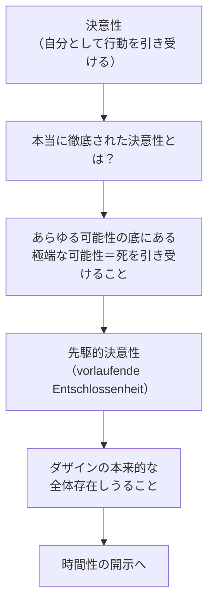

## 「§61」は何だと言っているのか

*ハイデガー『存在と時間』第61節*

---

### この節の結論を一言で

§61 は「これから何をどの順番でやるか」を宣言する**章の入口**である。

ここでハイデガーが言いたいことは一つ——「死への先駆（Vorlaufen）」と「決意性（Entschlossenheit）」というこれまで別々に論じてきた二つの現象を、外から無理やり貼り合わせるのではなく、**決意性そのものの内側から先駆を引き出す**という道筋をとることで、はじめて「ダザイン（Dasein）の本来的な全体存在」が正しく捉えられる、ということだ。そしてその捉え方の根底には「時間性（Zeitlichkeit）」があると予告する。

---

### 前提の整理——「先駆」と「決意性」はどこが問題か

まず、これまでの議論で出てきた二つの概念を確認しておこう。

| 概念 | 一言説明 | 対応する問い |
|---|---|---|
| **先駆**（Vorlaufen） | 自分の死を可能性として引き受け、そこへ向かって歩むこと | 「ダザインは全体としてどういう存在か」 |
| **決意性**（Entschlossenheit） | 日常の「みんな」の声に流されず、自分自身として状況の中で行動を引き受けること | 「ダザインの本来的な存在の証しはどこにあるか」 |
| **ダザイン** | 「存在」という問いをもつ、われわれ人間のあり方 | — |

この二つを前の章ではそれぞれ別に分析した。するとこんな疑問が当然わき起こる。

> 死と行為の「具体的状況」とのあいだにいかなる共通点があるというのか。

「死の前に立ちすくむ」という話と「今ここで何かを決断する」という話——これはあまりにも遠い話に見える。

---

### 禁じ手——外から貼り合わせてはいけない

ハイデガーはここで「二つをとにかくくっつけよう」という誘惑を**明示的に退ける**。

> 決意性と先駆とを無理やり一つに押し込めようとする試みは、……耐えがたい、まったく非現象学的な構成へと誘惑することにならないか。

「非現象学的」というのは、「実際に現れていないものを外から貼り付けた作り話になる」という意味だ。ハイデガーの哲学の大原則——**「現象から出発し、現象が自ら示すものだけを語る」**——に反してしまう。

---

### 唯一許される道——決意性の内側から先駆を引き出す

では正しい道はどこか。ハイデガーはこう言う。

> 方法的に唯一可能な道として残るのは、その実存的な可能性において証示された決意性という現象から出発し、次のように問うことである——決意性はそれ固有の実存的な存在傾向において、それ自身、先駆的決意性へと……あらかじめ指し示しているのではないか。

つまり問いは「外からどう繋ぐか」ではなく、「**決意性は本当に徹底されると、おのずと死への先駆を含まないか**」に変わる。

その答えの見通しはこうだ——決意性が本物の決意性になるのは、「目の前の便宜的な可能性」だけでなく、「ダザインのすべての事実的な存在しうることの根底にある**極端な可能性**（＝死）」へと自らを企投するときだ、と。先駆なき決意は、いつでも「本当はまだ時間がある」という錯覚のうちにある仮の決意にすぎない。

---

### 方法論の宣言——「なぜ今ここで立ち止まるか」

節の後半はやや自己言及的だ。ハイデガーは「これまで方法論の話を後回しにしてきたが、ここで一度立ち止まる必要がある」と言う。

> まず「諸現象へと進む」ことが肝要だったのである。……探究の歩みは一時の「停留」を要する。それは「休息」のためではなく、探究に鋭化された推進力を与えるためである。

「方法論を先に議論しすぎると、実際の現象から離れた技術論になる」——これがハイデガーの立場だ。まず現象に向かい、ある程度積み上がったところで「自分たちは何をどうやって論じているのか」を確認する、という順序をとる。

---

### 「時間性」の予告——この章全体の地図

§61 の最後の仕事は、続く章の構成を提示することだ。そのキーワードが「時間性」である。

> 時間性は現象的に根源的な仕方で、ダザインの本来的な全体存在において、すなわち先駆的決意性の現象において経験される。

先駆的決意性を丁寧に見ると、そこには「過去・現在・未来」を自分として引き受けるという構造が現れてくる——それが「時間性」だとハイデガーは言う。しかもこれは腕時計で測るような「通俗的な時間」とは別物だ。

> 一見したところ時間性が、通俗的理解に「時間」として接近可能なものに対応していないとしても、それは驚くべきことではない。

この宣言のあと、章の構成が次のように示される。

| 節番号 | 主題 |
|---|---|
| §62 | 先駆的決意性——ダザインの本来的な全体存在しうること |
| §63 | 解釈学的状況の確認と実存論的分析論の方法論的性格 |
| §64 | 配慮と自己性 |
| §65 | 配慮の存在論的意味としての時間性 |
| §66 | ダザインの時間性と、以後の分析への課題 |

---

### まとめ——§61 の役割

§61 は内容上の新しい主張を行う節ではない。それは**地図を広げて「ここまで来た道」と「これから行く道」を確認する節**だ。

核心となる主張は三つに整理できる。

1. **決意性と先駆は外から貼り合わせてはいけない**。現象学の原則上、禁じ手である。
2. **決意性を徹底すると、おのずと先駆的決意性へと向かう**。これが「先駆的決意性」の概念を導入する方法論的な正当化だ。
3. **先駆的決意性の分析は、時間性の解明へと通じる**。以後の章全体の道筋がここで予示される。

言い換えれば——「死と決断は結局つながっている。それが時間性という話になる。では順番に見ていこう」というのが、この節全体のメッセージである。
