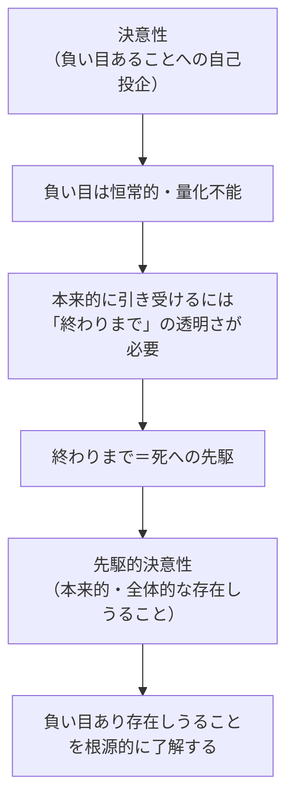

## 「§62」は何だと言っているのか

*ハイデガー『存在と時間』第62節*

---

### この節の結論を先に言うと

「決意性」と「死への先駆」はバラバラな二つの話ではない。決意性を徹底的に突き詰めていくと、それは自然に「死への先駆的決意性」として完成する——これがこの節の核心です。

言い換えれば、**本当の意味で自分の人生に決意するとは、自分がいつか必ず死ぬという事実を正面から引き受けたうえで決意することだ**、ということです。

---

### 登場する主な概念の確認

まずこの節で使われる言葉を簡単に整理します。

| 用語 | 一言でいうと |
|---|---|
| ダザイン | 「そこにいる存在」＝私たち人間のこと |
| 決意性 | 世間の声に流されず、自分の本来の在り方へと踏み出すこと |
| 負い目あること | 「私は自分の存在の根拠を自分では作れない」という根本的な受け身さ・欠如 |
| 死への先駆 | 自分の死を「いつか来る終わり」として想像するのではなく、いま・ここで可能性として引き受けること |
| 配慮（Sorge） | ダザインの存在構造全体を指す言葉。気にかけ・かかわりつつ生きている在り方 |

---

### ステップ１：決意性を「終わりまで考える」とどうなるか

ハイデガーはまず問います。「決意性とは何かを最後まで突き詰めると、いったいどこへ行きつくのか？」

決意性とは、

> 不安を引き受けつつ、黙している中で、固有の負い目あることへと自己を投企すること

と説明されていました。「負い目あること」とは道徳的な罪ではなく、**自分の存在の土台を自分では作れない**という根本的な事実を指します。

ここで重要なのが次の一点です。この「負い目」はダザインの存在に根本的に属しているため、増えも減りもしない。私たちは「時には負い目があり、時にはない」のではなく、**存在することそのものが負い目あることと不可分**なのです。

だとすれば、決意性が本物であるためには、この「恒常的な負い目あること」を常に透明に理解し続けなければならない。そしてそれが可能になるのは、**ダザインが「終わりまでの存在可能」を自分に開示したとき**だけだ、とハイデガーは言います。

---

### ステップ２：「終わりまでの存在可能」＝死への先駆

「終わりまで」を本当に理解するとはどういうことか。それは、自分の死を**可能性として**正面から引き受けることです。

> 決意性は、終わりへの理解する存在として、すなわち死への先駆として、自らがあり得るものとして本来的になる。

ここで大事なのは、決意性と先駆が「別々のもの」ではないという点です。決意性は外から先駆を「接続する」のではなく、**自分の中にすでに死への存在を宿している**とハイデガーは言います。

---

### ステップ３：死と負い目は「配慮」の中で等根源的に存在する

ここでハイデガーは重要な主張をします。

> 配慮として、ダザインは自己の死の被投的な（すなわち無的な）根拠なのである。配慮は死と負い目とを等根源的に自己のうちに蔵している。

「配慮」はダザインの存在の全体的な構造です。その配慮の中に、**死（終わりから規定される無性）**と**負い目（根拠のなさという無性）**が、どちらが先でもなく同等の深さで存在している——。

先駆的決意性が初めてこの二つをまとめて、根源的に了解することを可能にします。

---

### ステップ４：決意性の「確実性」と「不確定性」

本来的な決意性には「確信」が伴いますが、それはどんな確信でしょうか。

ハイデガーの答えは少し逆説的です。決意性の確実性とは、**撤回に向けて自らを自由に保つこと**だと言います。

> 決意性の確実性が意味するのは、その可能的にして、そのつど事実的に必要な撤回に向けて自らを自由に保つことである。

つまり「決意したのだから絶対に揺るがない」という頑固さではなく、むしろ**状況に応じて繰り返し決意し直す準備を持ち続けること**こそが本来的な確実性です。

そしてこの「つねに撤回可能でありながら、つねに確実でありたい」という緊張を最も根底で支えるのが、**死の確実性と不確定性**です。

| 死の性質 | 意味 |
|---|---|
| 確実である | 死は必ず来る——これだけは絶対に確実 |
| 不確定である | 「いつ来るか」は分からない——瞬間ごとに不確定 |

先駆はダザインをこの「確実だが不確定な可能性」の前へと連れ出します。死の不確定性が根拠となって、決意性は**つねにいまここで決意し直す**ものになります。

---

### ステップ５：先駆は「押しつけられた観念」ではなかった

節の後半で、ハイデガーは以前の議論を振り返って訂正します。

> これまで先駆は、存在論的な企投としてのみ見なされうるにすぎなかった。しかし今や明らかになったのは、先駆とは作り事であってダザインに押しつけられた可能性ではなく、ダザインにおいて証示された実存的な存在しうることの一様態である。

当初「死への先駆」は哲学者が分析のために設定した仮説のように見えていました。しかしこの節で、それは**決意性という証示された現象の中にすでに潜んでいた**ことが明らかになりました。先駆は外から持ち込まれたのではなく、決意性の内側から出てきたのです。

---

### この節の要点まとめ

| 問い | 答え |
|---|---|
| 決意性を終わりまで考えると何になるか？ | 死への先駆が内包された「先駆的決意性」になる |
| 決意性と先駆の関係は？ | 別々ではなく、決意性の本来性の中に先駆が潜んでいた |
| 本来的な死への思索とはどんなものか？ | 「死について考えること」ではなく、良心をもとうとする意志そのものである |
| 確実性とはどういう意味か？ | 揺るぎない固執ではなく、撤回へ開かれながら繰り返し決意し直すこと |
| 先駆的決意性は何から解放するか？ | 世間の空騒ぎや自己隠蔽から解放し、幻想なき行為の決意へと連れ戻す |

---

### 最後に：この節の位置づけ

この節は『存在と時間』第二部の「折り返し点」にあたります。前半の議論（死の分析・良心の分析・決意性の分析）がここで**一つに統合**され、「先駆的決意性」という概念として結実します。

ハイデガーは最後に、この分析が特定の「実存の理想」を前提にしているのではないか、という問いを自分で立て、そうだと認めます。しかし彼はそれを隠すのでも否定するのでもなく、**哲学は自分の前提を把握し、それをより切迫した展開へともたらすべきだ**と述べて、次の議論へと歩を進めます。
