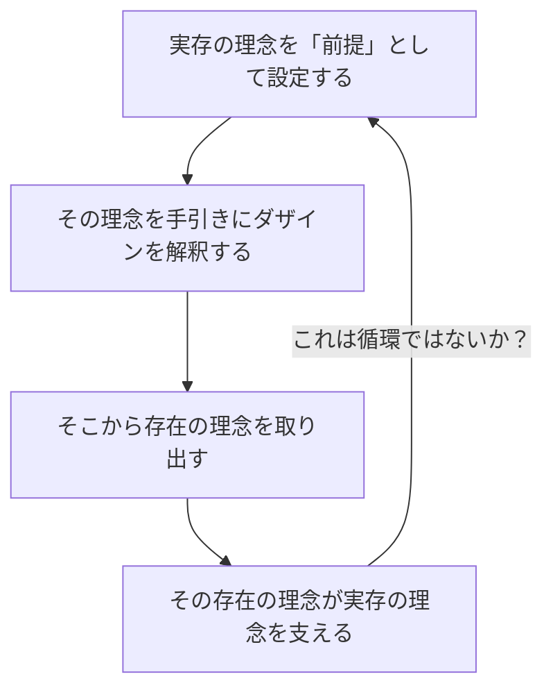

## 「§63」は何だと言っているのか

*ハイデガー『存在と時間』第63節*

---

### この節の結論を一言で言うと

「準備が整った」「でも一つ問題がある」「いや、その問題こそが正しい」という三段構えの節である。

ハイデガーはここで、ダザイン（*私たち人間の在り方*）の分析がここまで積み重ねてきたものを振り返り、「解釈学的状況が整った」と宣言する。しかし同時に、「実存理念を前提にしてダザインを解釈し、そこから存在の理念を取り出す――これは循環論法ではないか？」という根本的な疑念を正面から取り上げ、その疑念に真剣に応答する。結論は「それは欠陥ではなく、むしろ飛び込まなければならない円環だ」というものである。

---

### 段階１：「ようやく地盤が固まった」という確認

節の冒頭でハイデガーは、これまでの分析が「解釈学的状況」を整えたと述べる。

> 先駆的決意性によって、ダザインは、その可能な本来性と全体性という観点から現象的に可視化された。

「解釈学的状況」とは、物事を正しく解釈するための「立ち位置のよさ」のことだ。地面が固まっていない場所に立って測量しようとしても精度は出ない。ハイデガーはここまでの分析――世界内存在の構造、自己＝ひとの解明、配慮・死・良心・負い目の分析――を通じて、ダザインの本来的なあり方（*先駆的決意性*：死を見すえたうえで自分自身の可能性へ向けて自分を開く決断性）を軸に据えることで、ようやく安定した足場が得られたと言う。

そしてここで第５節で投げかけられた命題が回収される。

> われわれがそのつどわれわれ自身である存在者は、存在論的に最も遠い

私たちは自分自身について、じつは最もよく分かっていない。その理由は「頽落」（*ひとびとの世間的な解釈に安住して、本来の自分を見失う傾向*）にある。だから、ダザインの根源的な存在を明るみに出すためには、「頽落する傾向への対抗運動」が必要だ――それがこれまでやってきたことだ、とハイデガーは整理する。

---

### 段階２：方法論上の根本問題――「循環ではないか」

ここで節は急に自省的・批判的な調子になる。ハイデガーは方法論上の疑問を自分自身に投げかける。

問題をもう少し具体的に言い直すと、こういうことだ。

- ダザインを正しく解釈するには「実存とは何か」という理念が必要。
- しかしその理念の妥当性は、ダザインを解釈して初めて確かめられる。
- ということは、最初の「実存の理念」はどこから来ているのか。

> こうしてみると、提起された根本存在論的問題が「循環」のうちで動いていることが、ついに完全に明白となるのではなかろうか？

ハイデガーは、この問いを誤魔化さずに真正面から受け止める。

---

### 段階３：「循環」への応答――それは欠陥ではなく本質だ

ここが節の核心部分である。ハイデガーは「循環論法は避けるべき誤り」という常識的な立場を、二重の意味でひっくり返す。

#### ① 「循環」の内実を問い直す

> それともこの前提とすることは、了解的な企投（Entwerfen）という性格を持つのであろうか

「前提とする」ことには二種類ある。

| 前提の種類 | 内容 | 問題 |
|-----------|------|------|
| 演繹的前提 | 命題Aを出発点に命題Bを論理的に導く | 循環すれば誤り |
| 了解的企投 | 対象を特定の方向から照らし出し、対象自身に語らせる | 循環は避けられない、むしろ必然 |

ハイデガーが使っているのは後者だ。「実存の理念」は出発点として固定された公理ではなく、ダザインを照らし出すための「光の方向」に近い。形式的・暫定的な「形式指示」として掲げられ、解釈が進むにつれて対象自身によって修正・確認されていく。

#### ② ダザインの存在様式そのものが「円環的」だ

さらにハイデガーは踏み込む。循環を問題にする「分別」（*世人的な常識的理解*）そのものが、了解の本質を見誤っている、と言う。

> 「理解の循環」という異議申し立てそのものが、ダザインのある存在様式から生じている

ダザインは「配慮」（*Sorge*：自分の存在を気にかけながら世界の中に投げ込まれている在り方*）によって構成されており、「つねにすでに自己自身に先んじている」。つまり、存在している限り、ダザインはすでに何らかの存在了解を持ちながら動いている。これは避けられない構造だ。

> 循環を否定し、これを隠蔽し、あるいはそれを乗り越えようとすることは、この誤認を最終的に固定化することを意味する。むしろ努力は、この「円環」の中へと根源的にかつ全面的に跳び込むことへと向けられなければならない。

「円環を避ける」ことは、ダザインの本質的構造を無視することだ。むしろ円環の中へ意識的に「跳び込む」ことで初めて、ダザインの存在を正直に見つめることができる。

---

### 段階４：何を「前提しすぎ」て何を「前提が足りない」か

節の後半でハイデガーは、「世界なき自我から出発する認識論」「生を問い死を後から付け足す哲学」「まず理論的主観を立てて倫理を付加する哲学」を批判する。

> 「まず最初に」「理論的主観」に限定して……主題的対象は人工的・独断的に切り詰められているのである

これらの立場は「前提が少なすぎる」。孤立した主観から出発することで、ダザインがもともと世界の中に投げ込まれ、他者と共にあり、死へと向かう「全体的な」存在者であるという事実を最初から捨てているからだ。

---

### 節の締め：配慮の存在意味へ向けて

節の最後で、ハイデガーは再び前を向く。

> 先駆的決意性の摘出によって、ダザインはその本来的な全体性に関して前把持のうちへと齎された。

「前把持・前視・前把握」という三つの「先」を揃えた解釈学的状況が確保された。そして「根源的かつ本来的な真理」――先駆的決意性が開く真理――こそが、配慮の存在意味を問う解釈の地盤となる。

> この意味の解明のためには、配慮の完全な構造連関を損なうことなく保持しておくことが必要とされる。

これは次節以降（配慮の存在意味＝時間性の解明）への橋渡しである。

---

### この節の論点マップ（まとめ）

| 問い | ハイデガーの答え |
|------|----------------|
| 解釈学的状況は整ったか？ | 先駆的決意性によって整った |
| 実存理念を前提にするのは循環ではないか？ | 論理的演繹ではなく「了解的企投」であり、循環は欠陥でない |
| ダザイン存在がそもそも円環的なのでは？ | そのとおり。だから円環に「跳び込む」べきだ |
| では「循環異議」はどこから来るのか？ | 世人的「分別」の視野の狭さから来る誤解だ |
| この節は何へ橋渡しするのか？ | 配慮の存在意味＝時間性の解明へ |

---

> むしろ努力は、この「円環」の中へと根源的にかつ全面的に跳び込むことへと向けられなければならない。

この一文が§63の心臓部である。哲学的な厳密さとは「循環を排除する」ことではなく、「どんな円環の中で考えているかを透明に自覚する」ことだ――ハイデガーはそう主張している。
