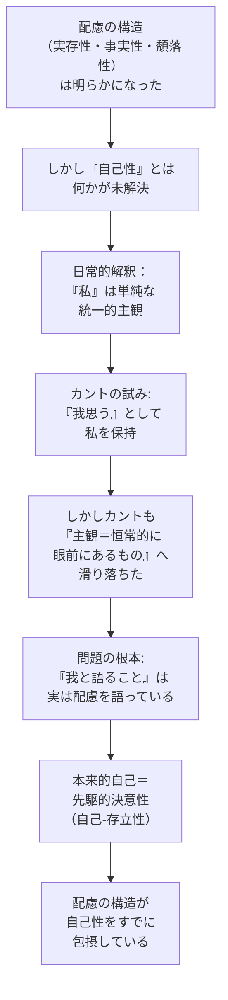

## 「§64」は何だと言っているのか

*ハイデガー『存在と時間』第64節*

---

### この節の結論を一言で

「私」という言葉で指し示されているものは、不変の「心の実体」ではない。それは**配慮（Sorge）**——すなわち世界に投げ込まれ、何かを気にかけながら自分の可能性へと先走っている存在のあり方——そのものである。そして本来的な意味での「自己」とは、その配慮の構造の中で、**先駆的決意性**（死を見据えて覚悟を定めること）として初めて成り立つ。

---

### §64の段取りを俯瞰する

この節はざっくり言うと、次の三段階で進む。

1. **準備問題の確認**：これまでの分析で「自己性（自分とは何か）」が未解決だと認める
2. **カント批判**：「私」を「主観」や「実体」として解釈することの限界を示す
3. **実存論的解決**：「自己」は配慮の構造の中にすでに含まれており、本来的自己は先駆的決意性として現れると論じる

---

### ステップ①　積み残された問い——自己性とは何か

節の冒頭でハイデガーは、これまでの成果を一度棚卸しする。

> 「自己に先立つこと」は「いまだ——ない」として示された。

配慮の定式「自己に先立って——すでに——世界の中に——傍らにあること」は、ダザイン（人間的存在者を指す術語）の構造全体をうまく表現していた。しかし問題が残っていた。この複雑な構造を「統一的に保ち合わせる」のは誰なのか。直感的には「私」がそれをしているように見える。ところが「私とは何か」という問いは、これまでの分析で**答えられたことがなかった**とハイデガーは認める。

さしあたり明らかになっていたのは、日常的な「私」はたいていの場合、「ひと自己（Man-selbst）」——「みんながそうしているから私もそうする」という没個性的な自己——に紛れ込んでいるということだった。では本来的な自己とはどこにあるのか。その存在論的な構造を解明することがこの節の課題である。

---

### ステップ②　「私」を実体として捉えることの誘惑と罠

哲学の長い歴史の中で、「私」はつねに「実体（変わらず底に横たわるもの）」か「主観（すべての経験の担い手）」として理解されてきた。ハイデガーはカントを例にとって、この傾向を解剖する。

カントは「私」を**「我思う」**として把握した点では正しかった。「私」は不変の魂の物質ではなく、表象する活動の**形式的な構造**だ、と。

> 「私」とは、あらゆる概念に伴う単なる意識である。

これはある意味で鋭い洞察だった。カントは「私は実体だ」という存在的テーゼには根拠がないと示した。しかし——とハイデガーは続ける——カントはここで止まれなかった。「我思う」を「論理的主観」と呼んだ瞬間、「主観」という言葉が持ち込む存在論的な前提、すなわち「**恒常的に眼前に存在するもの（手前的存在）**」というイメージに、カントも引きずられてしまった。

| 論者 | 「私」の把握 | 問題点 |
|------|------------|--------|
| 伝統的形而上学 | 不変の魂の実体 | 存在的テーゼとして根拠なし（カントが批判） |
| カント | 「我思う」＝表象の形式的主観 | 「主観＝恒常的に存在するもの」へ滑り落ちた |
| ハイデガーの要求 | 実存論的に把握すべき | 「世界内存在」としての配慮が自己を規定する |

さらに根本的な問題がある。カントは「我思う（Ich denke）」と言う。しかし実際には「**我は何かを思う**」であり、その「何か」は世界内部の存在者である。そうなると「我は何かを思う」という命題は、暗黙のうちに**世界という現象**を前提にしている。ところがカントはこの世界という現象に目を向けなかった。その結果、「私」は表象を伴う孤立した主観として取り残されてしまった。

---

### ステップ③　「我と語ること」の正体——配慮が語っている

では日常的に「私」と口にするとき、何が起きているのか。

ハイデガーの答えは鮮明である。

> 「我」によって語り出されるのは配慮であり、それもさしあたりたいていは、気遣い〔Besorgen〕の「とりとめない」我‐語りにおいてそうである。

「私がこれをする」「私があれを心配している」——この「私」は実は、配慮の構造、すなわち「すでに世界の中に投げ込まれ、何かの傍らで気遣いながら、自分の可能性へ先走っている」あり方を丸ごと表明している。

逆説的なことに、日常的に「我！我！」と最も声高に言うのは、**ひと自己**——本来の自分から逃げているがゆえに、空虚な「私」にしがみついている状態——である。本来的に自己である者は、むしろ**沈黙の中に**ある。

> ダザインは、沈黙を保ちつつ不安に身をさらす決意性の根源的な個別化において本来的に自己自身である。

---

### ステップ④　本来的な自己とは何か——自己-存立性としての先駆的決意性

ここがこの節の核心である。

「自己の恒常性」といえば、普通は「ずっと同じ私がいる」という意味で、実体的な持続のイメージが浮かぶ。しかしハイデガーはそのイメージをひっくり返す。本来的な意味での**自己の恒常性（Ständigkeit des Selbst）**とは、刻々と変わらない魂の物質ではなく、**先駆的決意性**（死への存在を引き受けて、自分の最も固有な可能性へ向かって腹を決めていること）が持続していることである。

> 自己‐存立性〔Selbst-ständigkeit〕とは実存論的には、先駆的決意性〔vorlaufende Entschlossenheit〕以外の何ものをも意味しない。

これに対して、決断しないまま日常性に流れ落ちている状態は**非自己-存立性（Unselbst-ständigkeit）**と呼ばれる。自己は「ある」か「ない」かではなく、本来的か非本来的かという**様態の問題**なのである。

| 状態 | 名称 | 内実 |
|------|------|------|
| 本来的自己 | 自己‐存立性（Selbst-ständigkeit） | 先駆的決意性。死を見据えて腹を決め、自分の可能性を引き受けている |
| 非本来的自己 | 非自己‐存立性（Unselbst-ständigkeit） | 頽落（Verfallenheit）。「ひと」の中に紛れて本来の自分から逃げている |

---

### 結論——配慮の構造が自己性を包摂している

節の末尾でハイデガーは締めくくる。

> 配慮は自己における根拠づけを必要とするのではなく、配慮の構成契機としての実存性こそが、ダザインの自己‐存立性の存在論的構造を与える。

つまり話の順序はこうなる。「私という土台があって、その上に配慮が乗っている」のではない。**配慮という構造そのものが、自己性をすでに内包している**。「自己」は配慮に先立つ基礎ではなく、配慮の実存論的構造——とりわけ実存性の契機——が自己の存立性を与えるのである。

だから「自己とは何か」を問うことは、結局のところ「配慮の意味とは何か」を問うことに行き着く。そしてその問いは、次章以降で**時間性（Zeitlichkeit）**の解明として引き継がれていく。

---

### この節の要点まとめ

| 問い | ハイデガーの答え |
|------|----------------|
| 「私」を実体や主観として解釈してよいか | できない。そのカテゴリーは「恒常的に眼前にあるもの」を前提にしており、ダザインの存在様式に合わない |
| カントの「我思う」は正しかったか | 部分的に正しい。しかし「主観」という語に滑り込み、結局眼前存在の存在論に戻ってしまった |
| 日常の「私」は何を語っているか | 表面上は空虚な統一点に見えるが、実は**配慮**（世界内存在としての気遣い）を語っている |
| 本来的な自己の恒常性とは何か | 実体の持続ではなく、**先駆的決意性の持続**（自己-存立性）である |
| 配慮と自己性の関係は | 自己が配慮を支えるのではなく、**配慮の構造が自己性を包摂**している |
