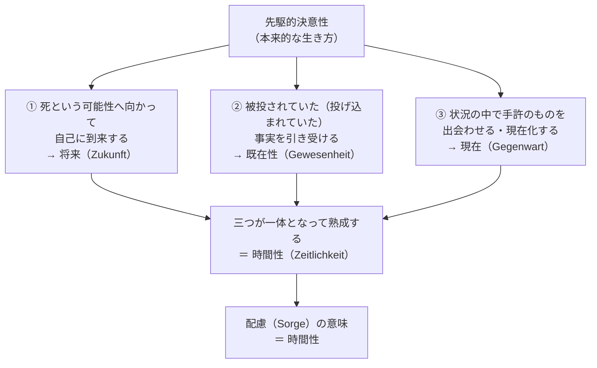

## 「§65」は何だと言っているのか

*ハイデガー『存在と時間』第65節*

---

### この節が言いたいこと――一行で

**「配慮（ダザインの存在の根本構造）を支えている意味の正体は、時間性である」。**

ハイデガーはこの節で、前節までに積み上げてきた「先駆的決意性」という本来的な生き方の分析を材料として使い、「では、その生き方をそもそも可能にしているものは何か」を問う。その答えとして導き出されるのが「時間性（Zeitlichkeit）」という概念であり、しかもそれは「将来・既在性・現在」という三つの脱自態が一体となって熟成する動的な構造として示される。

---

### 議論の出発点――「意味」とは何か

ハイデガーが最初に確認するのは、「意味」という言葉の使い方である。

> 意味とは、一次的な企投の何へ（Woraufhin）を意味しており、そこから或るものが、それがあるところのものとして、その可能性において了解されうる。

「意味」とは、何かを了解するときに私たちが知らず知らずのうちに寄りかかっている「向かう先」のことだ、と彼は言う。たとえばハンマーを「道具として」理解できるのは、「釘を打つ」という目的（向かう先）があるからだ。それと同じように、ダザイン（＝私たち人間の在り方）の存在全体を了解するときにも、何か「向かう先」があるはずだ――それが何かを問うのが、この節の中心課題である。

---

### 手がかり――「先駆的決意性」を解剖する

ハイデガーが手がかりにするのは、前節までに示された「先駆的決意性」という本来的な在り方である。これは平たく言えば、「自分がいつか必ず死ぬことを直視しながら、今ここで何をすべきかを引き受けて生きる」という姿勢だ。

この姿勢を細かく分解すると、三つの時間的な動きが見えてくる。

---

### 三つの時間的動き――それぞれの中身

#### ① 将来（Zukunft）――自己へと「到来する」こと

「将来」という言葉を使うと、私たちはすぐ「まだ来ていない今後の時点」を想像する。しかしハイデガーが言う「将来」は違う。

> ここで「将来」が意味するのは、いまだ「現実的」ではなく、いつかは到来するであろう或る現在ではなく、ダザインがその最も固有な存在可能において自己へ向かって到来するところの「到来（Kunft）」である。

これは、死という「超えられない可能性」に向かって自分を投げ出すことで、「自分とは何者か」を引き受けて自己に到来する動きのことだ。先駆（死への先走り）がダザインを本来的に将来的にする――ただし、そもそもダザインが存在として将来的な性格を持っているから先駆が可能なのであり、将来性はダザインの存在の根本的な性格である。

#### ② 既在性（Gewesenheit）――「あったこと」へと帰還すること

> ダザインが「私は——であり——あった」という仕方で概してそもそも存在する限りにおいてのみ、ダザインは将来的に自己自身へとそのように到来することができ、しかもそれは帰り来ることとしてである。

自分の死という最も固有な可能性に向かって先駆するとき、ダザインは同時に「自分がいかにして今ここに投げ込まれてきたか」という事実へと目を開く。この「被投された事実を引き受ける」動きが既在性だ。ハイデガーは「既在性は将来から発源する」と言う。つまり、本来的な将来への関わりがあってはじめて、過去を本来的に引き受けることができる。

#### ③ 現在（Gegenwart）――状況を「現在化する」こと

> 決意性がそれであるところのもの——みずから行為において把握するものを、ありのままに出会わせること——は、現在化という意味での現在としてのみ、決意性はそれでありうる。

将来に向かいつつ、過去を引き受けた決意性は、今ここの状況のなかで具体的に行為する。周囲にある道具や人々を「ありのままに出会わせる」のが現在の動きだ。本来的な現在は、通俗的な「今という点」ではなく、「瞬間（Augenblick）」――状況を全体として引き受けながら開示する眼差し――として現れる。

---

### 三つが一つになる――「時間性」の登場

> 将来的に自己へと帰り来ながら、決意性は現在化しつつ状況のなかへと身を置く。……このように既在しつつ現在化する将来として統一されたこの現象を、われわれは時間性と名付ける。

三つの動きはバラバラではなく、一体として成立する。この統一体を「時間性」と呼ぶ。そして時間性こそが、配慮（ダザインの存在の根本構造）を可能にするものだ。

| 配慮の構成契機 | 実存論的内容 | 根拠となる時間性の脱自態 |
|---|---|---|
| 自己に先立つこと（実存性） | 自分の可能性へ向かう投企 | 将来（Zukunft） |
| 既に……のうちにあること（事実性） | 被投された事実の引き受け | 既在性（Gewesenheit） |
| ……の傍らにあること（頽落） | 世界内部のものへの関わり | 現在（Gegenwart）＊ |

＊頽落に対応する現在化は、本来的時間性においては将来と既在性に「包み込まれた」まま保たれており、独立して前面に出るのは非本来的な時間性においてである。

---

### 「脱自態」とは何か

ハイデガーは将来・既在性・現在を「脱自態（Ekstasen）」と呼ぶ。

> 時間性は根源的な「それ自身における・それ自身にとっての外-自（Außer-sich）」である。

時間性は「一つの場所にじっとある存在者」ではなく、つねに自分自身の外へと向かいながら（脱出しながら）統一している動き——それ自体がいわば「外へ向かって開く」構造だ、ということである。通俗的な「今・今・今の連続」としての時間は、この根源的な脱自的時間性が平板化・派生したものにすぎない、とハイデガーは主張する。

---

### 将来の優位と時間性の有限性

ハイデガーは三つの脱自態を「等根源的」としながらも、将来に優位を認める。

> 根源的かつ本来的な時間性は、本来的な将来から時熟するのであり、しかもその仕方は、将来的に既在しながら、はじめて現在を呼び覚ますというものである。

さらに、配慮は「死への存在」でもあるから、将来は有限として開示される。

> 根源的な将来の脱自的性格は、まさにそれが存在可能を閉じるということ、すなわちそれ自身が閉じられていて、そのものとして無性の決意した実存的了解を可能にするという点に存している。

「時間はその後も続くではないか」という反論に対して、ハイデガーは答える。問題は「時間がいつまで続くか」ではなく、「自己へと向かうこと（到来すること）そのものの構造がどのようなものか」だ、と。時間性の有限性とは、時間の「長さが限られている」という話ではなく、「到来すること」という動き自体が超えられない無性（できないこと・根底のなさ）を内包しているという話なのである。

---

### この節の結論を四つの命題に

ハイデガー自身がこの節の末尾でまとめている。

> 時間は根源的には時間性の熟成（Zeitigung）として存在し、それとして配慮の構造の構成を可能にする。時間性は本質的に脱自的である。時間性は根源的に将来から熟成する。根源的な時間は有限である。

| 命題 | 一言で |
|---|---|
| 時間は時間性の「熟成」として存在する | 時間は流れるものではなく、ダザインが時熟する動き |
| 時間性は本質的に脱自的である | 自分の外へ向かいながら統一する構造を持つ |
| 時間性は根源的に将来から熟成する | 将来（到来）が全体を先導する |
| 根源的な時間は有限である | 死への存在として、到来すること自体が閉じられている |

---

### まとめ――§65 全体の流れ

この節は、「配慮という複雑な構造を一つの根拠で説明できるか」という問いに答える節だ。その根拠として示されるのが時間性であり、将来・既在性・現在という三つの脱自態が一体となって「熟成（zeitigt sich）」するという動的な構造として描かれる。

通俗的な「過去・現在・未来という時間の流れ」は、この根源的な時間性の派生形にすぎない。本来的な時間性とは、死という超えられない可能性へ向かいながら（将来）、投げ込まれた事実を引き受けつつ（既在性）、今ここの状況を開示する（現在）——その三つが同時に一体として成立する「生の動的構造」そのものである。
