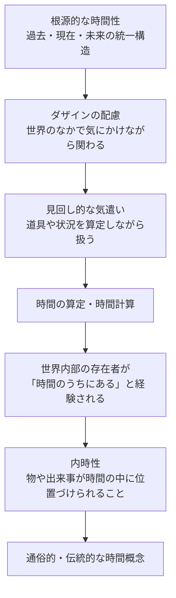

## 「§66」は何だと言っているのか

*ハイデガー『存在と時間』第66節*

---

### この節のひとことまとめ

第66節は、いわば「これからの仕事の地図」を広げる節である。ハイデガーはここで、これまで行ってきた分析を振り返りつつ、**なぜそれを「時間性」の観点からもう一度やり直さなければならないのか**、そして**その作業が最終的にどこへ向かうのか**を宣言する。

結論を先に言えば——

> 時間性はダザインの根本体制のすべての構造においてその力能を証示するはずである。

つまり、「人間の存在のあり方はすべて、時間性という根本構造から説明できる」という主張を、これから具体的に論証していくための予告篇が、この節の役割である。

---

### そもそも「時間的解釈」とは何か

ハイデガーはまず、作業の呼び名を定義する。

> 時間性を根拠としてダザインの存在体制の可能性を指示することを、われわれは略して――ただし暫定的にのみ――「時間的」解釈と呼ぶ。

**ダザイン**とは、ハイデガーが人間存在を指すときに使う語である。日常語の「人間」ではなく、「存在することが自分にとって問題になっているような存在者」というニュアンスを持つ。

「時間的解釈」とは、ダザインのさまざまな存在様式（気分・理解・言語・頽落など）が、どのように**時間性**（過去・現在・未来の統一的な構造）から成り立っているかを示す作業のことだ。

---

### なぜもう一度やり直すのか――「反復」の必要性

ここで重要な問いが生じる。前半の分析はすでに終わったのではないか? なぜ「反復」が必要なのか?

ハイデガーの答えはこうだ。これまでの分析は、まず**本来的なあり方**（先駆的決意性）から時間性を示した。しかし人間は普段、そのような本来的なあり方にいるわけではない。ほとんどの場合、**世人（ダス・マン）**——「みんな」という匿名の集団——のなかに埋もれた非本来的なあり方にいる。

> 開示性はほとんどの場合、頽落的な世人の自己解釈の非本来性のうちにとどまっている。

**世人（ダス・マン）**とは、「誰でもする」「みんながそう言っている」という形で、特定の誰でもない匿名の力として人間を支配している存在様式のことである。

そして、実存論的分析がそもそも出発点としたのは、この**日常性**、つまり平均的な人間のありふれた存在様式であった。だから、その日常性を今度は時間性の観点から解明し直さなければならない。これが「反復」の理由である。

---

### 反復することで何が明らかになるのか

反復は単なる繰り返しではない。ハイデガーは、反復によって二つのことが起きると言う。

| 反復によって得られるもの | 内容 |
|---|---|
| 見せかけの自明性の解体 | 「そんなのは当たり前だ」と思われていた分析の結果が、実は時間性の構造から必然的に導かれることが明らかになる |
| 分析の連関の明確化 | 前半の諸分析がなぜあの順番で行われたかの「必然性」が、時間的解釈を通じて初めて見えてくる |

また、反復は外面的・図式的な繰り返しではなく、**現象そのものが要求する別様の区分**に従って進む、とハイデガーは強調する。分析の順番や区切り方が変わるのは、方法の都合ではなく、事柄そのものがそう求めるからだ、というわけである。

---

### 自己性と歴史性――新しく浮かび上がるテーマ

反復的分析が特に重要な成果をもたらすテーマとして、ハイデガーは二つを挙げる。

**① 自己性（自存性）の時間的解釈**

> 私がそのつどそれである存在者の存在論的構造は、実存の自存性において集中している。

前半の分析では、「自己」とは何かという問いは、**配慮（Sorge）**の構造の記述に先立つ問題として、意図的に脇に置かれていた。**配慮**とは、ハイデガーがダザインの存在全体を特徴づける語で、「世界の中で気にかけながら関わり続けること」を指す。

今や配慮の構造と時間性が明らかになったので、「自己であること」と「自己でないこと（世人への埋没）」を、時間性の構造から説明できるようになる。これは自我をめぐる従来の哲学的誤りを正す根拠ともなる。

**② 歴史性（Geschichtlichkeit）の露示**

> この構造は、ダザインの歴史性として露わになる。

「ダザインは歴史的である」——これは単に「人間は歴史のなかに生きている」という常識的な観察ではない。それは、時間性という根本構造から必然的に導かれる**実存論的・存在論的な根本命題**である、とハイデガーは言う。

そしてこの歴史性こそが、学問としての「歴史学（Historie）」を成立させる根拠となる。人間が歴史を「学問として」研究できるのは、人間がそもそも歴史的な存在だからだ、という順序がここで示される。

---

### 日常的な時間経験はどこから来るのか――内時性の予告

節の後半では、日常的に私たちが使う「時間」の概念がどこから来るかが予告される。

ハイデガーはここで、日常的に私たちが「時間」と呼んでいるもの——時刻、期間、「いま」「まだ」「もう」といった時間表現——は、根源的な時間性から派生した**内時性（Innerzeitigkeit）**として生じると述べる。

> 内時性としての時間は、根源的な時間性の本質的な時熟様式から生じる。

また、ベルクソンの時間論——時間を「空間化されたもの」として批判する立場——に対して、ハイデガーは「内時性はそれ自体として真正な時間現象であり、空間への外化などではない」と釘を刺している。

---

### この節全体の見取り図

| 課題 | 内容 | これからどこで扱われるか |
|---|---|---|
| 非本来性の時間的解明 | 日常的な世人への埋没を時間性から説明する | 後続の日常性分析 |
| 自存性・非自存性の時間的解釈 | 本来的自己と世人への埋没を時間的に説明する | 自己性の分析 |
| 歴史性の解明 | 時間性から歴史的存在としてのダザインを導く | 歴史性論 |
| 内時性の解明 | 日常的時間経験の根拠を示す | 内時性論 |
| 存在概念一般の討議 | 以上すべてが最終的に「存在とは何か」の問いへ戻る | 書の全体的課題 |

---

### まとめ——§66が言いたいこと

第66節は内容を積み上げる節ではなく、**方向を示す節**である。ハイデガーがここで行っているのは、次の三つの宣言だ。

1. **前半の分析はやり直す必要がある**——なぜなら、本来性の側からだけでなく、日常的な非本来性の側からも、時間性を示さなければならないから。
2. **反復によって新しいテーマが浮かぶ**——自己性と歴史性は、時間性という根拠が明確になって初めて、独自の重みで論じられるようになる。
3. **日常的な「時間」も根源的時間性から説明できる**——内時性の解明を経て、通俗的な時間概念の起源が明らかになる。

そして最後にハイデガーは、これらすべての反復的分析もまた、結局は**「存在とは何か」という問い全体の枠内で、あらためて反復されることを要求する**と言って節を締める。個々の分析は、より大きな問いの内側でつねに暫定的なのだ——というのが、この節の最後のメッセージである。
