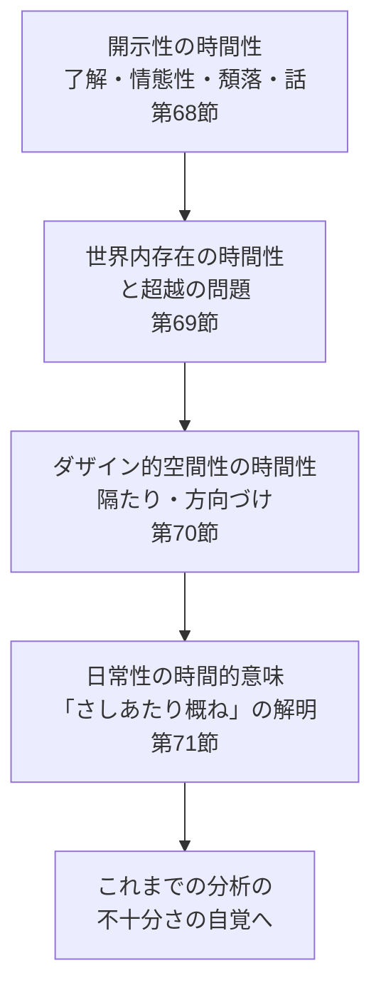

## 「§67」は何だと言っているのか

*ハイデガー『存在と時間』第67節*

---

### この節の結論を一言で

第67節は「内容ゼロの導入文」ではない。むしろ**第一篇の成果を棚卸しし、第二篇の分析がどの順番で何を目指すかを宣言する「設計図」**の節である。ハイデガーがここで言いたいのは、「根源（配慮）に戻ることは単純化ではなく、むしろ豊かさを要求する。その豊かさを今度は時間性という軸で再び辿り直す」という一点に尽きる。

---

### 第一の論点——「根源に戻る」とは何を意味するか

第一篇の「予備的分析」では、ダザイン（*Dasein*：「人間の存在様式」のこと。直訳すれば「そこにあること」）の構造が多角的に解き明かされ、最終的に**配慮**（*Sorge*：気にかけること・世話すること。ハイデガーにとって人間存在の根本的な構え）という一つの全体構造へと集約された。

しかしここでハイデガーは釘を刺す。

> 存在構成の根源性は、最終的な構成要素の単純性や唯一性と一致するわけではない。

つまり、「根っこに戻った＝シンプルになった」ではないということだ。配慮という根源は、そこから派生するすべての現象より「力能において先だって凌駕している」。根源は「より少ない」のではなく、「より豊か」なのである。

またこう続く。

> 「根源」へ向かう存在論的前進は、「通俗的悟性」にとっての存在的な自明性に達するのではなく、まさにそこに、あらゆる自明なものの問題性が開示されてくる。

哲学的に根源へ掘り下げるほど、日常的に「当たり前」と思っていたことが、じつは問い直しを要する謎として浮かび上がる——これがこの段落全体の主張である。

---

### 第二の論点——第一篇の成果の「棚卸し」

ハイデガーはここで第一篇の道筋を手短に振り返る。構造を整理すると次のようになる。

| 分析の順番 | 取り上げた現象 | 到達した問い |
|---|---|---|
| ① | 世界内存在のうち「世界」の側面 | 手許にあるもの・眼前にあるものとは何か |
| ② | 内世界性の析出 | 世界性（*Weltlichkeit*）とは何か |
| ③ | 世界性の構造＝有意義性 | 了解・投企・存在可能との連結 |
| ④ | 「そこ（Da）」の開示性 | 開示性の構造：了解・情態性・頽落・話 |
| ⑤ | 以上の全体の根底 | 配慮（*Sorge*）という構造的全体性 |

この棚卸しは単なる復習ではない。「次に何を時間的に問い直すか」の材料リストを確認する作業である。

---

### 第三の論点——第二篇の「設計図」

棚卸しが終わると、ハイデガーは第四章（本節を含む章）の分析が辿る道筋を明示する。

> 日常的ダザインの時間的解釈は、開示性を構成する諸構造に着手すべきである。

「開示性」とは、ダザインが世界と自分自身を「照らし出している」その在り方のこと。その構成要素は**了解・情態性・頽落・話**の四つである。第一篇ではこれらを「何があるか」として記述した。第二篇では「それがどのように時熟（*Zeitigung*：時間性が具体的に展開すること）するか」を問う。

分析の進行予定をまとめると以下のようになる。

ここで注目すべきは最終地点である。第71節は単に分析を「完成させる」のではなく、**それまでの分析がどこまで不十分であったかを明らかにする**ことを目的とする、とハイデガーは宣言している。これは哲学的誠実さの表明であり、「完結した体系を提示する」という姿勢とは対照的である。

---

### まとめ——§67が果たしている役割

| 役割 | 内容 |
|---|---|
| 原理の確認 | 根源（配慮）に戻ることは単純化ではなく豊かさを要求する |
| 成果の棚卸し | 第一篇の分析の順序と到達点を短く再整理する |
| 方針の宣言 | 開示性の四構造を時間性の観点から順に問い直す |
| 問いの射程 | 最終的には分析の「不十分さ」を自覚することへ向かう |

§67 は「つなぎ」の節に見えるが、実際には**第一篇と第二篇の間の哲学的緊張を可視化する**場所である。「根源に戻るほど問いは増す」という逆説が、これ以降の章全体のトーンを決めているのである。
