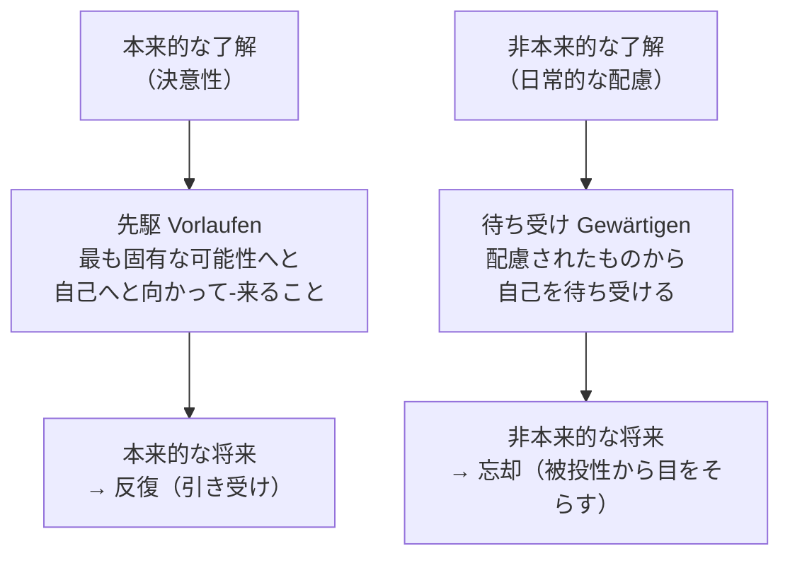

## 「§68」は何だと言っているのか

*ハイデガー『存在と時間』第68節*

---

### この節の結論をひとことで

「了解・情態性（気分）・頽落・語り」という、ダザイン（人間の存在様式）を構成する四つの要素は、それぞれ**将来・既在性・現在**という時間性の三つの次元のどれかを「主軸」として成り立っている。そして、それらは孤立した「次元」ではなく、つねに三つ一組で動いている。この節はその仕組みを一つずつ丁寧に論証し、最後に「配慮（ケア）全体の統一は時間性に根拠をもつ」と締めくくる。

---

### 前置き――なぜこの節が必要か

ハイデガーはすでに、人間の存在様式（ダザイン）の根本構造を**配慮**と呼んでいた。配慮とは「世界の中に投げ込まれながら、何かに気を遣いつつ、先へ先へと関わり続ける」あの存在のあり方全体を指す言葉である。

§68 はその配慮の内部構造——了解、情態性、頽落、語り——を時間という視点から個別に解剖する章である。

> 配慮の具体的な時間的構成を示すとは、その構造契機を——すなわち了解、情態性、頽落、語りを——個別に時間的に解釈することを意味する。

冒頭でハイデガーはこう宣言する。以下がその実行である。

---

### a）了解の時間性――「将来」が根拠

**了解**（Verstehen）とは、ここでは「何かを説明できる能力」ではない。自分がどんな可能性の中に立っているかを、実際に生きながら把握していること、そのような実存の構えを指す。

> 了解とは次のことを意味する——或る存在可能へと企投的に-存在すること。

「企投（Entwurf）」とは、自分の可能性へと自分を投げ入れること。将来の自分のあり方へと向かっていること、といえばわかりやすい。

だからこそ、了解の時間的な根拠は**将来**である。

| 了解の様式 | 将来の時熟 | 既在性の時熟 | 現在の時熟 |
|---|---|---|---|
| 本来的（決意性） | 先駆——自己へと向かって来る | 反復——被投性を引き受ける | 瞬間——状況を開く |
| 非本来的（日常） | 待ち受け——外から自己を待つ | 忘却——固有の被投性を見失う | 現在化——目前のものに引きずられる |

ポイントは「非本来的な了解も将来から時熟する」という逆説的な主張だ。ただしその将来は、自分の最も固有な可能性（死へ向かう孤独な存在可能）へと向かうのではなく、「配慮されたもの（仕事・用具・世間）が与えるか否か」によって自己を待ち受けるという様式をとる。

---

### b）情態性の時間性――「既在性」が根拠

**情態性**（Befindlichkeit）とは、「気分」のことである。私たちはいつも、何らかの気分の中に「置かれている」。その気分が、自分がどこにいるか（「そこ・Da」）を開示したり、逆に閉ざしたりする。

> 気分は、私がそのつど一次的に被投された存在者として存在するその様式を代表する。

**被投性**（Geworfenheit）とは、自分が望んで生まれたのではないこと、なぜここにこうして存在しているのかを説明できないという「事実のあること」を指す。情態性はその被投性のあり方を、認識としてではなく気分として開示する。

だからこそ、情態性の根拠は**既在性**（Gewesenheit、「かつてあったこと」）である。

> 了解は根源的には将来に根差しており、これに対して情態性は根源的には既在性において時熟する。

節はここで**恐れ**と**不安**という二つの気分を詳しく比べる。

#### 恐れの時間性

恐れ（Furcht）は、環境世界の中の何か具体的な脅威を待機するという**非本来的な将来**をもつ。しかし恐れの本質は待機だけではない。脅威的なものが「自己」を傷つけると感じられる、その自己への立ち返りがあってはじめて恐れになる。

> 怖れる待機が「自己」を怖れる——その実存論的・時間的意味は、自己忘却によって構成される。

恐れる者は自己を忘却し、次の可能性から次の可能性へと飛び移る（混乱した現在化）。その時間性は「待機しつつ・現在化しつつある忘却」である。

#### 不安の時間性

不安（Angst）は、恐れとは根本的に異なる。恐れには具体的な「何か」がある（燃えている家、迫る危険）が、不安の「何に対して」は確定できない。それはダザイン自身の「不気味さ（Unheimlichkeit）」、世界内存在の根拠のなさへの不安である。

> 不安の「何に対して」はすでに「そこ」にある、すなわちダザイン自身がそれである。

不安は被投性そのものへと連れ戻す。この連れ戻しが、**既在性の本来的な脱自様式**である。

> 不安は、被投性へと、反復可能なものとして、連れ戻すのである。

| 気分 | 既在性の様式 | 将来の様式 | 現在の様式 | 根源 |
|---|---|---|---|---|
| 恐れ | 忘却（自己を失う） | 混乱した待機 | 抑制なき現在化 | 世界内的なものに不意打ちされる |
| 不安 | 被投性への連れ戻し（反復可能性） | 本来的な将来を飛躍の寸前に保つ | 保持された現在 | ダザイン自身から湧き上がる |

---

### c）頽落の時間性――「現在」が根拠

**頽落**（Verfallen）とは、ダザインがさしあたりほとんどつねに「世間」「配慮されたもの」の中に埋没し、自己を失っている傾向のことである。ハイデガーはここで**好奇心**（Neugier）を手がかりにする。

好奇心とは、見ることそれ自体のために見ようとする傾向だ。何かを理解するためではなく、次の刺激・新しい何かへと常に跳び移る。

その時間的な構造はこうだ。

> 好奇心を構成するのは、抑制されていない現前化であり、それはただ現前化するだけで、そのことによって常に、自分がそこで抑制されずに「保持」されているところの待機から逃れ去ろうとする。

本来の待機（ある可能性をしっかり持ちこたえること）から現前化が「跳び離れる」。すると待機はそのあとを追って跳ぶ（追跳び）。結果として、どこにも留まれない**散漫**（Zerstreuung）と**滞在なき状態**が生まれる。

これは**瞬間**（Augenblick）と正反対である。瞬間は決意性のうちで保持された現在であり、状況を開示する。好奇心の現在化は、どこにでもいるようでどこにもいない現在である。

> 前者においてダザインはどこにでもいると同時にどこにもいない。後者〔瞬間〕は実存を状況へともたらし、本来的な「現」を開示する。

頽落の根源はさらに掘り下げられる。現在が「跳び離れ」ようとする傾向は、被投された死への存在という重さから逃げようとすることに根拠をもつ。迷失は外から来るのではなく、本来的な時間性そのものの変様として生じる。

---

### d）語りの時間性――時間性の地盤の上に立つ言語

語り（Rede）の節は短く、主に将来の課題を示すものだ。ハイデガーの主張は次の一点に絞れる。

> 言語活動はそれ自身において時間的である。

動詞の時制や「動作様態」は、出来事が「時間の中で」起きるから言語に現れるのではない。語ること自体が、時間性の脱自的統一（将来・既在性・現在）の中で初めて成り立つ。

「繋辞（ist＝〜である）」の存在論的意味や「意味の生成」を解明するためには、言語論の前に時間性の問題を解き明かすことが必要だ——この節はそう告げて次の問いへの橋渡しをする。

---

### 最後のまとめ――三つの脱自は「継起」しない

節の末尾でハイデガーは決定的な補足をする。

> 将来は既在性より遅くあるのでも、既在性は現在より早くあるのでもない。時間性は、既在しつつ-現在化する将来として時熟する。

時間性の三つの次元（将来・既在性・現在）は、順番に並ぶ「過去→現在→未来」ではない。それらは**つねに同時に、一つの統一として動いている**。了解が将来を「主軸」としながらも既在性と現在を含むように、どの現象も三つの次元の脱自的統一の中で時熟する。

| 構造契機 | 根拠となる主軸 | 本来的な時熟 | 非本来的な時熟 |
|---|---|---|---|
| 了解 | 将来 | 先駆（自己へと向かって来る） | 待ち受け（外から待つ） |
| 情態性 | 既在性 | 反復・不安的連れ戻し | 忘却（被投性から目をそらす） |
| 頽落 | 現在 | 瞬間（状況を開く） | 現在化・散漫（跳び離れる） |
| 語り | 三者の統一 | 存在と真理の問いへ | （今節では展開されない） |

---

### この節が言いたいこと、一段深く

§68 は「時間とは何か」を抽象的に論じているのではない。「人間が了解したり、気分になったり、世間に引きずられたりする、その一つひとつが、なぜそういう形で起きるのか」を時間性という鍵で説明する試みだ。

恐れは忘却の時熟だから混乱する。不安は被投性への連れ戻しだから固有の可能性を照らし出す。好奇心は抑制なき現在化だからどこにも留まれない。——これらはバラバラな「心理現象」ではなく、時間性という一つの根拠からそれぞれ必然的に生じてくる現象として描かれている。それがこの節の核心である。
