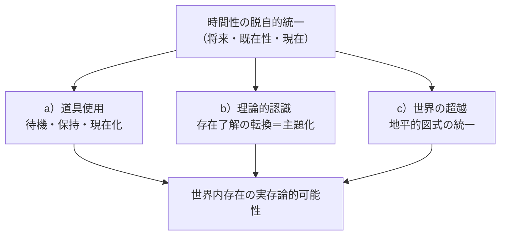
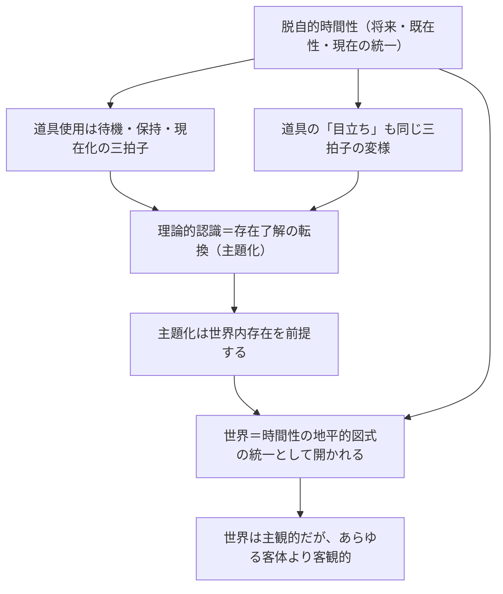

## 「§69」は何だと言っているのか

*ハイデガー『存在と時間』第69節*

---

### この節で言いたいことを一言で

「世界の中で道具を使ったり科学的に考えたりできるのはなぜか」——その答えが**時間性**にある、というのがこの節全体の結論です。

ハイデガーはここで、日常の「もの使い」から理論的思考、さらには「世界とは何か」という問いまでを一本の糸でつなごうとしています。その糸が「脱自的時間性（将来・既在性・現在という三つの次元が一つに統合された時間の構造）」です。

---

### 節の全体構成を把握する

この節は三つのパートに分かれています。

| パート | 問い | 答えの要点 |
|--------|------|-----------|
| **a）** 見回し的配慮の時間性 | 道具を使うとき、時間はどう働いているか | 「待機・保持・現在化」の三拍子が道具使用を支えている |
| **b）** 配慮から理論的認識への変様 | 実践から科学はどう生まれるか | 存在了解の「転換」が鍵。理論にも独自の時間構造がある |
| **c）** 世界の超越の時間的問題 | 「世界」はそもそもなぜ可能か | 時間性の地平的構造が世界を開く。世界は時熟する |

---

### a）道具を使うとき——時間はどう動いているか

ハイデガーは最初に、最もありふれた場面——ハンマーを握って釘を打つ——から出発します。

道具を使うとき、私たちは一本の釘だけを見ているわけではありません。

> 特定の道具の使用と操作は、それとしてつねに一つの道具連関へと方位づけられている。

「道具連関（Zeugzusammenhang）」とは、ハンマー・釘・板・仕事全体がひとつながりになったネットワークのことです。ものを扱うときには、この連関全体がすでに開かれている、とハイデガーは言います。

この開かれ方を支えているのが、時間の三つの次元の働きです。

| 時間の次元 | 専門語 | 道具使用での働き |
|-----------|--------|----------------|
| 将来 | 待機（Gewärtigen） | 「何のために」（作品の完成）を先取りする |
| 過去 | 保持（Behalten） | 「どの道具か」（適所性の連関）を保ち続ける |
| 現在 | 現在化（Gegenwärtigen） | 今まさにその道具に関与する |

この三拍子が一体になって初めて、道具が「道具として」出会われます。

注目すべきは、道具使用には「忘却」が必要だとハイデガーが言う点です。

> 道具世界へと「喪失」し、「現実に」仕事に取りかかり……自己は自己自身を忘れなければならない。

仕事に集中しているとき、私たちは自分のことを考えていません。この自己忘却こそが、作業への没入を可能にする——そしてそれも時間性の一様態だと、ハイデガーは見なします。

---

### 道具が「目立つ」とき——現在化の引き留め

道具がうまく働かないとき（壊れている、なくなっているなど）、状況は変わります。

> 待機しつつ保持する現在化は……適所連関のなかへ没入することを妨げられる。

「現在化が引き留められる」とは、道具の連関から引っ張り出されて、問題の道具そのものに注意が向く、ということです。それまで透明だった連関が一気に可視化される。

この「目立ち」さえも、待機・保持・現在化の脱自的統一なしには起こりえない、とハイデガーは論じます。「体験がバラバラに連続しているだけ」では、「使えない」という事態は成立しないのです。

---

### b）実践から理論へ——何が変わるのか

では、道具使用から科学的認識はどうやって生まれるのか。よくある説明は「手を止めて純粋に見る」というものです。ハイデガーはこれを退けます。

> 気遣いつつ交わるなかで特定の取り扱いが停止されても、それを導いていた視回りが単なる残余として残るわけではない。

手を止めても、周囲見回し（環視）は残ります。むしろ「点検」や「確認」として鋭化することすらある。「理論的態度」はそれだけでは生まれません。

では何が変わるのか。ハイデガーが示す答えは「存在了解の転換」です。

槌を例にとります。

- 配慮的な語り：「槌は重すぎる」（扱いにくい、という意味）
- 理論的な語り：「槌は重さという属性をもつ」（物体としての性質）

> 変様した語りにおいて……それは、出会われる手許にあるものを「新たに」、眼前にあるものとして見るからである。

「手許にあるもの（Zuhandenes）」とは道具として使われるもの、「眼前にあるもの（Vorhandenes）」とは純粋に目の前にあるモノのことです。後者として見るとき、存在了解が変わっています。

さらにハイデガーは、数学的物理学を例に挙げます。近代科学で重要だったのは「事実の観察」ではなく、「自然の数学的企投」——つまり、自然を特定の仕方で先取り的に了解する枠組みを設けること——だった、と言います。

> 企投されたところの自然の「光」のもとにおいてのみ、「事実」と呼ばれるものが見出されうる。

この企投によって存在者を科学的探究の対象として解放することを、ハイデガーは「主題化（Thematisierung）」と呼びます。主題化は存在了解の変様であり分節化です。

そして主題化が可能なためには、ダザイン（人間的存在者のこと）はすでに「世界」を了解していなければならない——つまり、理論には実践的世界内存在が前提されている、と論じます。

---

### c）「世界」はなぜ可能なのか——超越の問題

節の最後で、議論は最も深いところに降りていきます。

**問い：** 世界というものは、そもそもなぜ存在できるのか。

ハイデガーの手がかりは「地平的図式（horizontales Schema）」です。

脱自（Ekstase）とは「自己の外へ」という時間の動きのことですが、その「外へ」には必ず「向かう先」がある。この向かう先を「地平的図式」と呼びます。

| 時間の脱自 | 地平的図式 |
|-----------|-----------|
| 将来 | 「自己のために（Um-willen seiner）」——自己の存在可能 |
| 既在性 | 「委託されたそれへ」——被投性の前に投げ出されたこと |
| 現在 | 「……のために（Um-zu）」——配慮的に関わる何か |

この三つの地平が一体になって開くのが「世界」です。

> ダザインが時熟するかぎり、世界もまた存在する。

「時熟（Zeitigung）」とは、時間性が具体的に展開していくことです。世界は、手前に転がっているモノではなく、時間性の展開とともに「開かれる」ものだ、とハイデガーは言います。

---

### 「主観的な世界」が「客観」より客観的——節の締めくくり

ここでハイデガーは逆説的な言い回しをします。

> 世界は「主観的」である。しかしこの「主観的な」世界は、時間的―超越的なものとして、あらゆる可能な「客体」よりも「客観的」なのである。

通常「主観的」は「あてにならない」という意味で使われます。ここでは違います。世界は、いかなる個別の「客体（対象）」よりも根源的な次元にある——だからこそ「超越的」であり、それが時間性に根ざしているかぎり「最も堅固な」のです。

「超越の問題」は「主観がどうやって客体へ出ていくか」ではありません。

> 問われるべきは、存在者が世界内部的に出会われ、出会われるものとして客体化されることを存在論的に可能にするものは何か、ということである。

答えは——時間性の脱自的・地平的統一が世界を超越的に開く、ということです。そしてこの「世界の開かれ」の上に初めて、道具使用も科学的認識も成立します。

---

### まとめ——§69の論証の流れ

| 問い | 節での答え |
|------|-----------|
| 道具はなぜ「道具として」出会われるのか | 待機・保持・現在化という時間的統一が道具連関を開くから |
| 理論はなぜ実践の単なる「欠如」ではないのか | 存在了解の積極的転換（主題化）だから |
| 世界はなぜ可能なのか | 時間性の地平的統一が超越的に世界を開くから |
| 「超越」とは何か | 主観が客体へ出ていくことではなく、時間性が世界を根源的に開くこと |

---

§69は、道具を握る手の動きから始まり、科学の成立を経て、「世界とは何か」という最深部の問いへと一気に降りていく節です。すべての段階で答えを提供しているのは「時間性」という一つの原理——それがこの節の核心です。
