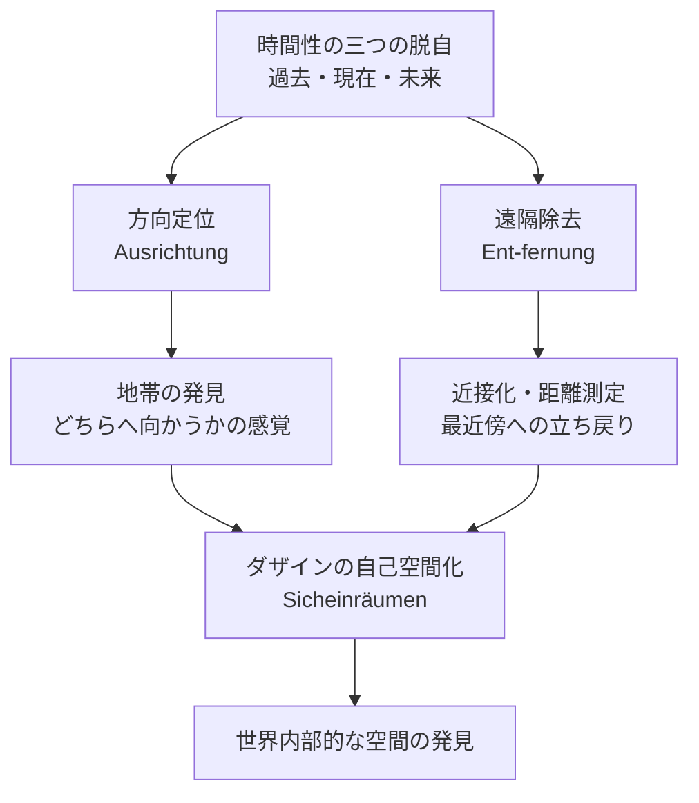

## 「§70」は何だと言っているのか

*ハイデガー『存在と時間』第70節*

---

### この節の結論を先に言ってしまう

ダザイン（人間的な存在のあり方）は「空間的な存在者」でもある。では、これまで積み上げてきた「時間性が根底にある」という議論と、この空間性はどう折り合うのか。ハイデガーの答えはこうだ——

> 脱自的・地平的な時間性の基盤の上においてのみ、ダザインの空間への突入が可能となる。

**ダザインの空間性は、時間性によって支えられている。ただし、空間を時間に溶かしてしまうわけではない。**
空間は空間として独立した意味を持つが、そもそもそこへ「突入」できるのは、ダザインが時間性として存在しているからだ、というのがこの節の核心である。

---

### 問題の立て方——「空間は時間性の外なのか」

§§22–24 でハイデガーはすでに、ダザインが固有の仕方で空間的であることを示していた。しかし時間性が「配慮の存在意味」だと言うなら、空間性はどこに収まるのか。二つの懸念がある。

1. **並列説への誘惑**：「ダザインは時間的『かつ』空間的だ」と、単純に並べてしまえばいいのではないか。
2. **カント的解釈への誘惑**：空間を時間に「格下げ」して、時間のほうが上位だとすればいいのではないか。

ハイデガーはどちらも退ける。

> 空間を時間から演繹すること、あるいは純粋な時間へと解消することを目指すことはできない。

カントが言うような「時間のなかで心的表象が流れ、それに空間が付随する」という話は、ダザインの実存論的な空間性とは別の、存在的（ものとしての事実確認レベル）な話にすぎないとされる。

---

### ダザインの空間性とは何だったか——復習

本論に入る前に、ハイデガーはダザインの空間性の特徴を短く再確認する。

> ダザインは現実的な物や道具のように一つの空間片を充填するのではない。

椅子や石ころは、ある空間の「片」をぴったり埋める。だがダザインは違う。ダザインは「遊び場（Spielraum）を切り開く」存在だ。

| 存在者の種類 | 空間との関係 |
|---|---|
| 物・道具 | 一定の空間片を充填する（ここにある） |
| ダザイン | 遊び場を切り開き、地所（Platz）を占有する |

さらに、ダザインが空間的であるのは「精神と身体の結合という不完全さゆえ」でもない。むしろ、ダザインが「精神的」であるからこそ、物体とはまったく異なる仕方で空間的になれるのだ、とハイデガーは言う。

ダザインの空間性を構成するのは二つの動き——**方向定位（Ausrichtung）**と**遠隔除去（Ent-fernung）**だ。ごく簡単に言えば、「どっちを向いているか」と「どれだけ近づけるか」である。

---

### 方向定位と遠隔除去が時間性に根差すしくみ

ここが節のメインの論証部分になる。

**方向定位**のほうから見てみよう。「地帯（Gegend）」という言葉が出てくる。これは道具が「帰属しうる可能的な『どこへ』」、つまり「この道具はあちらの方向へ片付けられるもの」という、配慮の場のまとまりを指す。この地帯は、「開示された世界の地平」においてのみ了解できる。

> 地帯のこの方向を定めつつの発見は、可能的な「そこへ」と「ここへ」を脱自的に保持しつつ待機する（ekstatisch behaltend gewärtigen）ことのうちに根拠づけられている。

「脱自的に保持しつつ待機する」とは、過去（保持）と未来（待機）という時間性の脱自（じぶんから外へ出ること）の働きを指す。つまり、「あちらの方向」という空間的な感覚は、時間性の脱自的な構造の上に乗っている。

**遠隔除去**については、近接化・距離の測定・「今ここ」への立ち戻りとして説明される。

> 近接化、ならびに遠隔除去された世界内現前存在者の間における距離の推定と測定は、現在化（Gegenwärtigen）のうちに根拠づけられる。

「現在化」は時間性の「現在」という脱自に対応する。何かを「今ここに近づける」という動きは、時間性の現在という契機なしには成り立たない。

---

### 頽落・現在化・空間への「迷い込み」

ハイデガーはさらに踏み込んで、なぜ人間が「空間的な表象」に引きずられやすいかを説明する。

配慮のうちに「頽落（Verfallen）」という構造がある。ものごとに没入して近づいていくとき、現在化（今ここへの没頭）が前面に出て、「待機的な忘却が現在化に後続する」——つまり、未来や過去の視野を失い、現在に貼り付いてしまう。

> 「さしあたり」ただ一つの事物だけが眼前存在しており、たしかにここにあるが、空間一般のうちで不確定なものとして存在しているにすぎないという仮象（Schein）が生じる。

こうして「目の前に物がある」という空間的な知覚が、もっとも原初的な経験のように見えてしまう。

さらにこの頽落が、私たちの言葉や自己理解を空間的なメタファーで満たす。

> 意味と概念の分節化における空間的なもののこの優位の根拠は、空間の特定の支配力にあるのではなく、ダザインの存在様式にある。

「高い理想」「深い思い」「広い視野」——日常言語は空間的表現だらけだ。それはなぜか。空間が本当に優位だからではなく、**頽落しつつ現在化に迷い込むダザインの存在様式ゆえ**に、空間的なものが了解の「指導の糸」になってしまうのだ、とハイデガーは言う。

---

### まとめ——時間性と空間性の関係の整理

| 問い | この節での答え |
|---|---|
| 空間性は時間性と単純に並べられるか | 否。空間性は時間性に根差している |
| 空間は時間に溶かされるか | 否。空間は独自の意味を持つ |
| カント的な「時間優位」と同じか | 否。それは存在的（事実確認的）な話にすぎない |
| 方向定位の根拠は | 時間性の脱自的な保持と待機（過去・未来の契機） |
| 遠隔除去・近接化の根拠は | 時間性の「現在化」 |
| 空間的表象が日常言語を支配する理由は | 空間の力ではなく、頽落というダザインの存在様式 |

ダザインは時間性として存在しているから、空間に「突入」できる。しかし空間を時間に還元したら何も見えなくなる。その微妙な関係——時間性が空間性を「包み込む」が、空間性をなくしはしない——を確認することが、この節の仕事だった。
