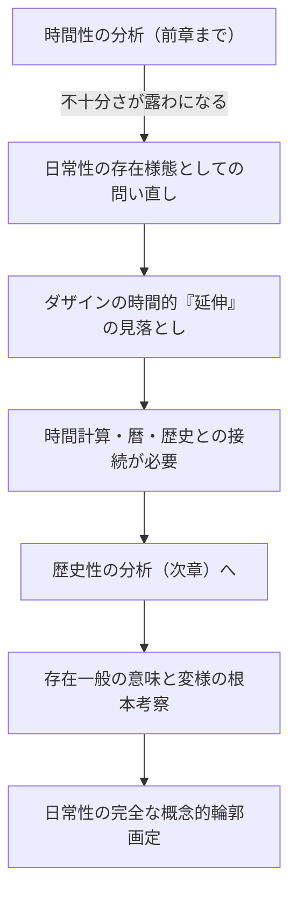

## 「§71」は何だと言っているのか

*ハイデガー『存在と時間』第71節*

---

### この節の結論を一言で

「日常性」とは単なる「毎日の生活」という描写ではなく、**ダザイン（人間の存在のあり方）の存在そのものの一様態**である。そしてその存在論的な意味を完全に解明するには、時間性の分析だけでなく、「歴史性」や「存在一般」の考察まで射程を広げなければならない、とハイデガーは言っている。

この節は、前章（時間性の分析）を締めくくりつつ、次章（歴史性）への橋渡しをする「踊り場」のような位置にある。

---

### ① なぜ今ここで「日常性」を問い直すのか

分析論の出発点で、ハイデガーは意図的に「英雄的な実存」や「卓越した瞬間」を主題に選ばなかった。代わりに選んだのが、**日常性（Alltäglichkeit）** ——人間が「さしあたり、そしてたいていの場合」に身を置いている平均的な存在様式——だった。

しかしその出発点では、「日常性」とは実際には何を意味するのか、存在論的にきちんと定義されていなかった。今や時間性の分析が一段落したところで、その問いに正面から向き合う必要が生じている。

---

### ② 「日常性」を誤解しないために

「日常」という言葉には、暦的・時計的なイメージが自然につきまとう。「毎日が積み重なって一生になる」というイメージだ。しかしハイデガーはそれを退ける。

> 「毎日」とは、ダザインにその「生涯」において与えられた「日々」の総和を意味するのではない。

では日常性とは何か。ハイデガーはこう言い換える。「生涯にわたって」ダザインを貫き支配する、実存の**ある様式**だ。その特徴を整理するとこうなる。

| キーワード | 意味 |
|---|---|
| さしあたり | 公共の場で「顕わ」になっている仕方（内面はどうあれ） |
| たいていの場合 | 常にではないが、通例あらゆる人に対して姿を現す仕方 |
| 日々を漫然と生きる | 流れに身を任せ、習慣のなかで安らう（あるいは安らいでいると思い込む）あり方 |
| 永遠の昨日 | 日常的な「翌日」は、結局いつも同じ昨日の繰り返しにすぎない |
| 気晴らし | 単調さの中で、その日の出来事を「変化」として受け取って紛らわせること |

---

### ③ 日常性は「見かけ」ではなく「存在様態」である

ここがこの節の重要な主張のひとつだ。日常性を「人間が外から見せている様子」「ふだんの振る舞いの描写」として扱ってはいけない。

> 日常性とは存在の一様態であるが、それにはもとより公共的な開示性が属している。

つまり日常性とは、ダザインが**世界に向けて開かれている（開示されている）具体的なあり方**そのものだ。そしてその開示のされ方には、**淡い無調子さ（鈍い色合いの気分）** が漂っている。人はそのなかで鈍く「苦しむ」こともあり、散漫のなかで更なる散漫へと逃れようとすることもある。また、ある瞬間に日常を「克服」することもある。ただし——

> 日常を消し去ることは決してない。

どれほど特別な瞬間であっても、日常そのものが消えるわけではない。これはハイデガーが日常性を単なる「凡庸さ」ではなく、**逃れがたい存在構造**として捉えている証拠だ。

---

### ④ これまでの時間性分析の限界

節の後半でハイデガーは率直に問題を認める。これまでの時間性の解釈は、ダザインをある一定の「状況」や「瞬間」に固定しがちだった。その結果、ある重要な事実を見落としてきた。

> われわれはこれまで絶えずダザインをある一定の情況や状況に固定し、ダザインが自分の日々を生きながら、その日々の連続のなかで「時間的に」延伸するという事実を「一貫して」看過してきたのではないか。

単調さや習慣、「昨日のごとく今日あり」という感覚は、**ダザインが時間のなかで引き伸ばされている（延伸している）こと**を前提にして初めて理解できる。また、人間が毎日「時間を計算」し、カレンダーや時計で生活を組み立てるという事実も、この延伸と切り離せない。

これらを時間性の解釈に組み込まなければ、日常性の存在論的意味は問えない——そうハイデガーは言う。

---

### ⑤ 日常性の完全な解明はどこへ向かうか

> 日常性という標題のもとで根本的には時間性以外の何ものも意味されていないのであり、しかもこの時間性こそがダザインの存在を可能にするものであるがゆえに、日常性の十分な概念的輪郭画定は、存在一般の意味とその可能な変様についての根本的な考察の枠内においてのみ成就されることができる。

ここで§71は閉じる。日常性は時間性の一表現であり、その完全な解明は「存在一般の意味」という問い——『存在と時間』全体の問い——とともにしか達成できない。だから次章「歴史性」へと歩みが移されるのだ。

---

### まとめ：§71 の「踊り場」としての役割

| 問い | §71 の答え |
|---|---|
| 日常性とは何か | カレンダー的な「毎日の集積」ではなく、存在の一様態 |
| これまでの分析で十分か | 不十分。「時間的延伸」と「時間計算」を見落としていた |
| なぜ歴史性が次に来るのか | 日常性の完全な解明には、延伸・歴史・存在一般まで広げた考察が必要 |
| この節の位置づけ | 時間性の分析を総括し、歴史性の分析への扉を開く橋渡し節 |

§71 は「答えを出す節」ではなく、「問いの射程を広げる節」だ。ハイデガーは日常性という最も平凡なものが、実は最も深い謎を孕んでいると示しながら、次の章へと読者を連れ出していく。
