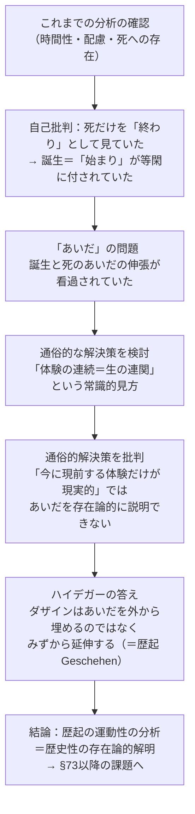

## 「§72」は何だと言っているのか

*ハイデガー『存在と時間』第72節*

---

### この節の結論を一言で言うと

「ダザイン（人間的な存在者）は、誕生から死へと**みずから延び広がる運動そのもの**であり、その運動の存在論的な解明こそが『歴史性』の問題の出発点となる」――これが§72の核心である。

節の前半は、これまでの分析が「死」にばかり着目して**誕生と死の「あいだ」を見落としていた**という自己批判。後半は、その「あいだ」を正しく捉えるには「通俗的な時間理解（体験が今の連続として流れる）」では不十分であり、**時間性こそが歴史性を解明する根拠になる**という論じ方で議論を次節以降へつなぐ。

---

### 論証の流れを整理する

---

### ① これまでの分析の成果を確認する

節の冒頭でハイデガーは、実存論的分析論（人間の存在構造の解明）がここまで何を達成したかを振り返る。

> 配慮の可能性の根源的条件としての時間性を解明することによって、要求されていた根源的なダザインの解釈は達成されたように思われる。

「ダザイン（ここでは人間の在り方全般を指す概念）」の存在構造は**配慮（Sorge：気にかけながら世界に関わるあり方）**として捉えられ、その根底に**時間性（過去・現在・未来が統一された時間の在り方）**が見出された。また、死・負い目・良心の分析によって「本来的な全体でありうること」も明らかにされた。

この確認の上で、ハイデガーは「しかし、ちょっと待て」と問い直しに入る。

---

### ② 見落としの発見――「あいだ」が抜けていた

> 死はダザインの「終わり」に過ぎず、形式的に見れば、ダザインの全体性を包括するただ一方の端に過ぎない。もう一方の「端」は「始まり」、すなわち「誕生」である。

これまでの分析は「死」という終わりの端に照準を合わせていた。だが人間の存在には**もう一方の端＝誕生**があり、さらに重要なのは**その両端のあいだの「伸張（Erstreckung）」**、つまり生の連関そのものが見落とされていたということだ。

ハイデガーはこれを自己批判として率直に認める。

> 始まりへの存在が等閑に付されただけでなく、とりわけ誕生と死のあいだのダザインの伸張が看過されていた。

「伸張」とは、人間が時間の中で引き伸ばされた存在として在ること――始まりから終わりへと**跨がって存在している**、その跨がり方そのものを指す。

---

### ③ 通俗的な解決策の検討と批判

では常識はこの「あいだ」をどう説明するか。ハイデガーはごく一般的な見方を取り上げる。

> 「時間の中」における体験の連続から成り立っている。

つまり「人生とは、次々と現れては消える体験の連続だ」という理解である。この見方では、**今この瞬間に現前している体験だけが「現実的」**であり、過去の体験はもうなく、未来の体験はまだない。

ハイデガーの批判はここに集中する。

> この体験の絶え間ない交替において……ダザインは、いわば今の連続を飛び跳ねるようにして通過する。

「今の連続を飛び跳ねる」というイメージは皮肉を含んでいる。もし現実なのが「今この瞬間」だけなら、誕生も死も（それが「今」にはないという意味で）「非現実的」になってしまう。すると**誕生と死のあいだを存在論的に語る根拠がなくなる**――これが通俗的理解の限界だ。

| 通俗的な理解 | 問題点 |
|---|---|
| 体験の連続が生の連関を作る | 「今」にある体験だけが現実的になってしまう |
| 誕生・死は「外からダザインを囲む枠」 | 枠自体は「今」ではないので現実性を欠く |
| 自己は体験の交替の中で同一性を持つ | その持続の存在論的な構造が未解明のまま |

---

### ④ ハイデガーの答え――「延伸するのはダザイン自身」

批判の後にハイデガーが打ち出す答えが、この節の最も重要な一段落である。

> ダザインは、みずから延伸するのであり、その際、みずからの存在が延伸として構成されていることが、あらかじめ成り立っている。

「延伸する（sich erstrecken）」とは、**ダザインが外から時間という容れ物に入るのではなく、みずからの存在のあり方として始まりから終わりへと跨がっている**ということである。

これをもう少し噛み砕くと：

- ❌ 誤った理解：ダザインが「今」という一点に存在し、誕生と死がその外側を囲んでいる
- ✅ 正しい理解：ダザインの存在には誕生と死のあいだが**最初から含まれており**、その跨がり方こそが存在の仕方である

> 事実的なダザインは、生まれながらにして実存しており、また生まれながらにして、死への存在という意味においてすでに死にもつつある。

誕生は「済んだ過去」でも、死は「まだ来ない未来」でもない。どちらも今まさにダザインがそれとして在る仕方に属している。両端とあいだは、**配慮（Sorge）として統一されてただ一つの仕方で成り立っている**。

> 配慮として、ダザインは「あいだ」である。

---

### ⑤ 「歴起（Geschehen）」という概念の導入

ここから節の後半へ移る。延伸しながら自己を延ばすその運動性に、ハイデガーは固有の名前を与える。

> 延伸しつつ自己延伸することに固有の運動性を、われわれはダザインの歴起（Geschehen）と呼ぶ。

**歴起**とは「物理的な運動」ではない。ダザインが誕生から死へと跨がりながら自己を展開していく、その動的な在り方そのものである。「生の連関」をめぐる問いは、この歴起の存在論的問題として立て直される。

そしてここから一気に見通しが開ける：

> 歴起の構造と、その実存論的・時間的な可能性条件とを開示することは、**歴史性についての存在論的了解の獲得を意味する**。

歴史（Geschichte）の問題は、外から人間を眺める「歴史学」の問題ではない。ダザイン自身の存在構造としての**歴史性（Geschichtlichkeit）**の問題であり、その根拠は時間性にある。

---

### ⑥ 歴史の問題の「場所」を確定する

節の末尾でハイデガーは、なぜ「歴史学（Historie）」から問いを立てるのでは不十分かを述べる。

> 歴史学による可能的な主題化に先立ち、その根底に横たわる歴史の根本現象は、それによって取り返しのつかない仕方で傍らへと押しやられてしまう。

「歴史」を「歴史学が研究する対象」として捉えると、問い方が最初から「認識する側（学者）vs 認識される対象」という構図に固定されてしまう。ジンメルの「歴史的把握の認識論」やリッカートの「概念形成の論理」はその典型だとされる。

ハイデガーにとって歴史の問いの**正しい場所**は、ダザインの存在様式としての歴史性、そしてその根拠としての時間性のうちにある。

---

### この節の構造を表で確認する

| 段階 | 内容 | キーワード |
|---|---|---|
| 成果の確認 | 時間性・配慮・死への存在の分析は達成された | 時間性、配慮 |
| 自己批判 | 誕生と「あいだ」の伸張が見落とされていた | 誕生、伸張 |
| 通俗的理解の検討 | 体験の連続という常識的な生の連関理解 | 今の連続 |
| 通俗的理解の批判 | 「今」だけが現実では誕生・死のあいだを語れない | 存在論的限界 |
| ハイデガーの答え | ダザインはみずから延伸する＝あいだである | 延伸、配慮 |
| 新概念の導入 | その運動性を「歴起」と呼ぶ | 歴起 |
| 問いの場所の確定 | 歴史性は歴史学ではなくダザインの存在から問う | 歴史性、時間性 |
| 次節以降の予告 | §73〜§77の構成を示す | 歴史性の実存論的解明 |

---

### まとめ――§72が架ける橋

§72は、一つの「踊り場」の節である。これまでの分析（時間性・配慮・死への存在）を振り返りながら、**自己批判を通して問いを広げ**、「歴史性」という新しい地平へと読者を連れていく。

その核心的な主張は次の二点に集約できる。

1. **人間（ダザイン）は誕生と死の「あいだ」をみずから延伸する存在であり、その延伸の動的な在り方が「歴起」である。**
2. **歴史性の問いは、歴史学の認識論ではなく、この歴起の時間性への根づきから立て直されなければならない。**

ここから§73以降、ハイデガーは「歴史とは何か」「歴史的に実存するとはどういうことか」という問いを、ダザインの存在論として展開していく。
