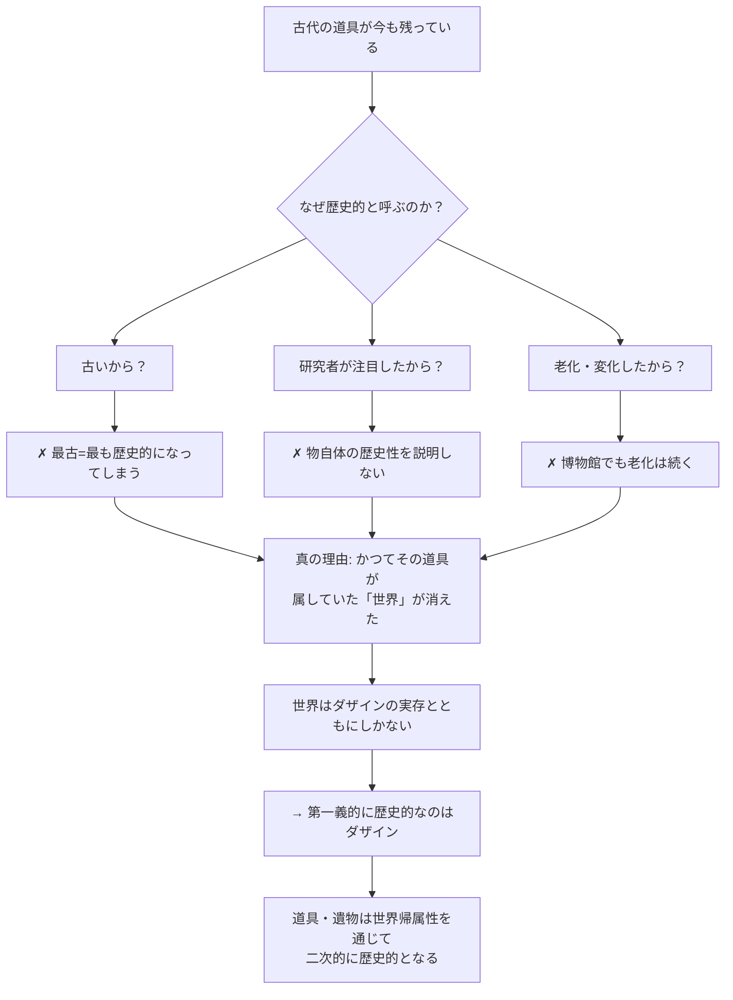

## 「§73」は何だと言っているのか

*ハイデガー『存在と時間』第73節*

---

### この節の結論を先に言う

「歴史とはいったい何か」を考えようとするとき、私たちはつい「過去に起きた出来事」や「博物館にある古い物」を思い浮かべる。しかしハイデガーが第73節で言いたいのは、それらが「歴史的」に見えるのは、**それ自体に歴史性が備わっているからではなく、それが人間の存在（ダザイン）の世界に属していたからだ**、ということである。

つまり「歴史」の第一の主体はダザイン（人間の実存的なあり方）であり、歴史的大地も古代遺物も、**ダザインの世界への帰属を通じて二次的に歴史的**になるにすぎない。この節は「歴史とは何か」を問うための出発点を整地する作業であり、答えを完全に出す節ではない。

---

### 「歴史」という言葉の四つの顔

ハイデガーはまず、私たちが「歴史」という語を使うときに、実はバラバラな意味が混在していることを指摘する。

| 意味 | 具体例 | キーワード |
|------|--------|-----------|
| ① 過去のもの（もはやない） | 「これはもう歴史だ」 | 過去・消滅 |
| ② 由来・発展の連関 | 「歴史をもつ」「歴史をつくる」 | 生成・伝承 |
| ③ 人間的実存の変遷の領域 | 「自然史」に対する「人間の歴史」 | 文化・運命 |
| ④ 伝承されたもの自体 | 習慣・慣行・受け継いだ遺産 | 伝承 |

これら四つを一本化すると、ハイデガーはこう言う。

> 歴史とは、実存するダザインの、時間のなかで生起する固有の出来事であり、しかもその際、相互共存において「過去」となり、同時に「伝承」され、なおも働きつづける出来事が、強調された意味で歴史として通用する。

四つの意味に共通するのは、**人間（ダザイン）が「出来事の主体」として前提されている**という点だ。では、その出来事はどういう構造をもつのか——これが節の核心の問いに向かう足がかりになる。

---

### 博物館の遺物は「なぜ」歴史的なのか

ここからハイデガーは思考実験をする。博物館に置かれた古い家庭用具を例にとる。

その道具は今この瞬間も存在している。腐食は進んでいるかもしれないが、物として「ある」。なのになぜ私たちはそれを「歴史的」と呼ぶのか。

- 単に「古い」から？　→　なら最古のものが最も歴史的になってしまう。
- 研究者が注目したから？　→　それは後付けの理由で、物自体が歴史的であることの説明にならない。
- 物が変化・老化したから？　→　博物館に置いても老化は続く。それは「歴史性」とは別のことだ。

では何が「過ぎ去った」のか。ハイデガーの答えは明快である。

> 道具連関に属しながら手許にあるものとして出会われ、世界内存在として配慮しつつあるダザインによって使用されていた、その道具類の内部にあった世界、それ以外の何ものでもない。

道具を使っていた**人々の「世界」が消えた**のだ。ギリシア人が神殿で礼拝し、誰かが炉端でその鍋を使っていた——そういう生きた文脈としての「世界」がもはやない。物質的な鍋は残っていても、それが意味をもって埋め込まれていた世界は失われている。

**物が歴史的に見えるのは、その物が属していたダザインの世界を引きずっているからである。**

---

### 「過ぎ去る」と「かつて-あった」は別のことだ

ここでハイデガーは重要な区別を立てる。ダザインは「過ぎ去る」ことができるのか、という問いだ。

「過ぎ去る」とは石や椅子のように「もはやそこにない（現前しない）」ことを指す。しかしダザインは本質的に「現前するもの」ではなく「実存するもの」だ。だから死んだ人間も、石が消えるのとは意味が違う。

ハイデガーはここで「かつて-あった（da-gewesen）」という言い方を使う。これは単なる「消えた」ではなく、**「そこにあった」という実存の痕跡・重み**を指している。今もなお残る遺物の歴史性は、この「かつて-あったダザイン」とその世界への帰属に根ざしている。

さらにハイデガーは問う——ダザインは死んで初めて歴史的になるのか？　いや、事実的に今まさに実存しているダザインこそ、すでに歴史的なのではないか？

この問いは、「既在性（Gewesenheit）」——すなわち時間性の構造として「あったもの」であるという契機——が、単なる「過去」とは違うことを示唆する。時間性は「過去・現在・未来」の三者が等根源的に（同じ深さで）絡み合って成り立つ。にもかかわらず、なぜ歴史的なものを語るとき「過去（既在性）」が特別な役割を担うのか——これは第73節が問いとして立てておく謎であり、次節以降への橋渡しとなる。

---

### 第一義的・第二義的な「歴史的なもの」の区別

節の終盤でハイデガーは序列を整理する。

| 順位 | 何が歴史的か | 理由 |
|------|------------|------|
| **第一義的** | ダザイン（人間の実存） | 歴史性は存在の根本構制 |
| **第二義的** | 世界内で出会われるもの（道具・自然・大地） | ダザインの世界への帰属による |

後者を彼は「世界史的なもの（das Weltgeschichtliche）」と呼ぶ。通俗的な「世界史」の概念はこの二次的な歴史的なものに定位しているにすぎない、とハイデガーは言う。

そして節を締めくくるのは、これだ。

> 「歴史的」主観の主観性に歴史性が本質的構制として属するのは、どのような意味において、かつ、いかなる存在論的条件に基づいてか、と。

「人間が歴史の主体だ」という話はみな知っている。しかしハイデガーが問うのはその一歩先——**なぜ・いかにして、ダザインの存在そのものが「歴史的」という構造をもつのか**——である。第73節はその問いを鋭く立てることで終わる。

---

### まとめ：第73節の道筋

1. 「歴史」という語の多義性を整理し、共通の核（ダザインが主体）を取り出す。
2. 博物館の遺物を例に、「歴史的」に見える物の歴史性が、物自体にではなく、**それが属していたダザインの世界**に由来することを示す。
3. 「過ぎ去る」と「かつて-あった」の区別を通じて、ダザインの時間性と歴史性の接点を示唆する。
4. 歴史的なものの第一義（ダザイン）と第二義（世界史的なもの）を区別する。
5. 「なぜダザインの存在構造が歴史的なのか」という問いを次節以降への課題として立てる。
