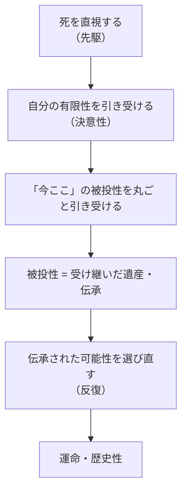
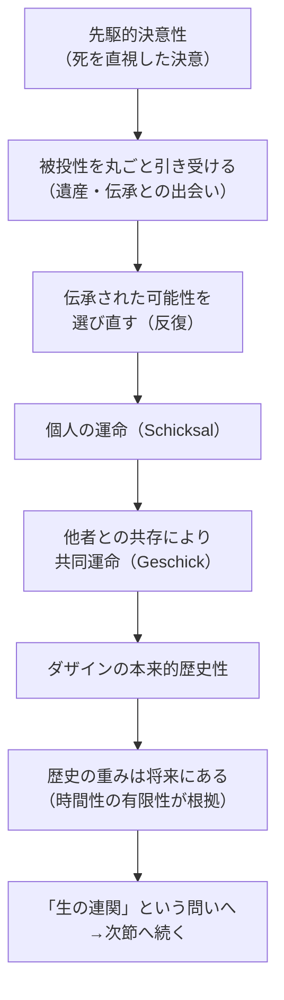

## 「§74」は何だと言っているのか

*ハイデガー『存在と時間』第74節*

---

### この節の結論を先に言う

ハイデガーがこの節でやりたいことは一つです。「人間（ダザイン）はなぜ歴史をもつのか」という問いに、**存在の構造から**答えること。答えを先取りすれば、こうなります。

> 有限でもある本来的な時間性のみが、運命というようなもの、すなわち本来的な歴史性を可能にする。

つまり「人間が歴史的である」のは偶然でも文化の産物でもなく、**人間が時間的な（とりわけ「死すべき」）存在であるという構造そのものに由来する**、というのがこの節の核心です。

---

### 登場する主なコトバの意味

まず用語を整理しておきます。

| 用語（原語） | 一言で言うと |
|---|---|
| **ダザイン** | 「そこに在る」人間存在のこと。単なる「人間」ではなく、存在を問いうる存在者 |
| **配慮（Sorge）** | 人間の存在全体を一言で表すハイデガーの言葉。「気にかける・関わる」という構造 |
| **先駆的決意性** | 死（最終的な可能性）を直視した上で、自分の状況へ決然と向き合うこと |
| **被投性（Geworfenheit）** | 自分が選ばずに「放り込まれた」事実的な状況・歴史・環境 |
| **運命（Schicksal）** | 個人が自分の有限な自由のうちで引き受ける「出来事の筋道」 |
| **共同運命（Geschick）** | 共同体・民族が共有する出来事の筋道 |
| **反復（Wiederholung）** | 過去を「そのまま再現」するのではなく、かつての可能性に応答し直すこと |
| **歴史性（Geschichtlichkeit）** | 「歴史をもちうる」という、ダザインの存在構造そのもの |

---

### 第一段階：なぜ「決意」から話が始まるのか

ハイデガーはまず、すでに分析済みの「先駆的決意性」に戻ります。

> 決意性は、己自身の負い目あること（Schuldigsein）へと向かう、沈黙に満ちた、不安に備えた自己投企として規定された。

「決意性」とは、死という限界を直視しながら、自分の状況へと覚悟をもって向き合う姿勢です。ここから「歴史」の話がなぜ出てくるのか。

理由はこうです。決意して「今ここ」に向き合うためには、自分が**どこから来たか（被投性）**を引き受けなければならない。そしてその「どこから来たか」は、自分一人で作ったものではなく、先人から受け継いだものです。だから「本来的に決意する」ことは、必然的に「受け継いだ遺産と向き合う」ことになる。

---

### 第二段階：「どこから可能性を汲み取るか」という問い

決意するとして、では「何に向かって決意するか」、つまり**実存の諸可能性はどこから来るのか**、という問いが立てられます。

ハイデガーの答えは慎重です。「死から直接に具体的な可能性は汲み取れない」と言います。死への先駆は、可能性の**全体性と本来性を保証する**だけであって、「では具体的に何をするか」は別の源泉から来る。

その源泉が**被投性**です。自分が放り込まれた世界、他者との関わり、それまで受け継いできた解釈や文化。ただし注意点があります。

> 本来的な実存論的了解が伝承された解釈性から身を引き離すことは、ほとんどない。むしろそれはつねに、その解釈性から出発しつつ、それに抗しながら、しかしまたそれのために、決意の中で選ばれた可能性を掴み取るのである。

つまり、伝承から「完全に切り離れる」のではなく、伝承の**中から・それに抗しながら・それのために**可能性を選び取る。これが「反復」の構造の前提になります。

---

### 第三段階：「運命」とは何か

決意性が被投性（遺産）を引き受けると、そこに「運命（Schicksal）」が生まれます。ハイデガーの言う運命は、「神に決められた宿命」でも「成り行き任せ」でもありません。

> 死への自由のみが、ダザインにひたすら目標を与え、実存をその有限性の中へと突き動かす。

死を直視することで「無限に選択肢がある」という幻想が崩れ、有限な可能性の中で本当に選ぶことが可能になる。その選択の筋道が「運命」です。

重要な補足として、ハイデガーはこう言います。

> ダザインが運命の打撃によって打ちのめされることができるのは、まさにそれがその存在の根底において、上述の意味における運命であるからにほかならない。不決意な者もまた、それらによって翻弄される――しかも選択した者よりもさらに激しく――が、それでも彼は運命を「持つ」ことができない。

「不決意な人」も偶然の出来事に翻弄されます。しかし翻弄されるだけでは「運命を持つ」とは言えない。**自分の有限性を引き受けた上で向き合う**ことによってはじめて、運命という構造が成立する。

---

### 第四段階：個人の運命から「共同運命（Geschick）」へ

人間は一人で存在しているわけではありません。常に他者と共にある（共存：Mitsein）。だからこそ、運命は個人にとどまらず**共同体・民族の出来事**へと広がります。これを「共同運命（Geschick）」と呼びます。

> 共同運命は個々の運命（Schicksal）から合成されるものではない。

共同運命は、個人の運命を足し合わせたものではありません。同じ世界に共に在り、同じ可能性へと決意しているとき、諸運命はあらかじめ「導かれている」。伝達と闘争の中でその力が発揮されます。

---

### 第五段階：「反復」とは何か――過去を「取り戻す」ことではない

この節で最も精密に論じられるのが「反復（Wiederholung）」の概念です。

> 反復とは明示的な伝承、すなわち、かつて現存したダザイン（dagewesenes Dasein）の諸可能性への遡行である。

反復は「過去をそのまま再現する」ことではありません。かつての英雄や先人の**可能性に応答する**ことです。しかも同時に、

> 決意のうちでの可能性への応答は、同時に、瞬間（Augenblick）における応答として、今日において「過去のもの」として作用しているものの撤回（Widerruf）でもある。

過去の可能性に「応答する」ことは、現在において惰性的に続いている「過去のもの」を**撤回する**こともセットになっている。つまり反復は過去への従属でも未来への進歩主義でもなく、両方を超えたものです。

| 混同されがちな「過去との関わり」 | ハイデガーの評価 |
|---|---|
| 過去をそのまま再現・復元する | ✗ 反復ではない |
| 過去を「時代遅れ」として捨てる | ✗ 反復ではない |
| 現在の惰性を「進歩」と称する | ✗ 反復ではない |
| かつての可能性に応答し、今の惰性を撤回する | ✓ 本来的な反復 |

---

### 第六段階：歴史の重みは「過去」にではなく「将来」にある

ここがこの節で最も逆説的に聞こえる主張です。

> 歴史はその本質的な重みを、過去のうちにも、今日とその「過去との連関」のうちにも持つのではなく、ダザインの将来から生じる実存の本来的な出来（Geschehen）のうちに持つ。

「歴史」というと、過去のことだと思いがちです。しかしハイデガーによれば、歴史の重みは**将来（死という究極の限界）から来る**。死を直視するからこそ被投性（過去）を引き受け直すことができ、「既往性（かつてあったこと）」に固有の意味が生まれる。

> 死への本来的な存在、すなわち時間性の有限性こそが、ダザインの歴史性の隠された根拠である。

---

### 第七段階：「生の連関」という問いの立て方自体への疑問

節の後半で、ハイデガーは「では、誕生から死までの全体的な『つながり』はどう説明されるのか」という問いを立てます。

そして、この問い自体が**通俗的な時間理解（出来事が次々と続く「体験の連続」という見方）**に引きずられている可能性を指摘します。

> 実存論的分析論のこれまでの歩みのなかで、ダザインの存在論が通俗的存在理解の誘惑に繰り返し陥るという事実ほど明白になったことはない。

「連関」を「決断の途切れない連続」として問うのは、問いの立て方が間違っているかもしれない。この問題の解明は次節以降に引き継がれます。

---

### この節の全体的な流れ

---

### まとめ：この節で言われていること

| 問い | 答え |
|---|---|
| なぜ人間は歴史をもつのか | 人間の存在が時間的（死すべき・有限な）構造をもつから |
| 歴史の重みはどこにあるか | 過去ではなく、将来（死という限界）から生じる |
| 本来的に歴史と関わるとはどういうことか | 「反復」――過去の可能性に応答し、現在の惰性を撤回すること |
| 運命とは何か | 有限な自由の中で被投性を引き受けた選択の筋道 |
| 共同運命とは何か | 個人の運命の総和ではなく、共に在ることの出来事の構造 |
| 歴史学（Historie）は必要か | 歴史的であるために歴史学は必須ではない――存在構造が先にある |

この節全体を一言で言えば、**「人間が歴史をもつのは、人間が死すべき有限な時間的存在だからであり、その有限性を引き受けた決意の中にこそ、過去を生きた反復として受け取る可能性が宿っている」**ということです。
