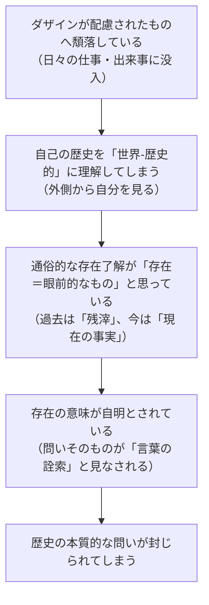

## 「§75」は何だと言っているのか

*ハイデガー『存在と時間』第75節*

---

### この節の結論を先に一言で

「歴史」とは、孤立した「心の中の体験の流れ」でも、外界のモノが変化するプロセスでもない。歴史とは、**世界の中に投げ込まれ、他者とともに実存する「ダザイン（人間存在）」そのものの出来事**であり、その出来事は世界ごと、道具ごと、景観ごと、まるごと動いている。そしてその歴史をきちんと自分のものとして引き受けられるかどうかは、「本来的な実存」ができているかどうかにかかっている——これが§75の中心主張である。

---

### 出発点：私たちはどこから自分を理解するか

ハイデガーはまず、日常の私たちがどこから自分を理解しているかを確認する。

> ダザインはさしあたりたいていの場合、環境世界的に出会われるものおよび見回し的に配慮されるものから自己を了解している。

「**ダザイン**」とは、ここでは「人間という存在のあり方」のことを指す。  
「**配慮**」とは、日常の「とりあえず何とかしようとする関わり」のこと。

普通の私たちは、自分の正体を自分の内側から直接知るのではなく、「今日やるべき仕事」「使っている道具」「周りとの取引や出来事」——つまり世界の側から自分を読み取っている。これは単なる「外からの知識の受け取り」ではなく、世界の可能性に向けて自分を投げ出して生きるという構造そのものだ、とハイデガーは言う。

---

### 問い：では「歴史」はどこにあるのか

ここで節の核心的な問いが立てられる。

> 歴史の生起は、個々の主体における「体験の流れ」の孤立した推移にすぎないのか。

日常では、自分の「歴史」を「これまで体験してきたことのつながり」として考えがちだ。あるいは反対に、歴史を「モノや社会の変化の連鎖」として考えがちだ。ハイデガーはどちらも退ける。

> 実際のところ、歴史はオブジェクトの変化の運動連関でも、「主体」の宙吊りになった体験系列でもない。

「主体（内側の体験）対客体（外のモノ）」という二分法に歴史を収めようとすること自体が間違いだ、というのがハイデガーの立場である。

---

### 核心：歴史とは「世界ごと」の出来事である

ハイデガーが打ち出す答えはこうだ。

> ダザインの歴史性についての命題が言っているのは、世界なき主体が歴史的であるということではなく、世界内存在として実存する存在者が歴史的であるということである。

「**世界内存在**」とは、「世界の中に既に投げ込まれて他者や道具とともにある存在」のこと。

ダザインは世界を「入れ物」として使っているのではなく、世界と一体になって出来事を起こしている。だから歴史もその世界ごと動く。

これを受けてハイデガーは「**世界‐歴史的なもの**（das Welt-Geschichtliche）」という概念を導入する。

| 概念 | 内容 |
|---|---|
| ダザインの歴史性 | ダザイン自身が決意・運命・反復を通じて時間の中を延展すること |
| 世界の歴史性 | ダザインと本質的に一体のものとして、世界そのものが歴史的に動くこと |
| 世界‐歴史的なもの | 道具・建築・制度・景観など、内世界的な存在者がその歴史の中に組み込まれていること |

> 道具や作品、たとえば書物にはそれぞれの「運命」があり、建築物や制度にはそれぞれの歴史がある。

道具の「歴史」は「魂の内的な歴史」に付随する「外的な添え物」ではない。道具・景観・自然でさえも、人間の実存の世界の中に組み込まれることで歴史的になる。「指輪が手渡される」という出来事は、単なる「場所の移動」では語れない——そこには世界‐歴史的な運動性がある。

---

### 日常における歴史の「見誤り」

なぜ普通の私たちはこのことに気づかないのか。ハイデガーは三重の理由を示す。

「**頽落**」とは、ダザインが「ひと（das Man）＝世間の流れ」に流されて自分を見失っている状態のこと。この状態では、自分の歴史を「たまたま起きた出来事の寄せ集め」として捉えてしまい、そこから事後的に「体験のつながり」を捜す、という問いの立て方になってしまう。

---

### 問いの立て直し：本来の問いはどこにあるか

ハイデガーはここで問いを根本から組み直す。

> 問いはこのようには立てられえない——ダザインはいかにして、生じた・生じつつある「体験」の継起の事後的な連鎖のために連関の統一を獲得するのか、と。そうではなく、問いはこうでなければならない——ダザインはいかなる存在様式において自己を失い、そのために、散乱から事後的にはじめて自らを集め直し……なければならないのか、と。

つまり「どうやってバラバラな体験をつなぐか」ではなく、「そもそもなぜバラバラになってしまうのか」が問いの正しい形だ、ということである。

答えは既に先の章で示されていた——「ひと（das Man）」への迷失と、死への逃走。  
そしてその処方箋もまた既に示されていた——「**先駆的決意性**」と「**反復**」。

---

### 本来的歴史性 vs 非本来的歴史性

| | 本来的な歴史性 | 非本来的な歴史性 |
|---|---|---|
| 時間の向き | 将来（死への先駆）→ 既往（反復）→ 瞬間 | 今日の「現在」に没入 |
| 可能性との関係 | 既往の可能性を反復し、再来させる | 可能性に盲目。残滓・記録だけを保持 |
| 「連関」の源 | 延展された常住性（決意性そのもの） | 体験の事後的な「連鎖」として外から組み上げる |
| 「過去」の理解 | 運命的‐瞬間的な反復として生きられる | 現在から逆算して「古いもの」として見る |

> 本来的な歴史性は、歴史を可能なものの「再来」として理解し……可能性が再来するのは、実存が運命的‐瞬間的に、決然たる反復においてそれに対して開かれているときだけである。

「決意性」は「一つの決断」という「作用」が持続する間だけ効く、というものではない。決意性の中にはすでに実存的な常住性——すなわち、あらゆる可能な瞬間を先取りする延展性——が宿っている。瞬間は「後からつなぎ合わせる」のではなく、「すでに延展された時間性から生起する」のだ。

---

### この節の到達点と次への架け橋

§75はダザインの歴史性の議論を締めくくりながら、同時に次の課題を予告する。

> ダザインの歴史性から学問としての歴史学（Historie）の存在論的な生成を描き出す一つの企投を試みてみよう。

「歴史性（Geschichtlichkeit）」はダザインの存在のあり方であり、「歴史学（Historie）」はその歴史性を根拠にして成立する学問だ——という展開が続く第76節へのつながりがここで示される。

---

### まとめ：§75が言っていること

1. **歴史は「体験の流れ」でも「モノの変化」でもなく、世界内存在としてのダザインの出来事である。**
2. **道具・建物・景観も、ダザインの世界と一体になることで歴史的になる（世界‐歴史的なもの）。**
3. **日常の私たちは配慮に没入し、自分の歴史を「起きたことの寄せ集め」として外から捉えてしまう（非本来的歴史性）。**
4. **本来的な歴史性とは、先駆的決意性と反復によって、延展された常住性の中に自分の誕生と死の「あいだ」をすでに包含しているあり方である。**
5. **「体験をどうつなぐか」という問いより、「なぜバラバラになるのか」という問いが先にある。**
