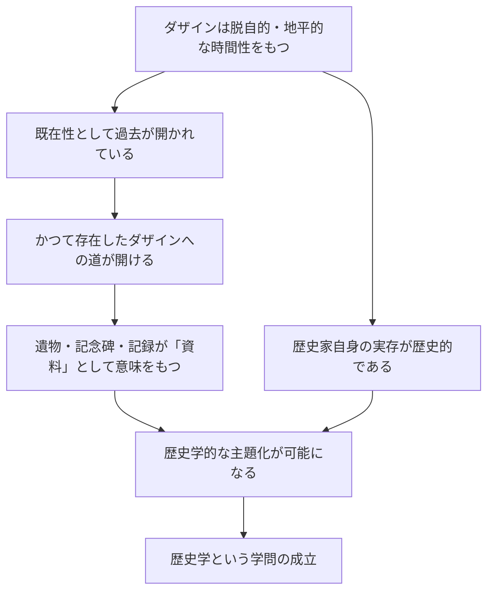

## 「§76」は何だと言っているのか

*ハイデガー『存在と時間』第76節*

---

### この節で言いたいこと――一行で

「歴史学（史学という学問）が成り立つのは、人間（ダザイン）がそもそも歴史的な存在だからであり、歴史学の方法や対象の選び方は、その歴史的な存在のあり方から生まれている」――これが§76の核心である。

---

### 前置きの問い――「なぜ歴史学が成り立つのか」

歴史学は「過去を調べる学問」だと普通は思われている。しかしハイデガーはまず一歩引いて問う。

> 歴史の歴史学的な開示は……その存在論的構造に従って、ダザインの歴史性の中に根ざしているのである。

つまり「過去を研究できる」という事実そのものに、説明が必要だ、という出発点に立っている。

ここで使う主な概念をあらかじめ整理しておこう。

| 用語 | この節での意味 |
|---|---|
| **ダザイン** | 人間の存在のあり方（「そこに居る存在」）|
| **歴史性（Geschichtlichkeit）** | ダザインが時間のなかに投げ込まれ、過去・現在・未来をつなぎながら存在するという構造 |
| **実存論的起源** | 学問の成立条件を、人間の存在構造のレベルで説明すること |
| **反復（Wiederholung）** | 過去の可能性を単なる模倣でなく、自分の実存に引き受け直すこと |
| **既在性（Gewesenheit）** | 「すでにあったこと」という過去の次元。ただし消えたのではなく、現在のダザインを規定し続けている |

---

### 論証の第一段階――「歴史学は現実の学問から抽象するのではない」

ハイデガーはここで、よくある議論の進め方を批判する。

普通の学問論は「今の歴史家が実際にやっていることを観察し、そこから歴史学とは何かを定義しよう」と考える。しかしハイデガーはこう言う。

> 根本的に見て、この事実的な手続きが歴史学をその根源的かつ本来的な可能性に即して代表しているという保証が、どこにあるというのか。

要するに、「実際にやられていること」は必ずしも「本来どうあるべきか」を体現していない。逆に言えば、「歴史学の本来の姿」を先に理解しておかなければ、現実の歴史学を正しく評価する物差しもない。だから分析は、「ダザインの歴史性」という存在の構造の側から進める必要がある。

---

### 論証の第二段階――「過去」へのアクセスはどこから来るのか

ハイデガーは「資料があれば過去を研究できる」という常識的な見方を逆転させる。

資料（遺物、記念碑、記録）が「歴史的な資料」として意味をもつのは、それを見る歴史家がすでに歴史的な存在だからである。

> 資料の収集・精査・保全は、「過去」への遡行をはじめて始動させるのではなく、かつて存在したダザインへの歴史的な存在を……すでに前提としている。

言い換えれば、資料を集めることが歴史学を生み出すのではなく、歴史家がすでに歴史的に存在していることが、資料を「資料として」見えさせているのだ。

---

### 論証の第三段階――歴史学の本来の「対象」は何か

ここが最も重要で、かつ最も意外な主張である。

歴史学は「事実」を扱う学問だとされる。「実際に何があったか」を明らかにする学問だ、と。しかしハイデガーは問い返す。ダザインにとって「事実的にある」とは、決意して選んだ可能性のなかに自分を投企することである。だとすれば、過去の人間が「事実的に」あったということは、その人たちが直面し選択した「実存の可能性」にほかならない。

> 一回限りに起きた出来事でもなく、それに上空から漂う普遍的なものでもなく、事実的に実存してかつてあった可能性こそが歴史学の主題なのである。

つまり歴史学が最終的に照らし出すのは「過去の可能性」であり、その可能性は現在の私たちが「反復」によって引き受け直すことができる。歴史学が「可能性」を主題とするのは、歴史を空想化するためではなく、かつての人間の実存がそもそも可能性として構造されていたからだ。

---

### 論証の第四段階――「客観性」の問い直し

「過去を現在の決意から解釈するなら主観的になるのでは？」という疑問が当然出てくる。ハイデガーはこれを逆転させる。

> 「過去」の歴史的な開示が、運命的な反復に根ざしているということ、これはいかほどにも「主観的」ではなく、まさにこの開示のみが歴史学の「客観性」を保証するのである。

なぜか。学問の客観性とは、対象を「その存在の根源性において覆いを取り除いた形で理解に差し向けること」だからだ。多数の賛同を集めることでも、普遍的な尺度に従うことでもない。本来的な歴史性から発する開示こそが、歴史学の対象をその本来の姿において示す。

---

### 論証の第五段階――ニーチェの三区分との接続

ハイデガーはここでニーチェの「歴史学の三種」（記念碑的・骨董的・批判的）を引き受け、それをダザインの時間性から根拠づけ直す。

| ニーチェの区分 | ハイデガーの対応づけ | 時間性の次元 |
|---|---|---|
| **記念碑的歴史学** | かつての実存可能性への開かれ（反復） | 未来性 |
| **骨董的歴史学** | 把握された可能性が現れた過去の実存への敬いと保存 | 既在性 |
| **批判的歴史学** | 今日の頽落した公共性からの苦しみながらの解放 | 現在（瞬視） |

三つは別々の態度ではなく、本来的な歴史性から一体として育ってくるものだとハイデガーは言う。

> 本来的な歴史性は、歴史学の三様式の可能的な統一の根拠である。

そして三様式を統一するさらに深い根拠は、時間性（未来・既在性・現在の脱自的統一）であり、その根拠はさらに「配慮（Sorge）」――人間の根本的な存在様式――に行き着く。

---

### 節の末尾――ディルタイ・ヨルクへの言及

節の締めくくりで、ハイデガーはヴィルヘルム・ディルタイとヨルク・フォン・ヴァルテンブルク伯爵の仕事に言及する。精神科学（人文・社会科学）の理論は、そもそもダザインの歴史性を実存論的に解釈することを前提としている。ディルタイらがそれに近づこうとしてきたのだ、とハイデガーは評価している。

---

### まとめ――§76の議論の骨格

| 問い | ハイデガーの答え |
|---|---|
| なぜ歴史学が成り立つのか | ダザイン自身が歴史的な存在だから |
| 過去へのアクセスはどこから来るか | 歴史家自身の歴史的存在が過去への道を開く |
| 歴史学の本来の対象は何か | 「事実」ではなく、かつての実存の「可能性」 |
| それでも客観的と言えるか | 本来的な歴史性からの開示こそが真の客観性を保証する |
| 歴史学の三様式の根拠は何か | ダザインの時間性（未来・既在性・現在）の統一 |

§76は、「歴史学とはどんな学問か」を外から定義しようとするのでなく、「人間がそもそも歴史的にしか存在できない」という存在論的な事実から、歴史学がいかに必然的に生まれてくるかを内側から示す節である。
