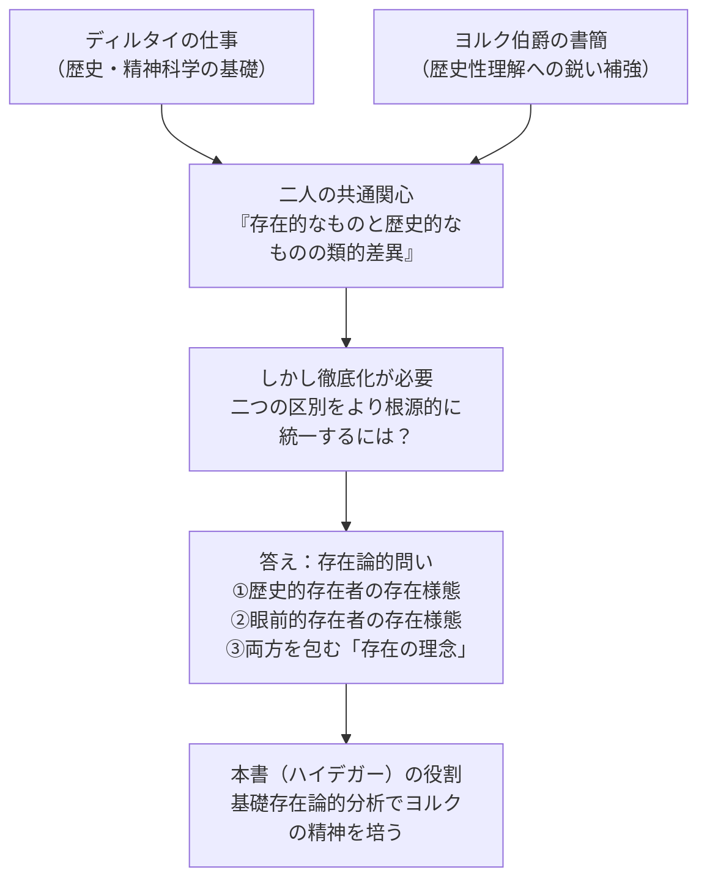

## 「§77」は何だと言っているのか

*ハイデガー『存在と時間』第77節*

---

### この節の結論を一言で

ハイデガーが本書全体で展開してきた「歴史性」の議論は、ディルタイとヨルク伯爵という二人の先人の仕事から育った。しかしその仕事を真に受け継ぐには、両者が「存在的なものと歴史的なものの差異」と呼んだ問題を、**存在そのものへの問い**（存在論）という次元にまで徹底して掘り下げなければならない。§77はそのことを、ヨルクの書簡から豊富な引用を交えながら示す節である。

---

### §77 の全体的な見取り図

---

### ディルタイ像の誤読を正す

節はまず、世間に広まっているディルタイの「通俗的な肖像」を退けることから始まる。

> 「精神史……の洞察に富む解釈者であり……全体を相対主義的な『生の哲学』へと溶解させてしまった人物」

ハイデガーはこれを「表面的な考察には正しいが、実質を見逃している」と切り捨てる。

では「実質」とは何か。ハイデガーによれば、ディルタイの膨大な仕事——精神科学論、科学史、心理学——はすべて**一点に収斂**している。

> 「生」を哲学的に理解へと齎すこと、そしてこの理解に対して「生そのものから」解釈学的な基盤を確保すること。

「生の哲学」とは相対主義への逃げ込みではなく、「人間が生きている」という事実全体を学的に基礎づけるプロジェクトだった。その核心に置かれていたのが**解釈学**——理解という行為の自己解明——である。

---

### ヨルク伯爵が加えた切れ味

ヨルク伯爵（1835–1897）はディルタイの親友であり、二人の往復書簡（1877–1897）にその思想が残る。ハイデガーはここから多くを引用し、ヨルクの「鋭さ」を以下の点に見出す。

#### 1. 「存在的なものと歴史的なものの類的差異」

ヨルクはディルタイ批判として、この差異が「あまりにも強調されていない」と指摘する。

| 区別の軸 | 存在的なもの（Ontisches） | 歴史的なもの（Historisches） |
|---|---|---|
| 別名 | 目視的なもの、自然の現前存在 | 生きているダザイン（人間的現存在） |
| 認識の様式 | 比較・形姿による観察 | 内的な移入・自己省察 |
| 歴史研究への影響 | 像・人物像・政治的事件の陳列（「骨董的」） | 不可視の連関・可能性態の把握 |

ランケ（19世紀の代表的歴史家）への批判がその典型である。

> 「ランケは偉大な眼球であり、その眼球には消え去ったものが現実となることができない」

「目で見えるもの」だけを記録する歴史学は、生きていた過去を本当には捉えていない——これがヨルクの主張だ。

#### 2. ダザイン自身が歴史である

ヨルクは「なぜ歴史が重要か」を科学論からではなく、**人間の存在様式そのもの**から導く。

> 「心身的所与性の総体が生きているということ、これが歴史性の萌芽点である……まさしく自然であるのと同様に、私は歴史である」

「人間は自然法則で説明できるのと同じ意味で、歴史的に規定されている」という洞察だ。これはハイデガーが本書で展開した「ダザインは本来的に歴史的な存在者である」という論点と直接対応する。

#### 3. 哲学することは歴史から切り離せない

> 「歴史的でない真の哲学することなど存在しない。体系的哲学と歴史的叙述との分離は、その本質において誤りである」

「非歴史的な立場から哲学する」という発想自体が、すでに一つの形而上学的な思い込みである——ヨルクはそう断言する。

---

### ハイデガーによる批判的超出

ハイデガーはディルタイとヨルクを高く評価しながら、同時に彼らの問いが「根本的な徹底化を必要とする」と言う。その論点は三点に整理できる。

> 一、歴史性の問いとは、歴史的に存在する存在者の**存在様態**についての存在論的問いである。
> 二、存在的なものへの問いとは、……眼前的存在者（Vorhandenes）の存在様態についての存在論的問いである。
> 三、存在的なものは存在者の一領域に過ぎない。存在の理念は「存在的なもの」と「歴史的なもの」の双方を包括する。

言い換えれば——

- ディルタイとヨルクは「存在的なもの」と「歴史的なもの」を**比較**しようとした。
- しかし比較するためには、その両方を統一的に見渡せる**より根源的な視点**が必要だ。
- その視点こそ、「存在一般の意味への問い」（基礎存在論）にほかならない。

ヨルクが「存在的なもの」という語を「非歴史的な存在者一般」の意味で使ったこと自体、古代以来の伝統的存在論が「存在」を「目の前にある物」として捉えてきた支配の名残である——ハイデガーはそう見抜く。

---

### まとめ：§77 が架ける橋

| 要素 | 役割 |
|---|---|
| ディルタイの仕事 | 「生」を学的に基礎づけるプロジェクトの提示 |
| ヨルク伯爵の書簡 | 「存在的なものと歴史的なものの差異」という核心問題の定式化 |
| ハイデガーの批判的取得 | その差異を「存在一般の意味」への問いで根拠づけること |
| 本書全体との関係 | ダザインの実存論的・時間的分析論が、この継承と超出を実現するための土台 |

---

### 読者への補足：なぜこの節が置かれているのか

§77は第二部（歴史性の分析）の締めくくりとして機能している。ハイデガーは自分の議論が「思いつき」ではなく、ディルタイとヨルクという具体的な先人の問題意識を引き受けた上で**哲学的に深化させたもの**であることを示したかった。引用の多さはその誠実さの証である。と同時に「彼らで十分ではない、もう一段の根拠が必要だ」という宣言でもある。次の第六章（時間性と内時間性）へと向かう扉が、ここで開かれる。
