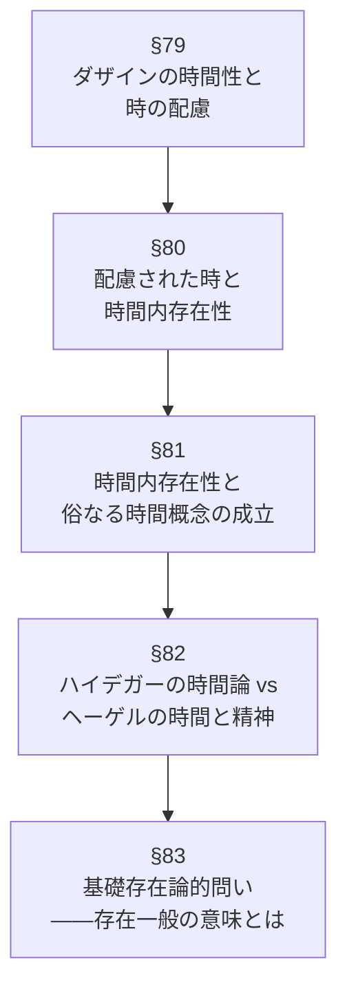

## 「§78」は何だと言っているのか

*ハイデガー『存在と時間』第78節*

---

### この節の結論を一言で

§78 は、これまでの「時間性」の分析が**まだ不完全だった**という反省から始まり、**その不完全さを埋めるために、以降の章で何をどの順番で論じるかを予告する**節である。内容的な新主張よりも、「地図を示す」役割を果たしている。

---

### なぜ「不完全」だったのか

ハイデガーはここまでの議論で、ダザイン（「人間の存在のあり方」を指す術語）の存在を成り立たせるのは**時間性**だと論じてきた。さらに歴史性（私たちが歴史的な存在であること）も「根底において時間性にほかならない」と示された。

しかし、ここで一つの盲点が指摘される。

> 実存論的・時間的な歴史性の分析の過程において、歴史をもっぱら「内時的な」出来事としてのみ知る日常的なダザイン理解には、発言の機会が与えられなかった。

つまり、これまでの分析は**日常的な「時間のなかで何かが起きる」という感覚**を意図的に脇に置いて進めてきた。それ自体は方法として正しかったのだが、今度はそれを放置したまま終わるわけにはいかない。哲学的な分析は、最終的に**日常の経験と結びつけて説明できなければならない**からである。

---

### 「時間を勘定に入れる」とはどういうことか

ハイデガーが特に注目するのは、私たちが日常的に行っている、ある素朴な振る舞いである。

> 事実的に実存しつつ、その都度のダザインは「時間を」「持って」いるか、あるいは「持っていない」。それは「時間をとる」か、あるいは「時間の余裕がない」かである。

私たちは毎日、「今日は時間がある」「あの用事に時間をとろう」と考える。時計を見る前に、**すでに時間を意識し、それに合わせて行動している**。これをハイデガーは「時間を勘定に入れる（mit der Zeit rechnen）」と呼ぶ。

そしてこの振る舞いこそが、時計の使用よりも根本的だと言う。時計を読むという行為は、そもそも「時間を気にしている」というこの根源的な態度のうえに成り立っているからだ。

---

### 何が「欠落」していたのか

ここで §78 の核心的な自己批判が出てくる。

> 時間性そのものには、実存論的・時間的な世界概念の厳密な意味における**世界時間**のごときものが属しているからである。

| 概念 | 意味の概略 |
|---|---|
| **時間性** | ダザインの存在を根底で成り立たせる、哲学的・根源的な時間 |
| **世界時間** | 私たちが世界のなかで出来事を経験するときに現れる「公共的な」時間 |
| **内時性（Innerzeitigkeit）** | 存在者が「時間のなかに」あるという日常的な経験の構造 |
| **俗なる時間概念** | 「時間は均一に流れる線のようなもの」という日常・伝統的な時間観 |

これまでの分析は「時間性」だけを掘り下げ、そこから**世界時間・内時性・俗なる時間概念がどうやって生まれるか**を説明し切れていなかった。これが「根本的な欠落」の中身である。

---

### ヘーゲルが引き合いに出される理由

節の終盤では、突然ヘーゲルの時間論が登場する。なぜか。

ハイデガーの分析が進むと、「精神（人間の主体）と時間の関係」という問いに否応なく行き着く。ヘーゲルはまさにこの問いに正面から取り組み、「精神が歴史として時間の中へ落ちる」という構想を提示した。表面的には似て見える。しかしハイデガーは、自分の出発点と目標はヘーゲルと**根本的に異なり、むしろ対立している**と宣言する。その対比を示すことで、自分の立場がより明確になるという構成である。

> 本稿の時間分析は、その出発点においてすでに根本的にヘーゲルと異なり、その目標すなわち基礎存在論的意図においてまさにヘーゲルと対立した方向に向けられている。

---

### 以降の章で何を論じるか

§78 は次のような予告図で締めくくられる。

この流れは「根源（時間性）→ 日常的経験（世界時間・内時性・俗なる時間）→ 伝統との対比 → 最終問い（存在とは何か）」という順に降りていく構造になっている。

---

### まとめ

§78 を一段落で言い換えるとこうなる。

「これまで私は『時間性がダザインを成り立たせる』と論じてきたが、日常的な"時間のなかで何かが起きる"という感覚を分析しないまま終わらせることはできない。私たちが毎日『時間をとる・とれない』と感じている、あの素朴な経験こそが解明されるべきだ。そのために、世界時間・内時性・俗なる時間概念の由来を順番に追い、最終的にはヘーゲルとの対比を経て、存在一般の意味という根本問題へ向かう。」

この節は、長い旅の後半戦に入る前の**地図の確認**にあたる。
