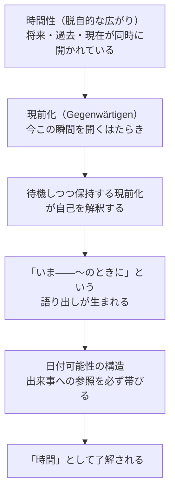

## 「§79」は何だと言っているのか

*ハイデガー『存在と時間』第79節*

---

### この節の結論を先に言う

私たちが日常的に口にする「いま」「そのとき」「あのとき」という言葉は、どこから来るのか。ハイデガーはこの節で、その答えを掘り下げる。結論は次のひと言に要約できる。

> 自己を解釈する現在化、すなわち「いま」において語りかけられた解釈されたものを、われわれは「時間」と呼ぶ。

私たちが「時間」と呼んでいるものは、時計が刻む客観的な「時点の系列」ではない。それは、人間の実存（ダザイン）がみずからの時間性を「語り出した」姿なのだ、というのがこの節の核心である。

---

### 前提を確認する：ダザインはいつも「語っている」

**ダザイン**（Dasein）とは、ここでは「人間存在」と読んでよい。ハイデガーによれば、ダザインは世界に「投げ込まれ」ながら、気になるものへと引き寄せられ（頽落）、同時に先のことへと自己を投企している。この三つの動き――被投性・頽落・投企――をひとまとめにして「配慮（Sorge）」と呼ぶ。

そして配慮しながら生きているダザインは、いつも「語っている」。声に出すかどうかに関係なく：

> 「そのとき」に、あれが起きるべきであり、「それよりも前に」、これが片づけられるべきであり、「いま」、「あのとき」に失敗し取り逃がしたことを取り戻すべきだ。

「いまは電話に出られない」「あのときこうしていれば」「もうすぐ昼になる」――こうした語りは、ダザインが**待機しつつ保持する現前化**（将来・過去・現在の三つを同時に開いておくはたらき）を行っていることの表れだ、とハイデガーは言う。

---

### 「いま、〜のときに」という構造：日付可能性

ここで重要な発見が導入される。

私たちが「いま」と言うとき、それはただ「いま」とだけ言っているわけではない。「いま――扉が鳴る」「そのとき――会議が始まるときに」「あのとき――雨が降っていたときに」というように、世界内部で起きている何かへの参照が必ずついている。

ハイデガーはこの構造を「**日付可能性**（Datierbarkeit）」と名付ける。

> あらゆる「そのとき」はそのようなものとして「そのとき、〜のときに……」であり、あらゆる「あのとき」は「あのとき、〜のときに……」であり、あらゆる「いま」は「いま、〜であるところの……」である。

カレンダー上の日付（2024年3月15日、など）があるかどうかは関係ない。それがなくとも、「いま・そのとき・あのとき」は必ず何かの出来事に結びついて了解されており、それ自体として**日付けられうる**構造を持っている。

| 時制の語 | 時間性のはたらき | 地平（背景となる視野） |
|---|---|---|
| いま | 現前化（現在を開く） | 「今日」「この瞬間に」 |
| そのとき | 待機（将来へ向かう） | 「のちほど」「やがて」 |
| あのとき | 保持（過去を引き止める） | 「以前」「かつて」 |

この日付可能性は偶然の付け足しではない。それは「いま」「そのとき」「あのとき」という語り自体に**本質的に**組み込まれた構造だ、とハイデガーは主張する。

---

### なぜ「いま、〜のときに」と語るのか

ここでハイデガーは問い返す。

> われわれはこの「いま――……するときに」をいったいどこから得るのか？

私たちは「いま」という概念を、世界に転がっている物体から取り出したわけではない。誰かに教わって初めて使い始めたわけでもない。最も些細な一言――「寒い」――にすら、「いま、外に出ると……」という「いま」の構造が含まれている。

その理由をハイデガーはこう示す：

つまり：時間性が「現（Da）の明るみ」をつくり出しているからこそ、ダザインはその時間性を「いま」として語り出すことができる。語られた「いま」が「時間」なのであり、「時間」が先にあって後から「いま」が貼り付けられるのではない。

---

### 「その間」と「幅」：持続の解釈

さらにハイデガーは、「そのとき」と「いま」のあいだに「その間（Inzwischen）」という構造があることを指摘する。

「そのときまで」を了解するとき、私たちはただ将来の一点を待つだけでなく、「それまでの間に何をするか」を分節化している。配慮はこの「その間」をさらに細かい「そのときから――そのときまで」に区分する。こうして「持続すること（Währen）」が出てくる。

そして「いま」「そのとき」「あのとき」のいずれも、単なる「点」ではなく、**幅（Spanne）**を持っている：

> 「いま」――休み時間に、食事のときに、夕刻に、夏に。「そのとき」――朝食のときに、登山のときに。

この「幅」は、ダザインの時間性がもともと**脱自的に延伸された**（過去・現在・将来にわたって広がった）ものであることを反映している。

---

### 「時間がない」と「常に時間をもつ」

ハイデガーはここで、**非本来的な実存**と**本来的な実存**のちがいを時間との関係で整理する。

| 実存の様式 | 時間とのかかわり | 特徴的な言葉 |
|---|---|---|
| 非本来的（日常的なひとりでに） | 出来事に引き回されて時間を失い続ける | 「私には時間がない」 |
| 本来的（決意性をもった） | 瞬視（Augenblick）において状況を引き受け、常に時間をもつ | 「いつでも時間はある」 |

非本来的な者は、次から次へと迫り来る出来事に反応し続けることで自分を喪失し、時間を「使われてしまう」。これに対して、決意した者は瞬視において状況全体を開き、過去から引き受けた将来のなかで現在を保つため、いつでも「今が状況の要求に応える時だ」と言える。

---

### 公共的な時間へ

最後にハイデガーは、「語り出された時間」が他者と共有されることに触れる。

「いま」という言葉は原則として誰にでも通じる。複数の人が「いま」と言うとき、それぞれが「いま――自分の周囲で起きていること」から日付けているにもかかわらず、その「いま」は共有可能だ。これは、ダザインが**世界内存在**として、もともと公共的な世界のうちで実存しているためである。

こうして、個々のダザインの時間性から語り出された「いま」は、**公共的な時間**へと開かれていく。時間が「人が計算に入れる時間」「世間が与える時間」として扱われるほど、その公共性はいっそう強まる――これがのちの「世界時間」論への伏線となる。

---

### まとめ：この節が示した道筋

1. ダザインは配慮しながら生き、その配慮はつねに「いま・そのとき・あのとき」と語っている。
2. これらの語りは必ず世界内の出来事への参照（日付可能性）を帯びており、それは偶然ではなく、時間性の**脱自的な構造**の反映だ。
3. したがって、「いま」として語り出されたものこそが「時間」であり、「時間」は世界に転がっている物体でも、純粋な主観の産物でもない。
4. この語り出された時間は、複数の人間が公共的な世界を共有している以上、必然的に公共化される。

> 時間性が現＝存在（Da）の明るみを脱自的＝地平的に構成するがゆえに、時間性は根源的に現＝存在においてつねにすでに解釈可能であり、したがって知られているのである。

「時間を知っている」ことの自明さの裏側に、時間性というより深い根があること――それがこの節の核心的な主張である。
