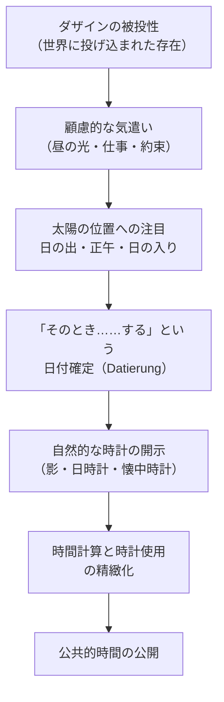

## 「§80」は何だと言っているのか

*ハイデガー『存在と時間』第80節*

---

### この節の結論を先に示す

§80 の核心は一文で言える。

> 世界時間は、可能的なあらゆる客体よりも「客観的」である。……世界時間はしかしまた、あらゆる可能な主観よりも「主観的」でさえある。

私たちが日常「時間」と呼んでいるものは、「心の中にある主観的なもの」でも「外の世界に転がっている客観的なもの」でもない。それは**世界時間**（Weltzeit）と呼ばれ、主観／客観という二項対立よりも根本的なところで成立している——これが §80 の主張である。

そして「なぜそう言えるのか」を論証するために、この節は次の順番で議論を積み上げる。

1. 時間の「公開」はどこから来るか（配慮・被投性・太陽）
2. 日付確定・時計使用の実存論的な根拠
3. 「今」を語ることと時間測定の構造
4. 世界時間の特徴（日付可能性・延び・公開性・世界性）
5. 世界時間は「主観的」でも「客観的」でもない——そして「時間内部性」へ

---

### 第一段階：時間の公開はどこから来るのか

哲学の言葉をひとつ説明しておく。**ダザイン**とは「人間という存在者」のことで、ハイデガーは人間を「そこに在る（Da-sein）」と呼ぶ。**配慮**（Sorge）はダザインの存在様式そのものを指す——私たちが世界の中で気にかけ、気を配りながら生きている、そのあり方のことだ。

ハイデガーはまず、時間の公開が「後付けで偶然に」生じるのではないと言う。

> ダザインは脱自的・時間的なものとしてつねにすでに開示されており……配慮のうちにおいてもすでに時間は公開されている。

私たちは生まれたときから「世界の中に投げ込まれた」（被投された）存在として、すでに時間の中にいる。その投げ込まれた状態のまま生き、かつ頽落（日常的なことがらへの埋没）しつつ実存するダザインには、時間を「配慮しつつ解釈する」という構造が必然的に伴う。これが**時間計算**（天文・暦の時間測定）の実存論的な根拠である。

---

### 第二段階：太陽と日付確定——「自然的な時計」

では具体的に、人間はどうやって時間を配慮するのか。ハイデガーは「太陽」を手がかりに説明する。

日常的なダザインは昼の光がないと仕事ができない。だから「夜が明けたら、そのとき……する」という形で自らに時間を与える。この「そのとき」に日付を与えるのが太陽の出入りであり、そこから**日（Tag）**という最も自然な時間単位が生まれる。

太陽は「気遣いのうちで解釈された時間に日付を与える」。この日付確定は、同じ天空の下に住む誰にとっても遂行できるため、**公共性**をもつ。これが「自然的な時計」の実存論的な根拠であり、人工的な時計（日時計・懐中時計など）はすべてこの「自然的な時計」に合わせて調整されている。

---

### 第三段階：時計を見ることと「今」を語ること

私たちが時計を見るとき、何をしているのか。ハイデガーは問う。

> 「今はこれこれの時刻だ、今は……する時間だ、あるいはまだ時間がある」

時計を見ることは本質的に「今-語ること（Jetzt-sagen）」である。そしてこの「今」は、単なる無色の瞬間点ではない。それは次の四つの構造をすでに含んでいる。

| 構造の名前 | 意味 | 例 |
|---|---|---|
| **日付可能性** | いつかを指定できる | 「日の出のとき」「正午に」 |
| **延び**（Gespanntheit） | 幅をもって続く | 「昼の間に」「仕事の時間」 |
| **公開性** | 誰にとっても同じ | 「誰でも同じ時計で確かめられる」 |
| **世界性** | 「……のための時間」という意味連関をもつ | 「仕事の時間」「約束の時間」 |

この「……のための時間」という構造が重要だ。「今」は単独で浮かんでいるのではなく、つねに「何かをするための今」として了解されている。ハイデガーはこれを、以前に論じた「意義性（Bedeutsamkeit）」——世界の世界性を構成するもの——と結びつけ、時間が**世界的性格**をもつと言う。これが**世界時間**と呼ばれる理由である。

> 世界時間が……世界に属しているからである。

---

### 第四段階：世界時間は「客観的」でも「主観的」でもない

§80 の哲学的な山場はここだ。

「公共的時間は主観的なのか客観的なのか」——この問いに対してハイデガーは両方を否定し、かつ両方を越えると言う。

**「客観的」より客観的である理由：**
世界時間は、世界の開示性とともに「脱自的＝地平的にすでに対象化されている」。つまり内部世界の存在者（物や道具）に出会う可能性の条件そのものだ。それはいかなる物よりも先に「ある」。

**「主観的」より主観的である理由：**
世界時間は、事実的に実存する自己の存在である配慮（Sorge）をはじめて可能にする。つまりいかなる主観よりも先に「ある」。

> 「時間」は「主観」の内にも「客観」の内にも現前せず、「内」にも「外」にもなく、あらゆる主観性と客観性よりも「以前」に「ある」。

この「以前」という言い方が重要だ。時間はカントが言うように「心の形式（感性の形式）」として内側にあるのでも、外の物理世界に単純に実在するのでもない。ハイデガーは付け加える——時間は「天空において」最初に見出される、と。人は自然な自己定位のなかで空を見て「時間」を読み取る。だからこそ「時間」が天空と同一視されることさえある。

---

### 第五段階：「時間内部性」へ——この節の締め括り

世界時間が時間性の時熟に属するならば、その時間の「中に」手許にある道具や眼前にある物体が出会われる。この「時間の中に在ること」を**時間内部性**（Innerzeitigkeit）という。

ただし注意が必要だ。

> この存在者は、厳密な意味において決して「時間的」と呼ばれることはできない。

ダザインでない存在者（石・道具・自然物）は、時間の「中に」出会われるが、それ自体が時間を生き出すわけではない。それらは**無時間的**だ。「時間的」と呼ばれるのは、あくまでもダザインだけである。

この節は最後にこう締める。

> 通俗的な時間概念の成立についての解明は、時間内部性を出発点とせねばならない。

つまり §80 の仕事は、「私たちが普段『時間』と呼んでいるもの（通俗的な時間概念）がどこから来るか」を説明するための地盤を整えることにある。その地盤が「時間内部性」であり、その根拠が「世界時間」であり、さらにその根拠が「ダザインの時間性」である。

---

### まとめ：§80 の論証の流れ

| 段階 | 問い | 答え |
|---|---|---|
| 出発点 | 公共的時間の「与えられること」はなぜか | ダザインの被投性（投げ込まれた存在であること）が根拠 |
| 具体的発生 | 時間配慮はどう実現されるか | 太陽の運行に基づく日付確定、自然的時計の使用 |
| 構造分析 | 「今」の中に何が含まれるか | 日付可能性・延び・公開性・世界性の四構造 |
| 命名 | その時間を何と呼ぶか | 世界時間（Weltzeit） |
| 位置づけ | 世界時間は主観的か客観的か | どちらでもなく、両方より「以前」にある |
| 着地点 | 世界時間と物体の関係は | 物体は時間の「中に」出会われる＝時間内部性 |

§80 は一言で言えば、「日常の時間配慮を手がかりに、世界時間という概念を定め、それが主観でも客観でもない独自の存在論的地位をもつことを示す節」である。そして次の §81 以降で論じられる「通俗的な時間概念」の批判的分析のための土台が、ここで整えられる。
