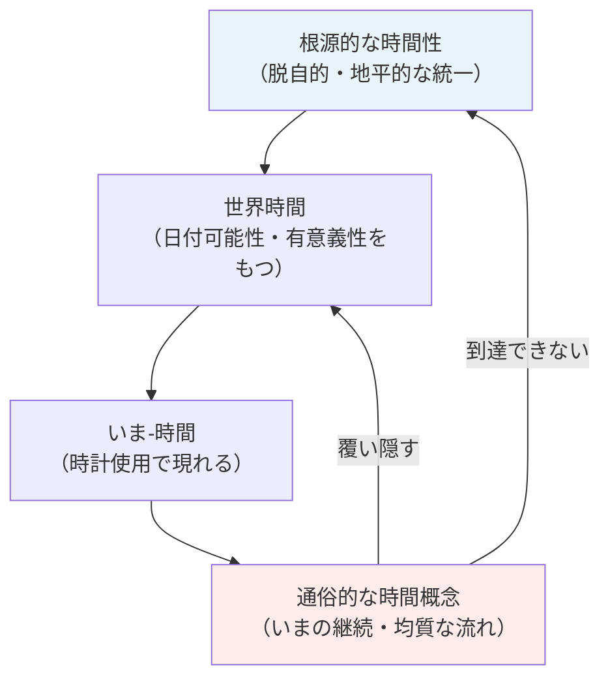

## 「§81」は何だと言っているのか

*ハイデガー『存在と時間』第81節*

---

### この節のひとことまとめ

私たちが日常で使っている「時間」のイメージ——時計の針が刻む「いま・いま・いま……」という流れ——は、人間の根本的なあり方（＝**時間性**）が「薄められ、覆い隠された姿」だ。それは間違いではないが、時間の本当の姿ではない。この節はその**覆い隠しがなぜ起きるのか**を解明し、**根源的な時間（時間性）と通俗的な時間概念との関係**を整理する。

---

### 出発点：時計を使うとはどういうことか

日常生活の中で私たちが最も直接的に「時間」と向き合う場面は、時計を見るときだ。

> 「その実存論的・時間的な意味は、動く針を現在化することとして示される。針の位置をたどる現在化が数える。」

時計の針を追うとき、私たちは「いま針はここにある」と**現在化**する。ただしそれは単に「いま」だけを見ているわけではない。

| 脱自的な契機 | 時計の使用での対応 |
|---|---|
| **待ち望み**（未来に向けて開かれる） | 「やがて針がそこへ来るだろう」＝いまだ‐ない地平 |
| **現在化**（いまを語る） | 「いまここに針がある」＝数えること |
| **保持**（過去に向けて開かれる） | 「さっきはここにあった」＝もはや‐ない地平 |

この三つが一体となっているのが、ハイデガーの言う**時間性の脱自的統一**だ。

ここでハイデガーはアリストテレスの定義を引く。

> 「すなわち時間とはこれである、より早きものとより後のものの地平において出会われる運動において数えられたもの」

アリストテレスはすでに「数えられたもの」として時間を捉えていた。ハイデガーはこれを「自然な存在理解から汲み取られた正直な定義だ」と評価する。この定義が奇妙に見えるのは、私たちがそれを根源的な地平（時間性）から見ていないからにすぎない。

---

### 「いま‐時間」とは何か

時計の使用の中で現れてくる時間を、ハイデガーは**いま‐時間**（Jetzt-Zeit）と呼ぶ。

> 「数えられたものとは『いま』（Jetzt）である。そしてこの『いま』は、『いまごとに』、『まもなく・もはや・ない……』および『ちょうど・いまだ・ない・いま』として示される。」

これが時計の使用において「見いだされた」**世界時間**の姿だ。まだここでは、世界時間はその豊かな構造を保っている。

---

### 覆い隠しはなぜ起きるか

ところが、配慮（日常的なものごとへのかかわり）がより「自然」になればなるほど、時間そのものへの注意は薄れ、人は「やること」に没入していく。そうなると時間への語り方は単純化し、ただ「いま、やがて、かつて」とだけ言うようになる。

その結果、時間は**「いま」が連続して流れるもの**として理解されるようになる。

ハイデガーが言う**世界時間の本質構造**には本来、次の二つが含まれている。

| 本質構造 | 意味 |
|---|---|
| **日付可能性** | 「いま」はつねに「いま‐そこで何かが起きている」という具体的文脈をもつ |
| **有意義性** | 「いま」は道具や仕事の連関（世界）と切り離せない |

しかし「いまの継起」として時間を見る通俗的な解釈は、この二つを**見えなくする**。

> 「純粋な継起としての時間の特性規定は、この両構造を『表に出て来る』ことを許さない。通俗的な時間解釈はそれらを覆い隠す。」

「いま」は文脈から切り取られ、均質な点として並べられる。そして「いまの流れ」だけが時間だとされる。

---

### 「時間は無限だ」という命題の正体

通俗的な時間理解の最も強い表れが、**「時間は無限だ」**という考えだ。

> 「最後の今はどれも、今として、すでにつねに『すぐに-もはや-ない』であり……最初の今はどれも、『ほんの少し前-まだ-ない』であり……それゆえ時間は『両方向において』果てがない。」

「いま」の連続を見つめるかぎり、始まりも終わりもない。これは「見かたの帰結」にすぎない。

ではなぜ人はこの見かたに落ち着くのか。ハイデガーはその根拠を**「死からの逃避」**に求める。

> 「気遣いにおける逃避のうちに死への逃避が、すなわち世界内存在の終わりから目を背けることが横たわっている。」

**ダザイン**（＝人間存在、「ここにいる」という仕方で存在するもの）は、本来は死に向かって有限な時間の中を生きている。しかし日常では「世人（ひと）」として生き、死を「いつかのこと」として遠ざける。

> 「世人はけっして死なない。なぜなら世人は死ぬことができないのであり……」

こうして「時間はまだある」という感覚が生まれ、時間は無限に続くものとして表象される。

---

### 「時間は過ぎ去る」という言い方の中に何があるか

私たちは「時間が生じる」より「時間が過ぎ去る」とよく言う。なぜか。

> 「時間の過ぎ去りについての語りのなかで、ダザインは結局、自分が認めようとする以上に時間について理解している。」

「引き留められない」という感覚は、どこかで時間の**有限性**を感じているからこそ生まれる。これは覆い隠されながらも、根源的な時間性が公共的な語りの中に**漏れ出している**痕跡だ。

また、通俗的解釈が時間を**逆転不可能な継起**と捉えることも、偶然ではない。

> 「逆転の不可能性は、公共的時間が時間性から由来することのうちに根拠を持つ。時間性の時熟は、第一義的に将来的なものとして、脱自的に自らの終わりへと『向かって』おり……」

時間が「一方向に流れる」のは、時間性が**死（終わり）へ向かう将来性を一番の軸とする**からだ。これは通俗的な観察でもかろうじて感じ取れる。

---

### 根源的な時間と通俗的時間概念の対応表

| 根源的な時間（時間性） | いま‐時間（通俗的概念） |
|---|---|
| 脱自的な**将来**（死への先駆） | 「まだ来ていない今」＝「未来」 |
| 脱自的な**既在性**（引き受けた過去） | 「過ぎ去った今」＝「過去」 |
| 脱自的な**瞬間**（本来的な現在） | 「切り取られた今（Jetzt）」 |
| 日付可能性・有意義性・有限性 | 覆い隠される |

> 「『現在』と呼ばれる、切り取られた純粋な今（Jetzt）から出発しては、本来的な時間性に属する脱自的・地平的な『瞬間』（Augenblick）という現象を解明すること……は、原理的に見込みのないことにとどまらざるをえない。」

通俗的概念は「今」を起点として時間を組み立てようとするが、根源的な時間性は「将来」を起点として時熟する。方向が逆なのだ。

---

### 覆い隠しには「権利」があるか

ハイデガーはここで重要な留保を加える。通俗的な時間概念は**間違いではない**。

> 「俗的な時間表象はその自然的権利を有する。それはダザインの日常的な存在様式に属し、さしあたり支配的な存在了解に属する。」

問題になるのは、通俗的な時間概念が**「これが時間の唯一の真実だ」**と主張するときだけだ。日常の中でとりあえず時計を見て動くことには何の問題もない。

そして締めくくりとして、アリストテレスやアウグスティヌスも時間を「魂」「精神」と結びつけていたことが示される。

> 「もし魂以外に、数えることのできる本性をもつものが何もないならば、魂なしに時間があることは不可能である……」（アリストテレス）

> 「時間とは心の拡張（distentio animi）以外の何ものでもないように思われる……」（アウグスティヌス）

こうした洞察は通俗的な時間概念の地平にいながらも、**根源的な時間性への入り口をひらきかけている**証言としてハイデガーは評価する。

---

### まとめ：この節が言いたいこと

1. **時計の使用**というごく日常的な行為を分析すると、そこにはすでに時間性の脱自的統一（待ち望み・現在化・保持）が働いている。
2. しかし配慮（日常のかかわり）の中でものごとに没入するにつれ、時間の本質構造（日付可能性・有意義性・有限性）は覆い隠され、時間は**均質な「いま」の流れ**として現れる。
3. この覆い隠しの根はダザインの**死からの逃避**にあり、「世人」として生きることで「時間は無限に続く」という表象が成立する。
4. 通俗的な時間概念を**解体して批判する**ためにも、また**その権利根拠を正しく評価する**ためにも、根源的な時間性（ダザインの時間性）への方向定位が必要だ。
5. 根源的な時間性は将来（有限な終わりへの向かい）を一番の軸とし、通俗的な概念はそこから派生するが、その由来を見えなくする。
