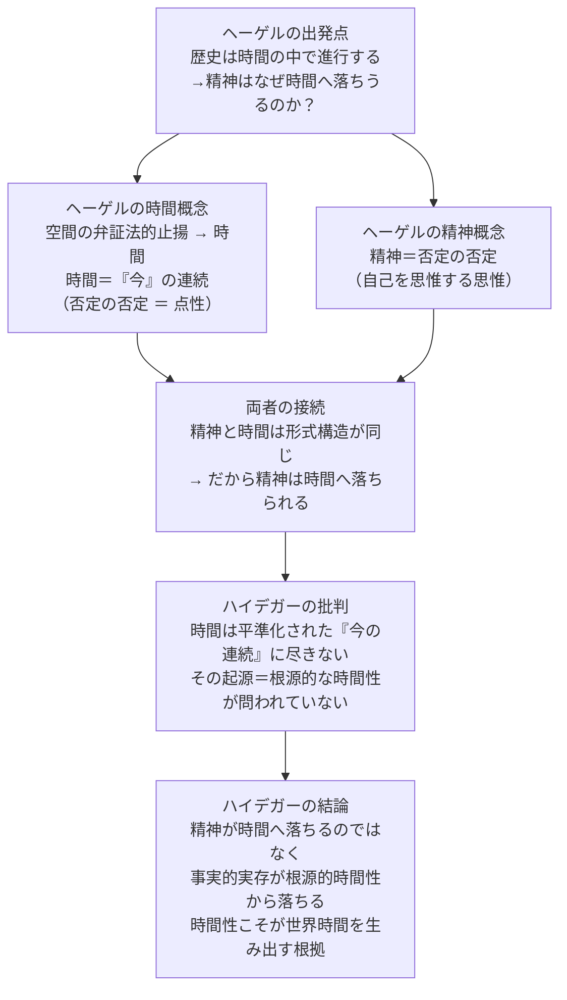

## 「§82」は何だと言っているのか

*ハイデガー『存在と時間』第82節*

---

### この節の結論を先に言うと

ヘーゲルは「精神が時間の中へ落ちる」と言った。ハイデガーはこれを正面から受け取り、**なぜヘーゲルではそう言うしかなくなるのかを解剖したうえで**、まったく逆の結論を打ち出す。

精神が先にあって、後から時間の中へ落ちるのではない。そもそも人間（ダザイン）は**根源的な時間性として実存している**のであり、その時間性が世界時間を生み出し、その地平の上で歴史が現れてくる。「落ちる」のは精神が時間へではなく、**事実的な実存が、根源的な本来的時間性から**「落ちる」のだ、というのがこの節の核心である。

---

### 節の見取り図

---

### ①ヘーゲルが解こうとした問い

ヘーゲルの歴史哲学は「歴史の展開は時間の中へと落ちる」という認識から始まる。しかしヘーゲルはこれを単なる事実として放置しない。**精神がなぜ時間と親縁でありうるのか**を哲学的に示そうとする。そのために二つを論じなければならない。

- 時間の本質とは何か
- 精神の本質とは何か

ハイデガーはこのヘーゲルの議論を素材として使い、**自分自身のダザイン＝時間性という解釈を際立たせる**ために分析する。ヘーゲルを「批判」することが目的ではない、と明言している。

---

### ②ヘーゲルの時間概念——「今の連続」という平準化

ヘーゲルは時間の概念を自然哲学（『エンチュクロペディー』第二部）の中に置いた。これはアリストテレスが時間を「自然学」の文脈、すなわち運動・場所とともに扱ったことと正確に対応している。

**空間から時間へ**

ヘーゲルにとって空間とは、無数の点が差異なく並び続ける「抽象的な相互外在」である。空間の中の点は、空間を否定するが（空間ではない何かとして自分を立てようとするが）、結局また空間の中に収まってしまう。

ここで弁証法が働く。否定が否定される（否定の否定）と、点は「自分のためにある」ものとして立てられる。その瞬間、点は「今・ここ」という単位を持つ。各点が自分のために自分を措定するとは、その都度「今」という形で現れることだ。この「今の連続」こそ時間であり、ゆえに「空間は時間である」とヘーゲルは言う。

> 「時間とは、それがあるときにはなく、それがないときにはある存在である。すなわち直観された生成である」

「直観された生成」——これは思惟されるのではなく、今の連続として単純に呈示される移行を指す。重要なのは、**時間がまず「今」から理解されている**という点だ。

**ヘーゲルの時間は「通俗的時間」の最も徹底した定式化**

ハイデガーはここで次のように指摘する。ヘーゲルの時間把握は日常の感覚と同じ方向にある。「今」を基点に取り、過去・未来はその「今」から派生する。ヘーゲル自身もこう述べている。

> 「ただ現在のみが存在し、前と後とは存在しない」

> 「今は絶大な権利を有する——私がそれを語り出すや否や、解消され、流れ去り、霧散してしまう」

ヘーゲルの時間は「否定の否定（点性）」という形で極限まで形式化された「今の連続」であり、そこでは今が平準化されて均質に並ぶだけになっている。これがハイデガーの言う**通俗的時間了解の最も根底的な概念的定式化**である。

| ヘーゲルとアリストテレスの対応 | アリストテレス | ヘーゲル |
|---|---|---|
| 時間の基本単位 | νῦν（今） | Jetzt（今） |
| 今の空間的性格 | στιγμή（点） | Punkt（点） |
| 今の指示的性格 | τόδε τι（この或るもの） | das absolute Dieses（絶対的なこれ） |
| 今の境界的性格 | ὅρος（境界） | Grenze（限界） |
| 時間の閉じた形 | σφαῖρα（天球）との結合 | Kreislauf（円環） |

ヘーゲルの時間概念はアリストテレスの時間論を弁証法的に再定式化したものに他ならない、とハイデガーは見る。

---

### ③ヘーゲルの精神概念——「否定の否定」としての自己

精神の本質はヘーゲルにとって**概念（Begriff）**である。これは単なる「頭の中の普通概念」ではなく、「自己を思惟する思惟」、つまり自分が自分を概念把握するという運動そのものを指す。

非我（自分ではないもの）を把握するということは、一つの区別作用だ。そしてその区別を把握するということは「区別の区別」になる。だからヘーゲルは精神の本質をも**否定の否定**として規定できる。これをヘーゲルは「絶対的否定性」と呼ぶ。

デカルトの「我思う、ゆえに我あり」——より正確には「我は我が何かを思うことを思う（cogito me cogitare rem）」——の論理的形式化が、ここに見えている。

精神の「前進」（歴史における自己実現）は、排除し克服しながら引き受けていく運動だ。精神はそのつど「おのれ自身」を最大の障害として乗り越えなければならない。この不安に満ちた自己克服こそが精神の発展であり、その目標は「おのれ自身の概念に到達すること」だ。

---

### ④精神と時間の連関——形式的同一性という解決

精神の本質 = **否定の否定**
時間の本質 = **否定の否定（点性の否定）**

形式構造が同じだから、精神は時間と親縁でありうる。これがヘーゲルの接続の仕方だ。

> 「時間とは、現にそこに存在する概念そのものであり、空虚な直観として意識に自らを表示するものだからである。それゆえ精神は必然的に時間の中に現れ……時間を抹消しない限り、時間の中に現れ続ける」

時間は「直観されるだけの概念」であり、精神はそれを把握して消化し、最終的に時間を「抹消」する。精神が時間を支配するとき、精神は時間の「外に」出る。これがヘーゲルの描く精神の歴史的運動だ。

しかしハイデガーはここに二つの根本的な問題を見る。

| ヘーゲルが問わずに放置した問い | 内容 |
|---|---|
| 平準化された時間の起源 | 「今の連続」という時間はどこから来るのか。根源的な時間性との関係が問われていない |
| 精神の構成の根拠 | 精神の「否定の否定」という本質は、根源的な時間性の上においてのみ可能ではないのか |

形式的な同一性（どちらも否定の否定）によって両者を接続するだけでは、**時間も精神も最も空疎な抽象レベルで捉えられている**。そのため「精神が時間へ落ちる」という事態の存在論的意味——何がどこへ落ちるのか——は暗いままに残る。

---

### ⑤ハイデガーの結論——「落ちる」方向が逆だ

ヘーゲルの図式では、精神が先にあって、そこから時間の中へ落ちる。

ハイデガーはこれをひっくり返す。

> 「精神」はそもそも初めて時間のなかへ落ちるのではなく、時間性の根源的な時熟（Zeitigung）として実存する。

**時熟（Zeitigung）**とは、時間性が自らを各様態（将来・既在・現在）において組織化し、具体的な実存の在り方を可能にすることを指す。ダザイン（人間的存在）は時間性そのものとして実存しており、その時間性が**世界時間を時熟させる**。世界時間とは、日常の道具的世界の中で「今・こうすれば」「その後に」という形で開かれてくる時間だ。その世界時間の地平の上で、はじめて歴史が「内時間的な出来事」として現れてくる。

「落ちる」のは方向が逆だ。

> 事実的実存は、頽落しつつあるものとして、根源的な本来的時間性から「落ちる」のである。

頽落（たいらく）とは、ダザインが自分の根源的な在り方から離れ、日常の「世の中」に紛れ込む傾向を指す。その頽落もまた、時間性の一様態として可能になっている。つまり「落ちる」こと自体が時間性の一部だ。

| 比較項目 | ヘーゲル | ハイデガー |
|---|---|---|
| 時間の捉え方 | 今の連続（平準化された世界時間）| 根源的な時間性が先にあり、世界時間はそこから派生する |
| 精神・ダザインの位置 | 精神が先にあり、時間へ落ちる | ダザインは時間性として実存する、時間性が先 |
| 「落ちる」方向 | 精神 → 時間 | 事実的実存 → 根源的本来的時間性から離れる |
| 歴史の位置づけ | 時間の中での精神の自己実現 | 世界時間の地平上での内時間的出来事 |
| 時間の起源 | 問われていない（与件として扱う）| 根源的時間性の時熟として説明される |

---

### この節全体が果たす役割

§82はいわば**対話相手としてのヘーゲル**を精密に召喚する節だ。ヘーゲルは通俗的な時間了解を最高度に概念化した哲学者だからこそ、格好の対照点になる。

ヘーゲルが「精神と時間の形式的同一性（否定の否定）」という答えで止まったところを、ハイデガーは「その形式的同一性自体が、根源的な時間性によってはじめて可能になっている」と掘り下げる。精神が時間の中へ落ちるのではなく、**時間性として実存するダザインから世界時間が開かれ、その地平の上で歴史が現れる**——これが『存在と時間』の時間論の締めくくりに向けて示される、最終的な見取り図である。
