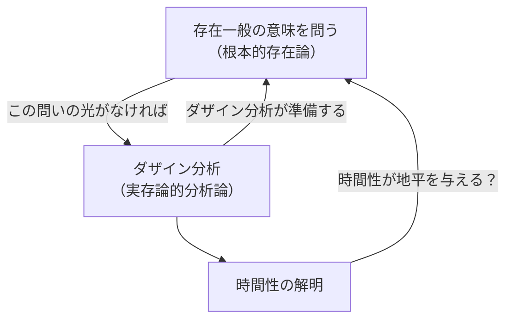
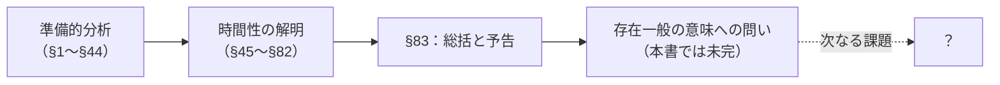

## 「§83」は何だと言っているのか

*ハイデガー『存在と時間』第83節*

---

### この節の結論をひと言で言うと

第83節は『存在と時間』の**最終節**である。ここでハイデガーは「これまでやってきたことの総括」と「これから本当に問わなければならないことの予告」を一緒に行っている。

まとめると——

> 本研究がひとえに向かっているのは、この準備のためにほかならない。

つまり、この大著全体はまだ「準備」に過ぎない、と著者自身が言っている。では何の準備か。それは「**存在一般の意味**とは何か」という、哲学史上もっとも根本的な問いに本格的に向き合うための、地ならし作業だった——ということが最後のページで明かされる。

---

### Step 1：これまでの道のりを振り返る

ここまでの『存在と時間』は大まかに次の構造をたどってきた。

| 段階 | 内容 |
|------|------|
| 準備的分析 | 人間（ダザイン）がどんな存在構造をもつかを記述する |
| 全体性の問い | 死・良心・決意を通じて、人間の存在の「まとまり」を問う |
| 時間性の解明 | 人間の存在の意味の根底に「**時間性（Zeitlichkeit）**」があることを示す |

**ダザイン**（Dasein）＝「そこにある」という意味のドイツ語で、ハイデガーが「人間」の代わりに使う言葉。存在を問いかける唯一の存在者を指す。

**配慮**（Sorge）＝人間の存在の基本的なあり方。常に何かに向かい、すでに何かの中に投げ込まれ、他の物事と関わりながら生きているという構造全体を指す。

**時間性**（Zeitlichkeit）＝過去・現在・未来が一体となって人間を「貫いている」あり方。配慮の意味として解明された。

---

### Step 2：しかし、まだゴールには届いていない

節の冒頭で達成を確認したあと、ハイデガーはすぐに釘を刺す。

> ダザインの存在体制の解明は、あくまで一つの道程にとどまる。目標は、存在問題一般の仕上げである。

「人間の存在を解明すること」はあくまで途中の道。最終目標は「**存在そのものとは何か**」を問うことだ、というのである。

そしてもう一つ重要な指摘がある。実は、人間の存在を分析するためにも、「存在とは何か」という問いが先に照らし出してくれる光が必要だった、という循環構造がここで正直に告白される。

この「行ったり来たり」の構造は循環論法ではなく、哲学的問いの**避けがたい往復運動**だとハイデガーは考えている。

---

### Step 3：「物化」という問題——古い存在論への批判

次にハイデガーは、過去の哲学が犯してきたミスを指摘する。

> 物化とは何を意味するのか。それはいかなるところから発生するのか。

**物化**（Verdinglichung）とは、本来「物」ではないもの（たとえば意識・人間・時間）を、まるで目の前に置いてある「モノ」と同じように扱ってしまうこと。

古代以来の哲学は「存在とは何か」を考えるとき、ついつい「目の前にある石や机」のような**眼前存在するもの**（Vorhandenes）をモデルにして考えてきた。しかしハイデガーは「それでは人間の存在も、意識の存在も、正しく捉えられない」と言う。

このことはハイデガーが示したかった大きな論点の一つだが、**物化の問いはまだ十分に答えられていない**とも認める。それも「存在一般の意味」が未解明なままだからだ、と。

---

### Step 4：では、どうすれば「存在一般」を問えるのか

ハイデガーはここで謙虚な宣言をする。

> 存在の解釈をめぐる論争は、いまだ火蓋さえ切られていないがゆえに、収拾されえない。

「存在とは何か」をめぐる本当の哲学的論争は、まだ始まってさえいない——なぜなら、論争の**地平（問いを支える共通の足場）**がまだ整備されていないからだ。そして形式的な論理的「抽象」によって存在の理念を取り出すことはできない、とも言う。

> 存在一般の「理念」の起源と可能性について探究するためには、形式論理的な「抽象」の手段によることは決してできない。

---

### Step 5：最後の問い群——本当の問いはここから始まる

最終段落でハイデガーは、これからの哲学が向き合うべき問いを一気に並べる。これが節の、そして本書全体の「締め」である。

> 「存在」のごときものは、存在了解のうちに開示されている。この存在了解は、理解として実存するダザインに属している。

人間は「存在する」という意味をぼんやりとだが先取り的に理解している（**存在了解**）。だからこそ存在者に関われる。では、その了解はどこから来るのか。

最後に投げかけられる問いを整理すると——

| 問い | 意味のかみ砕き |
|------|----------------|
| 存在了解はダザインの存在構成から答えられるか？ | 「人間の時間的なあり方」が「存在を理解できること」を説明できるか？ |
| 時間性のどの時熟様式が存在の企投を可能にするか？ | 未来・過去・現在のどのはたらきが「存在とは何か」への問いを開くのか？ |
| 根源的な時間から存在の意味へと至る道はあるか？ | 時間こそが「存在」を理解するための地平なのか？ |
| 時間それ自体が存在の地平として開示されるのか？ | 「**時間＝存在の地平**」という命題は成立するのか？ |

これらはすべて**問いのかたちのまま**で本書は終わる。答えは与えられない。

---

### まとめ：この節全体の位置づけ

第83節のメッセージを一本の線で表すとこうなる。

- **達成したこと**：人間（ダザイン）の存在の意味が時間性であることを示した。
- **まだ残ること**：時間が「存在そのもの」の地平となりうるかどうかは、これから問わなければならない。
- **本書の自己評価**：「準備」である。

ハイデガーが晩年に「存在と時間は未完だ」と繰り返し言い続けたのは、この最後のページに既に書き込まれていた。問いを立て直すこと自体が、この本の最大の贈り物だったとも言える。
