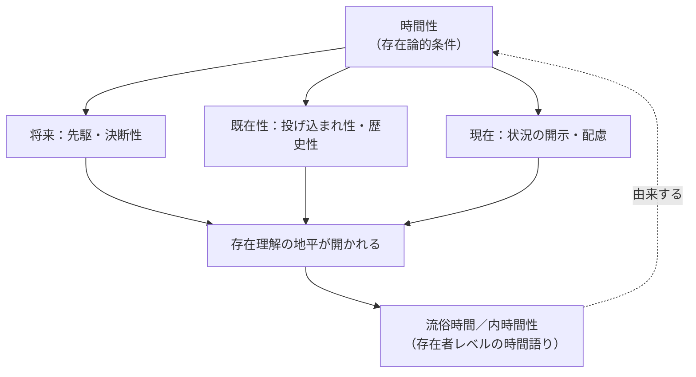

## 第二編の総括：時間性は「属性」ではなく開示の条件である

*内的完結稿 — 第一部 第三編 / 第1章 時間性と存在理解の地平 / 節 id: P1-III-01-01*

---

### 問いの再定位

第二編が終わったいま、立ち止まって振り返ることが必要である。第一編が「世界内存在」の構造連関を記述したとすれば、第二編はその構造が時間性（Zeitlichkeit）――ダザインの存在を貫く根本的な時熟の運動――によって一貫して支えられていることを段階的に示してきた。配慮（Sorge）は「すでに……において、……のかたわらで存在しながら、先駆する」という三重の構造をもち、この構造はそれぞれ既在性・現在・将来という時間性の三契機に対応する。視線としての了解、言語による開示、良心の呼びかけ、決断性（Entschlossenheit）、そして歴史性（Geschichtlichkeit）――これらの分析は別々の主題を扱っていたように見えて、じつは一つの問いを繰り返し掘り下げてきた。その問いとは、「ダザインはなぜ存在を理解できるのか」である。本節はその問いへの答えを、時間性という概念の核心に照準を絞って再確認する。

### 「時間がある」という語りと時間性との峻別

日常言語において「時間がある」「時間がない」と語るとき、わたしたちは時間を計量可能な資源のように扱っている。時計の針が刻む均質な「今の連続」、つまり流俗時間（vulgäre Zeitlichkeit）の語りである。この語り方では、時間はまず存在者の属性として登場する。ある出来事は「三時間かかる」、ある人物は「時間を無駄にした」、と。しかしここに注意が必要である。流俗時間の概念は、ダザインがすでに存在を了解していることを前提にして初めて成立する。何かを「今ある」と語れるのは、その「今」が既在と将来のはざまで切り取られているからであり、そのような切り取りはダザインの時間的開示なくしては起動しない。

存在論的差異（ontologische Differenz）――存在者と存在そのものとの区別――という概念枠を借りれば、この峻別は次のように言える。流俗時間は存在者レベルの語りであり、時間性は存在レベルの条件である。時間性は時間という名の「物」ではなく、「何かが存在として開示される」ことの構造的可能性の条件（Bedingung der Möglichkeit）である。ダザインが時間をもつのではない。ダザインが時間性として時熟する（zeitigen）がゆえに、そもそも存在者が現れる地平が開かれるのである。

### 第二編の諸分析を「存在理解」へ収束する

この視点から第二編の各分析を読み返すと、それらが一つの焦点に向かっていたことが明確になる。

死への先駆（Vorlaufen zum Tode）は単なる終末論ではない。もっとも固有な可能性としての死に先駆することによって、ダザインは常人（das Man）の匿名的な平均化から引き剥がされ、みずからの全体的な存在連関を引き受ける契機を得る。この引き受けは了解の射程を決定する。何を「ある」と受け取るかは、ダザインがどこに立って将来へと向かうかに依存しており、その「どこに立つか」を根拠づけるのが時間性の将来契機である。

良心の呼びかけと決断性においても同様の構造が働く。呼びかけは常人の語りの騒音を遮断し、現（Da）の開示性を本来的に引き受けるよう促す。決断性は「状況の開示」として定義されるが、状況とはつねに既在と将来のはざまに張られた現在の布置である。開示されるべき「状況」が時間性の三契機によって構成されている以上、決断性もまた時間性の具体的な時熟にほかならない。

歴史性の分析はこれをさらに拡張する。ダザインは「生まれた」存在であり、文化・伝統・運命的な連関のなかに投げ込まれている。この投げ込まれ性（Geworfenheit）は、単なる過去の「重荷」ではなく、ダザインが了解の出発点とする既在性の地盤である。歴史性はダザインが時間的連関の全体として存在することを示すが、この連関は外から課せられた「歴史という環境」ではなく、時間性そのものの伸張（Erstreckung）として了解されなければならない。したがって歴史性もまた、「存在が何として開示されるか」を規定する条件として時間性に収束する。

### 第一編・第二編の分析が一つの地平としてまとまること

第一編は世界内存在の構造を「道具連関」「指示性」「世界性」「他者と共存在」といった現象から解明した。当時はまだ、それらがなぜそのような構造をもつのかという根拠は潜在していた。第二編はその根拠を時間性として掘り起こした。これにより第一編の記述は、単なる現象列挙ではなく、時間性が具体的な局面で時熟した姿として再理解される。道具が「手元にある（Zuhandensein）」という現象も、配慮の時間的構造から切り離せない。世界が「了解された全体」として先立って開かれているのも、将来から投げ返される理解の地平があるからである。

こうして第一編と第二編は事後的に結合するのではなく、最初から一つの問い――「存在理解はいかにして可能か」――を問い続けてきた一続きの分析として読まれるべきものとなる。時間性はその問いに対するほぼ最終的な答えであるが、「ほぼ」という留保が残る。時間性が存在理解の地平を開くとすれば、その地平そのものを「存在論」の言語で主題的に取り出すことが、なお課題として残されるからである。これが第三編へと向かう論理的必然である。

### 結論の確認

ダザインの時間性は、ダザインという存在者が「もつ」属性でも、表象作用の一様式でもない。それは、何かが存在として現れる可能性そのものを先立たせる開示の条件である。流俗時間の語りはこの条件を隠蔽しながら寄生する。存在論的差異を踏まえるならば、時間性の問いは必然的に「存在の意味への問い」へと接続される。第三編はその接続を、概念としての「時間性」から、存在理解の「地平」という問いへとさらに一歩進めることになる。
