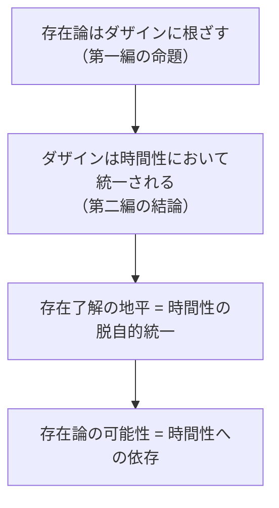

## 存在理解は常に「すでに」時間的である

*内的完結稿 — 第一部 第三編 / 第1章 時間性と存在理解の地平 / 節 id: P1-III-01-02*

---

### 解釈学的構造としての時間性──「事前理解」を再記述する

ダザイン（*Dasein*、「そこに在ること」を意味し、人間的存在様式を指す概念）は、世界に投げ込まれた瞬間からすでに何らかの仕方で存在を了解している。この了解は、反省や判断に先立って働いており、第一編・第二編においては「事前理解」あるいは「存在了解の先行構造」として記述されてきた。問題はいまや、その構造がいかなる根拠において可能であるか、という問いへと向かう。

事前理解の構造——すなわち先行把持（*Vorhabe*）・先行視（*Vorsicht*）・先行概念（*Vorgriff*）からなる解釈学的な「前」の三重性——は、単に認識論的な優先性を示すに過ぎないのではない。この「前」は、時間的に言えば「すでに＝かつて（*Gewesenheit*）」の様態において了解が構成されていることを指している。ダザインは何かを解釈するとき、つねに「かつてそうであった」了解の地平の上に立って現在の存在者に向かう。解釈学的構造は、それゆえ同時に時間的構造である。前者を後者へと再記述することは、単なる翻訳ではなく、構造の存在論的根拠を白日のもとに晒す操作である。

同様に、投げ込まれ性（*Geworfenheit*）は時間性の語彙において次のように厳密化できる。ダザインはつねにすでに「かつて」の中に投げ込まれており、その投げ込まれた「かつて」から逃れることはできない。投げ込まれ性は、ダザインにとってその「あった」が取り消し不能な所与として課されることを意味するが、これはまさに時間性の「かつて」の様態が単なる過去の「もはやない」ではなく、現在の了解を根底で規定し続ける実存的事実として機能していることを示す。了解の事前性は、存在論的には「かつて」の時間的重みに支えられている。

---

### 存在者を見出すこととしての時間的地平への立入り

存在者を存在者として見出すこと——これは日常の配慮（*Sorge*）において常になされているが、その条件は何か。第一編は、ダザインが世界内存在として世界と道具的に関わることを記述した。しかし、道具が「使えるもの」として開示されるためには、それが何らかの目的連関の地平の中に置かれていなければならない。この目的連関の地平は、「先に向かって＝将来（*Zukunft*）」という時間的様態によって支えられている。ダザインは、道具を手に取るとき、すでにその道具を用いる「ために」を先取りしており、その先取りにおいて道具は道具として意味を帯びる。

ここに時間性の三つの様態が揃う。ダザインは「かつて」投げ込まれた地平から出発し（過去性）、「先に向かって」何かを企投し（将来性）、その交差する只中において存在者を「今、ここで」配慮的に取り扱う（現在性）。存在者を存在者として見出すことは、この三様態の統一的な時間的運動の中でのみ成立する。地平としての時間は、存在者の出現する「場」を構成しており、ダザインはつねにすでにその地平の内側に立ってしまっている。

これは、時間を「流れ去るもの」と見なす流俗時間（*vulgäres Zeitverständnis*、今の点の連続として時間を捉える通俗的理解）の見方とは根本的に異なる。流俗時間において時間は均質な「今」の系列に還元されるが、ダザインの時間性はそのような均質性の中には見出せない。開示性（*Erschlossenheit*）を可能にする地平は、今の点が並ぶ直線ではなく、「かつて・先に・今」が相互に浸透し合いながら統一されている脱自的（*ekstatisch*）な構造である。存在者の開示は、この脱自的統一の内でのみ起こりうる。

---

### 「存在論はダザインに根ざす」命題の時間的厳密化

第一編は、あらゆる存在論（存在者一般の存在を問う学）がダザインという存在様式の中に根拠を持つことを示した。ダザインのみが存在を問いうるのは、ダザインのみが開示性をもつからである。第二編はさらに、この開示性を根底で可能にするものとして時間性を析出した。決断性（*Entschlossenheit*）においてダザインは良心の呼び声に応じ、死への先駆において自らの全体性を引き受けるが、そのような本来的な自己了解そのものが時間性の本来的様態によって成り立っていた。

いまや問われなければならないのは、第一編の命題「存在論はダザインに根ざす」が、厳密には「存在論は時間性に根ざす」という命題として書き直されるべき必然性である。ダザインが存在を了解するのは、ダザインが時間的だからである。逆に言えば、時間性を欠いた存在様式は、存在を了解することができない。したがって、存在論的差異（*ontologische Differenz*、存在者と存在それ自体との区別）をそもそも立てることができるのは、「かつて・先に・今」の統一された様態において世界に立ち入っているダザインだけである。

ここに本節の結論が成立する。存在を理解することは、つねにかつて・先に・今の統一された様態において世界に立ち入っていることに他ならない。この立入りは、ダザインが意識的に選択する以前にすでに起きており、了解はつねに時間性という地盤の上でのみ息づく。第三編が問いへと向かう「存在の意味としての時間」という主題は、以上の地点からのみ真剣に問いを立てることができる。存在論の問いが深まるほど、それは必然的に時間性の問いへと帰着するのであり、これが既刊の分析全体が準備してきた論理的帰着点である。
