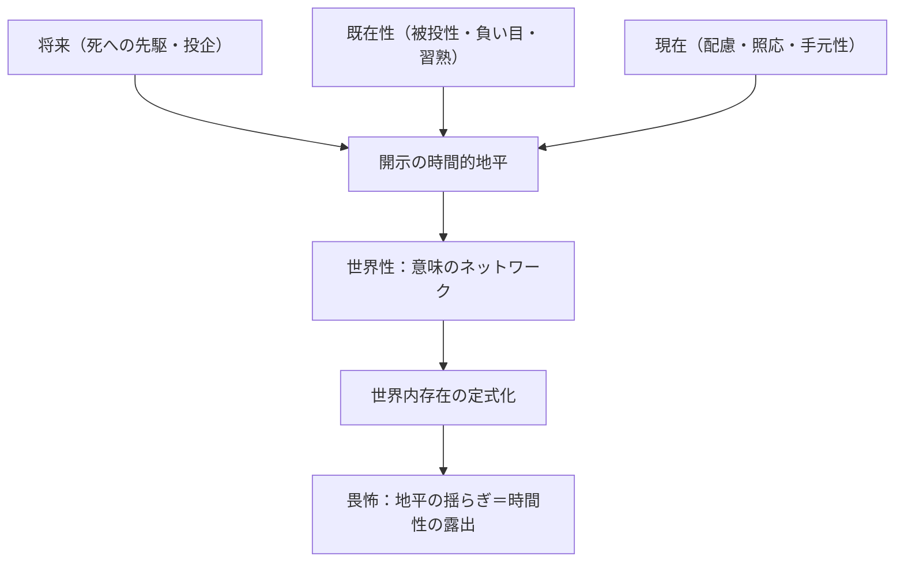

## 世界性と時間性：意味のネットワークの時間的根拠

*内的完結稿 — 第一部 第三編 / 第1章 時間性と存在理解の地平 / 節 id: P1-III-01-03*

---

### 手元性の分析を時間的地平へ接続する

第一部第一編において、ダザイン（現存在：そのつど自己の存在が問いになっている存在者）の日常的なあり方は「配慮」（ベゾルゲン：道具的存在者との関わり全体を統括する実践的な気遣い）として記述された。槌は打つためにあり、釘は留めるためにあり、作業台は仕上げるためにある——こうした**照応**（フェルヴァイズング：ある道具がそれ以外の何かへと差し向けられている連絡関係）の連鎖が重なり合い、全体として**用途性**（ディーンリヒカイト：「〜のために役立つ」という存在様式）の網の目を形づくる。この網の目をこそ**世界性**（ヴェルトリヒカイト）と呼ぶ。

だがここで問われるべきは、照応の連鎖が「そこに在る」という空間的・論理的な共存として完結するものかどうかという点である。槌を手に取るとき、ダザインはすでに「これで何かを仕上げようとしている」という**目的連関の予期**を担っている。槌が手元に使い込まれた工具として現れるのは、過去の習熟——「あのとき習い覚えた打ち方」——が沈殿しているからであり、今まさにそれが「今」の動作として生きられ、「そのとき完成するであろう何か」という将来の地平へ向けて引き張られているからである。

つまり「今・そのとき・あのとき」という時間的な三重性が、手元性の構造の内部に最初から織り込まれている。照応は静的な意味関係ではなく、将来（Zukunft）・既在性（Gewesenheit）・現在（Gegenwart）という時間性の三契機が同時に展開しているダイナミックな運動として初めて成立する。世界性とは、こうして**意味の照応がいつもすでに時間的に織り込まれている**構造のことに他ならない。

---

### 畏怖における世界の揺らぎを時間的に読む

第一編の不安（アングスト）の分析は、日常的な「常人」（ダスマン：世間の誰とも特定されない均質な「ひと」）的存在様式からダザインを引き剥がし、「世界がない」という奇妙な感覚へと投げ込む。不安においては、手元的な道具の連関が意味を失い、「なんとなく不気味だ」という基調が世界全体を覆う。これは従来、まず存在論的な開示の様式として論じられてきた。

しかし時間性の観点から再読すると、この経験はさらに鮮明な輪郭を持って現れる。不安において意味連関が崩れるとき、何が崩れているかといえば、それは「あのとき積み重ねた習熟がそのとき役立つ」という過去から将来への時間的連続性の保証である。畏怖の様態において「世界がない」と感じられるのは、単に手元的な道具が役立たなくなるのではなく、意味の照応を成立させていた**時間的地平そのもの**が揺らぐからである。将来への投企の先端と既在性の沈殿した底とが互いに支え合うことで初めて「世界」は透明に機能する——その相互支持が解体されるとき、ダザインは「根拠なき空虚」の中に晒される。

不安は、時間性を隠蔽している日常的な均質時間（流俗時間：時刻の系列として経験される通俗的時間把握）の皮膜を剥ぎ取り、世界性がじつは時間的地平の緊張の中にのみ成立していたことを露わにする。「世界がない」とは、意味のネットワークの時間的根拠が突如として前景に現れたときの、存在論的な眩暈の記述なのである。

---

### 世界内存在の定式化と開示の時間性

「世界内存在」（イン・デア・ヴェルト・ザイン）という定式は、ダザインが「内」にある世界という容器を持つという空間的命題ではなく、ダザインの存在様式そのものが世界と不可分に構造化されているという実存論的命題である。第二編における決断性（エントシュロッセンハイト：良心の呼び声に応え、固有の可能性へと先駆するあり方）の分析が明らかにしたように、ダザインが本来的に存在するとき、それはつねに「死へ先駆する」という将来の先端と「負い目ある存在として引き受けた既在性」との緊張の中で現れた。

この構造を踏まえると、世界内存在という定式が完全に解明されるのは、実はその時間的根拠が示されたときに限られることが分かる。

将来・既在性・現在の三契機が開示の統一的な地平として働くとき、手元的な道具の照応網は透明に「機能する世界」として現れる。その地平が揺らぐとき——不安において、あるいは決断において——世界性の時間的根拠が逆光の中で照らし出される。

世界内存在の定式化は、こうして**開示の時間性に基づいている**と言わねばならない。意味のネットワークは宙に浮く論理的構造ではなく、将来へ向けて引き張られ、既在性の重さを引きずり、現在の配慮のうちに生きられる時間的な出来事として初めて世界として機能する。世界性は、意味の照応がいつもすでに織り込まれているという意味で、時間的である——この命題は、第一編・第二編の分析が論理的に要求していた帰結であり、第三編が引き受けるべき問いの出発点でもある。
