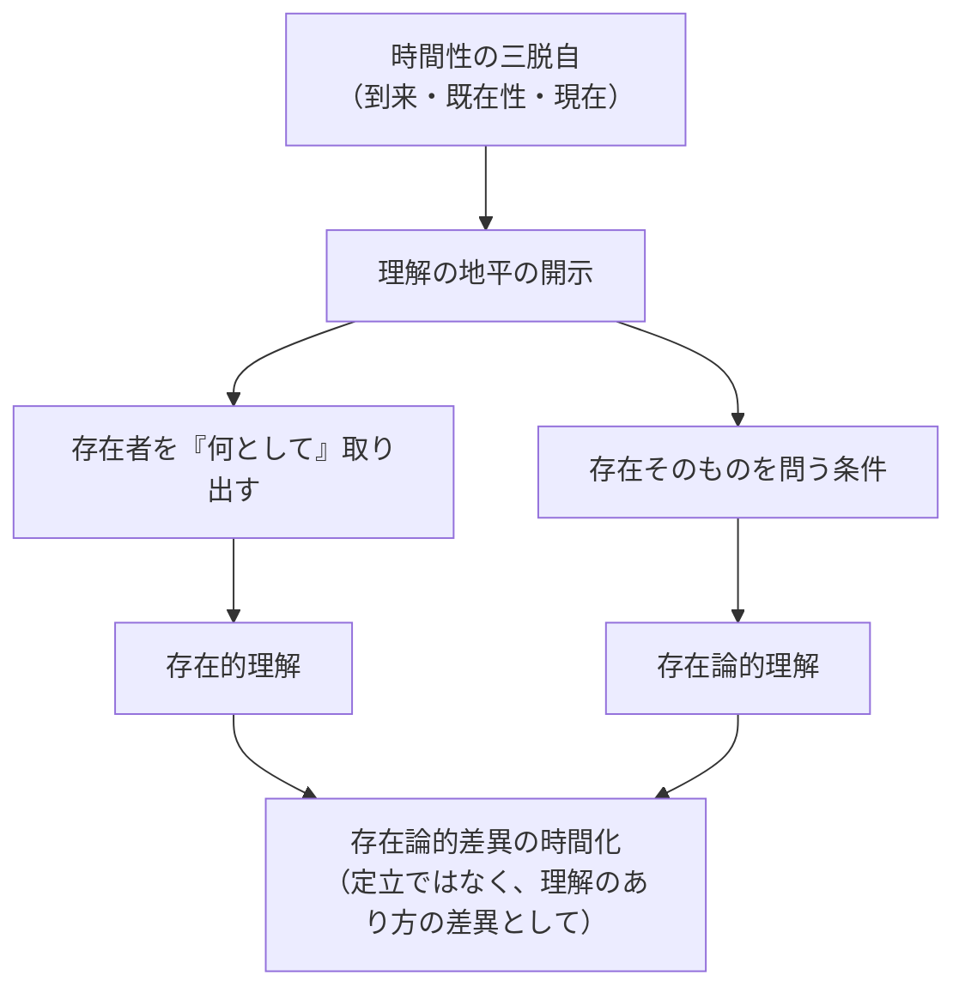

## 存在と存在者の区別の時間的意味

*内的完結稿 — 第一部 第三編 / 第1章 / 節 id: P1-III-01-04*

---

### 一　先行理解の地平としての時間性

ダザイン（現存在）が何らかの存在者に出会うとき、その出会いはつねに「何かを何かとして」という理解の構造を帯びている。工具が「使えるもの」として、他者が「配慮（Sorge）の連関のなかにいる誰か」として開示されるのは、ダザインが予め世界の地平を保持しているからである。この「予め」という先行性が重要である。存在者を「何として」取り出す行為は、事後的な認識操作ではなく、理解がすでに時間的に伸展していることによって初めて可能になる。

時間性とは、ダザインが「既在性・現在・到来」という三つの脱自（Ekstase）において自己を開き出す構造を指す。ダザインは過去のうちに閉じこもるのでも、瞬間の現在に釘付けになるのでもなく、到来へ向けて既在から引き受けた可能性を現に遂行するという仕方で存在している。存在者を「何として」理解する地平は、この三つの脱自が統一的に張り合わせた空間として成立する。言い換えれば、存在的（存在者レベルの）な事実の広がりに先立って、存在論的（存在レベルの）な地平としての時間性がすでに開かれているのである。

---

### 二　存在論的差異を「定立」としてではなく理解のあり方の差異として時間化する

存在論的差異とは、存在者と存在そのものとを区別することを指す。この区別はしばしば、二つの対象を並べてその違いを指摘する「定立」の操作として誤解される。しかし、そのように理解するならば、存在はただ「もう一つの存在者」に格下げされるにすぎない。存在はいかなる存在者でもなく、存在者を存在者たらしめる開示の条件そのものである。

この差異が定立ではないとすれば、それはどこから生じるのか。答えは時間性の内部にある。ダザインは到来へ向けて先駆するとき、己の死（終わりとしての可能性）を引き受け、既在の投企性（自己がすでに投げ込まれているという事実）を取り戻す。この運動において、存在者の「何であるか」という問いと、そうした「何であるか」が成立する条件という問いとは、同一の理解の内で自然に分岐する。つまり、存在論的差異はダザインが時間的に自己を開示する運動そのものにおいて時間化される。差異は論理的な命題として外から持ち込まれるのではなく、時間的伸展のうちで生起するのである。

---

### 三　「存在は自ら明示されない」という命題の時間的再提示

『存在と時間』の序論は、問うに値するものとして存在の問いを再提起するにあたって、一つの逆説的な事態を指摘していた。すなわち、ダザインはつねにすでに存在を何らかの仕方で了解しているにもかかわらず、存在それ自体は主題的に明示されないままにとどまる、という事態である。日常の常人（das Man）的な在り方においてダザインは「何が存在するか」には関わりつつ、「存在するとはどういうことか」には問いを向けない。存在はいわば使い尽くされながら隠蔽され続ける。

この命題を時間性の観点から再び取り出すと、次のように言える。流俗時間（日常的な「今の連続」として理解される時間）の水準では、ダザインは現在の「今」に釘付けになり、内時間性（世界のなかで道具や出来事に「いつ」という形で時間を割り振る様式）の範囲内に留まる。そこでは存在者の「いつ・どこに・何が」は問われても、存在者をそもそも開示している地平そのものへの問いは背景に退く。存在が明示されないのは、ダザインが流俗時間の平均的了解のうちに没頭し、時間性の根源的な統一性——到来・既在性・現在の脱自的統一——を主題化しないからである。

逆に言えば、良心の呼び声に応え、決断性（自己の可能性を引き受ける本来的な在り方）において時間性が本来的に開示されるとき、ダザインは存在者の「何として」に先立つ地平そのものへと向き合う回路を得る。存在論的差異が時間化されるとはまさにこのことであり、存在の問いが意味を持つのも、ダザインの時間的伸展がその問いを可能にする地平を開いているからにほかならない。

---

### 四　本節の帰結と続論への連絡

以上をまとめれば、存在と存在者を分つこと自体が、存在理解の時間的伸展に根ざしている、という命題の内実は次のように整理できる。

| 論点 | 内容 |
|---|---|
| 先行理解の地平 | 存在者を「何として」取り出す理解は、時間性の三脱自的統一が先行して開いた地平による |
| 差異の時間化 | 存在論的差異は定立ではなく、ダザインの時間的自己開示運動の内で生起する区別である |
| 存在の隠蔽と開示 | 流俗時間への没頭が存在を隠蔽し、本来的時間性への回帰が存在の問いを再び開く |

この整理は、時間性がたんに「ダザインの内側にある心理的時間」ではなく、存在理解そのものの地平的条件であることを示す。存在論的差異を時間性と結びつけることによって、「存在の問いはなぜ可能であり、なぜ繰り返し立てられなければならないか」という問いに対する応答の輪郭が浮かび上がる。次節以降では、この地平の構造が歴史性とどのように結びつくか、そして存在理解の伸展がダザインの自己解釈の歴史的連関としてどのように具体化されるかを論じる必要がある。
