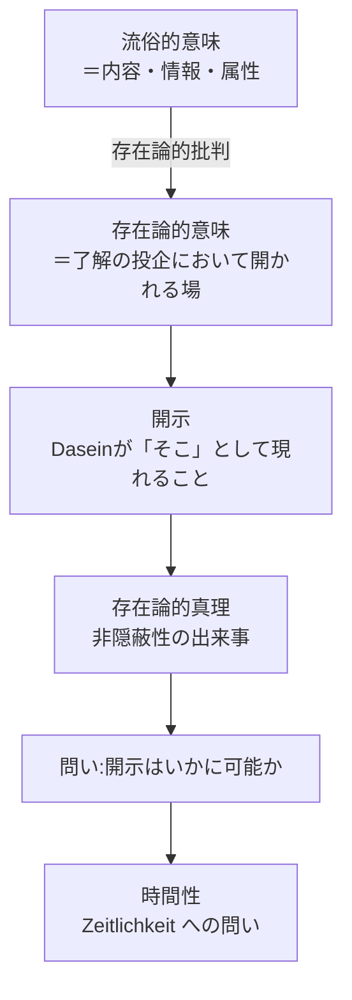

## 「意味」とは何を意味するのか（存在論的用法の整理）

*内的完結稿 — 第一部 第三編 / 第2章「存在の意味」と時間的視座 / 節 id: P1-III-02-01*

---

### 一　問いの射程を定める

「存在の意味とは何か」という問いは、『存在と時間』の第一句からすでに鳴り響いている。しかしこの問いを前にしたとき、私たちはまず立ち止まらなければならない。「意味」という語そのものが、問われぬまま滑りゆく危険を孕んでいるからである。日常の会話において「意味」とは、ある言葉が指し示す内容、あるいはある行為が担う情報のことを指す。だが存在論的な問い——存在者一般の「ある」ということが問われる場面——において、その流俗的な用法をそのまま持ち込むことは、問いを始まる前に潰してしまうに等しい。本節の課題は、「意味」という語の存在論的用法を整理し、それが開示（Erschlossenheit）という概念と不可分に結びついていること、さらにその開示の構造が時間性（Zeitlichkeit）において根拠づけられることを示すことにある。

### 二　流俗的「意味」との訣別

流俗的な意味理解においては、意味とは対象に付着した属性のように扱われる。ある石には重さがあり、ある言葉には指示内容がある。この図式において「意味」は、既存の存在者の内に閉じ込められた情報の単位にすぎない。しかしダザイン（Dasein）——その「ある」が自らにとって問題であるような、この「現に－ある－存在」——の分析から明らかになったのは、理解（Verstehen）とは命題的な内容の把握ではなく、ダザインが自らの存在可能に向けて投企（Entwurf）する働きであるということだった。意味は存在者の側に貼りついているのではなく、ダザインが配慮（Sorge）の構造において世界を開く、その開きの次元において初めて生起する。

この点をより精確に言えば、意味とは理解の投企において開かれる「場」のことである。ある道具が「～のために」という連関において意味を持つのは、道具それ自身が意味を内包しているからではなく、配慮的な関わりのなかでダザインが世界性（Weltlichkeit）の全体的連関を先もって了解しているからに他ならない。つまり意味は、存在者に内在する属性ではなく、開示という出来事の構造的な相貌として現れる。

### 三　開示・真理・意味の連鎖

開示とは、ダザインが「そこ（Da）」として現－存在することによって成立する、存在者の非隠蔽性（Unverborgenheit）の場のことである。真理（Wahrheit）が命題の正しさではなく、この非隠蔽性の出来事として理解されるとき——すなわち存在論的真理として把握されるとき——意味と真理と開示の三者は、一つの統一的な構造の三つの顔として現れる。意味とは、開示された存在の了解可能性（Verständlichkeit）の様態であり、真理とは、その了解が成立するための非隠蔽の出来事である。

この文脈において「存在の意味」という問いは次のように精密化される。存在者の存在が開示されることによって初めて、存在者について何ごとかを語り、理解し、問うことが可能になる。したがって「存在の意味は何か」という問いは、「存在の開示はいかにして可能か」という問いと同型であり、さらにその問いは「ダザインの開示性を根底で支える構造は何か」という問いへと至る。

### 四　問いの精密化——時間性への移行

既刊の分析が示したのは、ダザインの存在の意味が時間性であるということだった。配慮の構造——先駆（Vorlaufen）・現在化（Gegenwärtigen）・既在性（Gewesenheit）——はそれぞれ、将来・現在・過去という時間的な脱自（Ekstase）として解釈される。良心の呼び声に応え、死への先駆的な了解において自らを引き受ける決断性（Entschlossenheit）は、この三つの脱自を本来的な仕方で統一する時熟（Zeitigung）の出来事にほかならない。

ならば存在の開示——単に「このダザイン」の開示にとどまらず、存在一般の了解可能性を支える開示——もまた、何らかの時間的構造に即して説明されなければならないはずである。ここにおいて問いは次の形を取る。「存在の意味」とは、どの時間性の様態において開示されるのか。常人（das Man）の水準に留まる非本来的な時間了解——流俗時間（vulgäre Zeit）や内時間性（Innerzeitigkeit）——によっては、存在そのものの了解可能性は十全に解明されえない。歴史性（Geschichtlichkeit）の分析が示したように、ダザインは自らの既在性を引き受けることによって初めて、存在了解の地平そのものに問いかけることができる。

こうして本節の核となる命題が明確になる。**ここでいう意味は、開示のかたちであり、それは時間的構造に即して説明されうる。** この命題は、「存在の意味」という問いが単に概念的な定義の問いではなく、時間性という動的な構造のなかで繰り返し問い直されるべき問いであることを告げている。次節以降において、この開示の時間的構造をさらに掘り下げることが、第三編全体の課題となる。
