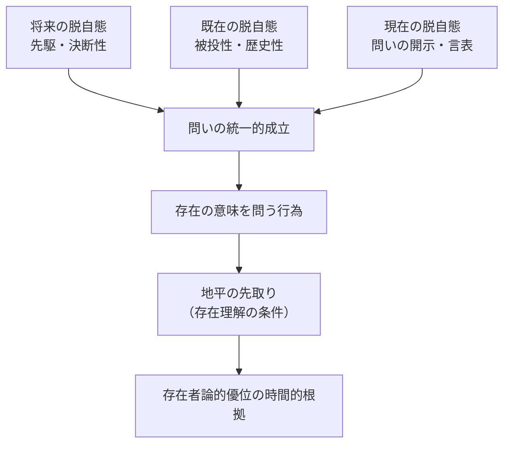

## 存在の意味を問うことの時間的性格

*内的完結稿 — 第一部 第三編 / 第2章「存在の意味」と時間的視座 / 節 id: P1-III-02-02*

---

### 問いの形式構造と時間性

問うという行為には、まず固有の形式構造がある。『存在と時間』第二節が明かしたように、いかなる問いも「問われるもの（Gefragtes）」「尋ねられるもの（Erfragtes）」「問いを立てるもの（Fragendes）」という三契機をもつ。これを時間性の観点から再構成するとき、それぞれの契機が時間の三つの脱自態——将来・既在・現在——に対応していることが浮かび上がる。

問いを立てるダザイン（Dasein、「現にある」という仕方で存在するほかない人間存在のこと）は、つねにすでに「問う前の沈黙」から抜け出てきた者である。その出発点は、既在性として担われている。問われるものへの方向定位は、まだ到来していない何かへの先駆——将来の脱自態——において成立する。そして問いが実際に口を開く瞬間は、既在と将来が交叉する「現在」の開示に他ならない。ここで重要なのは、この三契機が並列的に並ぶのではなく、将来が主導する仕方で既在を引き受けながら現在へと到来するという時間性の統一的構造において初めて、問うことが可能になるという点である。すなわち問いの形式構造は、時間性の統一によって支えられており、時間性を欠けば問いは問いとして成立しない。

とりわけ「存在の意味（Sinn von Sein）」を問う場合、この構造はいっそう鋭い相貌を帯びる。存在の意味を問う問いは、問われるものが存在者ではなく存在そのものであるという点で、ダザインの存在可能全体をかけた問いである。そのような問いは、死へと先駆的に自己を投企し、自己の最も固有な可能性へと決断するダザインの時間性、すなわち先駆的・決断的時間性（vorlaufende Entschlossenheit に基づく Zeitlichkeit）においてのみ真剣に引き受けられうる。問うこと自体がすでに、問う者の時間的実存を賭けた行為なのである。

---

### 歴史性と問いの反復

しかし問いはつねに、問う者が一人で白紙から始めるわけではない。ダザインは被投性（Geworfenheit、自分が選ばずして世界に投げ込まれていること）のうちにある。存在の問いもまた、哲学という伝統の蓄積の中に投げ込まれた問いとして引き受けられる。『存在と時間』が「存在の問いの解体（Destruktion）」として示したように、伝統が固定化し覆い隠してきた根源的な問いの動機を露わにする作業なしには、問いは単なる繰り返しに堕する。

ここで歴史性（Geschichtlichkeit）の概念が決定的に機能する。歴史性とは、ダザインが過去を単に「過ぎ去ったもの」として手元に持つのではなく、自己の存在可能を規定する既在として繰り返し（Wiederholung）引き受ける仕方である。良心の呼び声が日常的な常人（das Man）の自己埋没から本来的な自己を呼び覚ますように、存在の問いを引き受けるとは、伝統に埋もれた問いの動機を歴史的に反復しつつ、それを本来的な将来へ向けて解放することにほかならない。

換言すれば、存在の意味を問うという行為は、単なる理論的考察ではなく、ダザインが自己の歴史的被投性を引き受けながら本来的な問いへ決断する出来事である。問いは歴史の中で繰り返され、しかしその繰り返しは機械的な復唱ではなく、将来へと開かれた反復として時間性の統一に根ざしている。

---

### 存在の問いの優位の時間的根拠

以上の考察は、なぜ存在の問いが他のすべての問いに対して存在者論的優位をもつのかを時間的に裏付ける。存在論的差異（ontologische Differenz、存在と存在者の区別）は、ダザインが存在理解をつねにすでに有していることによって成立するが、この「つねにすでに」という構造がまさに時間性の既在的契機を示している。ダザインは存在理解なしには何一つ存在者と関わることができない。その関わり——配慮（Sorge）の全構造——が時間性によって統一されているとするなら、存在理解の可能性の条件もまた時間性のうちにある。

そして「地平を先取りする」という点も時間性から説明される。地平（Horizont）とは、存在が開示される幅のことであり、それは将来の脱自態が開く「先取り」によって確保される。存在の問いは、問われるものとしての存在を、あらかじめその地平において了解していなければ問いとして成立しない。この先取り的了解こそが、内時間性（innerzeitige Zeitlichkeit、日常において「今」の連続として経験される時間）でも流俗時間（vulgäre Zeit、通俗的な時計時間）でも汲み尽くせない、根源的な時間性の働きを示す。

こうして本節の核心は明確になる。存在の意味を問うという行為は、問う者の先駆的・決断的時間性に属し、同時に問われるものの地平を先取りしている。これが第三編の論述の論理的出発点となる。問いの時間的性格を確認することは、「存在の意味は時間性であるか」という問いそのものが、さらに深い地平、すなわち時間性を超えて存在の意味を問い返す必然性を準備するのである。第三編が「続書」としての必然を帯びるのは、まさにこの循環——問いの時間性が問い自身に差し戻してくる運動——ゆえにほかならない。
