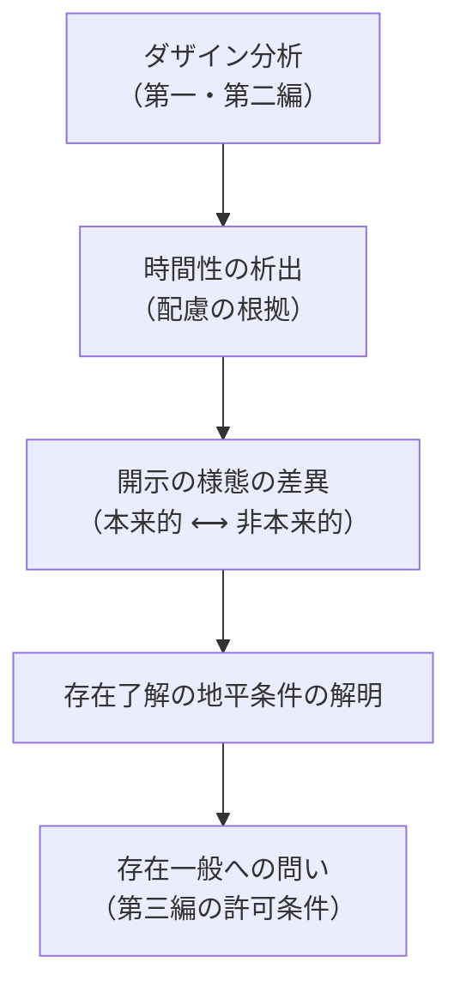

## 存在理解一般への一歩：ダザインを超えてはいないのか

*内的完結稿 — 第一部 第三編 / 第2章 / 節 id: P1-III-02-03*

---

### 「存在理解をもつ存在者」という定式の射程と限界

『存在と時間』の出発点において、ダザイン（人間的現存在）は「存在理解をもつ存在者」として際立てられた。この際立ては、他の存在者——道具、自然物、他者——が存在理解をもたないという否定的規定によって輪郭を得る。しかし、ここに一つの問いが生じる。もし存在理解がダザインにのみ帰属するなら、「存在一般」への問いは、結局ダザインという特殊な存在者の自己了解を記述することに終わるのではないか。つまり、存在論は人間学の別名にすぎないのではないか、という疑念である。

この疑念は的外れではない。しかし同時に、疑念が依拠する前提——「ダザインへの特権付与＝存在一般のダザインへの還元」——を急いで受け入れることも誤りである。定式の「効用」は、存在が了解されるためには必ず何らかの開示の場（*Erschlossenheit*）が要ること、そして既刊部分が検討した範囲では、その開示の場の構造はダザインの実存論的分析によってのみ主題的に取り出せること、を示した点にある。定式の「限界」は、開示の場の存在様式を解明することと、開示される存在の内実そのものを解明することとが、同一の問いではないという点に位置する。第一部第一編・第二編はあくまで前者——ダザインという開示の場の構造——を徹底的に分析する作業であった。それゆえ、第三編が「存在一般」へと踏み出すとき、それは第一・第二編の成果を放棄するのではなく、その成果が開いた地平の上に立つことである。

### 開示の構造を手にする逆説

ここに一つの逆説がある。存在理解一般を問うためには、存在理解がいかなる様態で生起するかを先に明らかにしなければならない。そのためにはダザイン分析が不可欠である。しかし、ダザイン分析を遂行するほど、問いはダザインという特定の存在者に集中する。出口を求めるために入口を掘り下げ、入口を掘り下げるほど出口が遠のくように見える——これが逆説の外観である。

だが第二編の成果を振り返るなら、この外観は解消できる。時間性（*Zeitlichkeit*）が、配慮（*Sorge*）の全体構造の統一的根拠として析出されたとき、ダザインの分析は単なる「ある特殊な存在者の記述」の段階を抜け出た。死への先駆、良心の呼び声、決断性、歴史性——これらの実存論的契機は、ダザインが自らの有限性を時間的に引き受ける様態であると同時に、「存在がいかに了解されうるか」の地平条件を指し示している。常人（*das Man*）として流俗時間（*vulgäre Zeit*）の均質な「今の連鎖」に埋没するとき、存在理解は最も貧しい様態に沈む。決断性において本来的な時間性が開かれるとき、存在理解は一種の澄明さを帯びる。この対比自体が、開示の深度と時間性の様態とが連動していることを示す。つまり、ダザイン分析の深化は、ダザインへの閉じ込めではなく、存在了解一般の地平条件を照らす光源の強化であった。

### 第三編が「存在一般」に触れる許可条件

第一・第二編の厳密さは、第三編への移行に対して次の条件を課す。

第一に、存在とダザインの**存在論的差異**（*ontologische Differenz*）——存在者と存在そのものとの区別——を一貫して保持すること。ダザインは存在者であり、存在ではない。ダザインが開示する存在もまた、ダザインそのものではない。この差異を見失うなら、「存在一般への問い」は「ダザインの自己解釈学」に退行する。

第二に、内時間性（*Innerzeitigkeit*）および流俗時間の批判的分析を経て、より根源的な時間性の次元——本源的時間（*ursprüngliche Zeit*）——を問う資格が生まれること。第二編は内時間性が時間性の派生的様態であることを示した。この派生関係の解明なしに「存在と時間」を接続しようとすれば、問いは通俗的な「時間の中の存在」の記述に堕する。

第三に、ダザイン分析が**一つの様態の解明**にすぎないという自覚を保つこと。ダザインの時間性の構造が露わになったことは、存在了解一般の必要条件を提示するが、それが唯一の様態であると主張することではない。特権付与は方法論的な足場であって、存在論的な独占宣言ではない。

これら三条件が満たされるとき、第三編は第一・第二編の論理から**必然的に**続く問いとして立ち現れる。ダザインを分析したのは存在を解明するためであった。存在を解明するために時間性が鍵であることが判明した。ならば、時間性と存在の関係そのものを、ダザインの分析が提供した地平において正面から問わなければならない——この論理の運動こそが第三編を要請する。ダザインを超えるのではない。ダザインを徹底的に分析したがゆえに、存在への問いの地平が初めて開けるのである。
