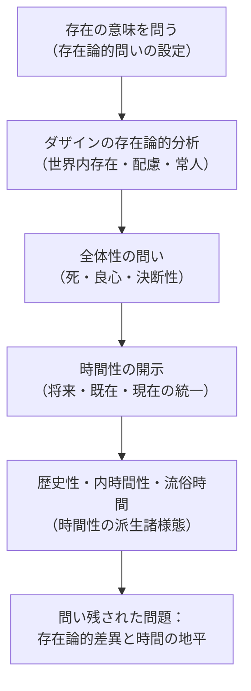

## 第一路線の回顧：存在から時間へ

*内的完結稿 — 第一部 第三編 / 第3章 タイトル順の反転：存在と時間／時間と存在 / 節 id: P1-III-03-01*

---

### 問いの出発点と「第一路線」の意味

『存在と時間』が踏み出した最初の一歩は、存在の意味を問うことであった。しかしその問いそのものが、いかなる問い方をされたかを振り返ることが、いまここで必要となる。問いは、存在一般を空中から問うのではなく、存在を問うことのできる唯一の存在者、すなわち**ダザイン**（*Dasein*：「そこに在る」こと自体がその存在の在り方となっている存在者）を手がかりとした。存在論的な問いを立てる能力それ自体が、ダザインという存在者の構造に根ざしている。ゆえに、存在の意味への問いは、まず存在理解をもつ存在者の存在論的分析へと向かうことを余儀なくされた。これが「第一路線」——存在から時間性へと**下降**した道程——の出発点である。

---

### 第一編の運動：世界とダザインの連関

第一編は、ダザインが常にすでに「世界の内に在る」という根本事態から議論を起こした。**世界性**（*Weltlichkeit*：ダザインが道具的な連関の全体として開かれている場の構造）の分析は、ダザインが孤立した主観として対象に向かうのではなく、そもそも気遣いの網目のなかに投げ込まれていることを示した。道具は「用具」として手元にあり、その連関の全体が**配慮**（*Besorgen*：日常的にものごとを取り計らう存在の仕方）として営まれる。さらに、ダザインは他者との共存在において、みずからを「誰でもないもの」に均してしまう**常人**（*das Man*）の支配のもとに落ち込む。この頽落の運動は、世界への日常的な没入として記述されたが、その際すでに、ダザインの在り方は「いつも」「そのつど」「今ここ」という時間的な様相を帯びていた。世界性の分析は、時間性の問いを暗黙のうちに下敷きにしていたのである。

---

### 第二編の運動：死・良心・決断性から時間性へ

第二編はダザインの全体性を問うことから始まった。ダザインは常に未完結であり、その最も固有な可能性として**死**（*Tod*：他者によって代替されえない、ダザイン自身の終わり）へと先駆する構造をもつ。この「死への先駆」は、ダザインを常人の安逸から引き剥がし、自己固有の存在可能へと連れ戻す契機となる。**良心**の呼び声はまさにこの引き剥がしの現象として機能し、ダザインは**決断性**（*Entschlossenheit*：現況を開示したまま状況のうちへ踏み込む存在の仕方）において、自己の存在をその全体性において引き受ける。

この全体性の構造が分析されたとき、第二編が到達したのが**時間性**（*Zeitlichkeit*：将来・既在・現在の統一的な脱自的広がりとして記述される、ダザインの存在の根本構造）である。先駆的決断性は、将来へと向かいつつ既在を引き受け、現在において状況を開示する——この三つの脱自的契機が統一されることで、初めてダザインの存在の意味が「時間性」として提示された。配慮の意味は時間性であり、第一編が記述した世界性・頽落・開示性のすべては、時間性の派生的様態として読み直される。

---

### 歴史性・内時間性と時間の地平

さらに第二編の後半は、時間性が**歴史性**（*Geschichtlichkeit*：時間性の延伸として、ダザインが伝承のなかで自己を受け取る在り方）へと展開し、そして**内時間性**（*Innerzeitigkeit*：「今・そして・かつて」という日付可能な時間の系列としてダザインが時間を数える在り方）を経由して**流俗時間**（*vulgäre Zeit*：今の連続として均質に理解される通俗的な時間概念）との対比を際立たせた。この対比において明らかになるのは、流俗時間が時間性の脱自的統一を平板化したものであるという事実であり、したがって流俗時間に依拠した存在了解もまた本源的な存在の意味を覆い隠すということである。

---

### 第一路線が残した問い

こうして振り返ると、第一路線の一貫した運動は「存在を問いながら、つねにすでに時間性へと引き込まれていく」構造をもっていた。**存在論的差異**（*ontologische Differenz*：存在者と存在そのものとを区別する根本の裂け目）は問いの核心に据えられながら、しかし第一路線においては、ダザインという存在者の分析を通じて時間性へ到達するという方向——すなわち**存在者から存在へ**という上向きの問いを、**存在から時間性へ**という下降の形で遂行する逆説的な道程——のうちに置かれていた。

この道程が達成したことは大きい。しかしそこで問われなかったことも同様に大きい。存在の意味そのものが時間性の地平においていかに開示されるか、つまり存在者であるダザインを経由せずに、存在そのものと時間との連関を問うことは、まだ問いとして立てられていない。第一路線は、その問いを要求することによって完結する。次に求められるのは、逆の方向からの問い——時間から存在へ——という第二路線の必然性である。
