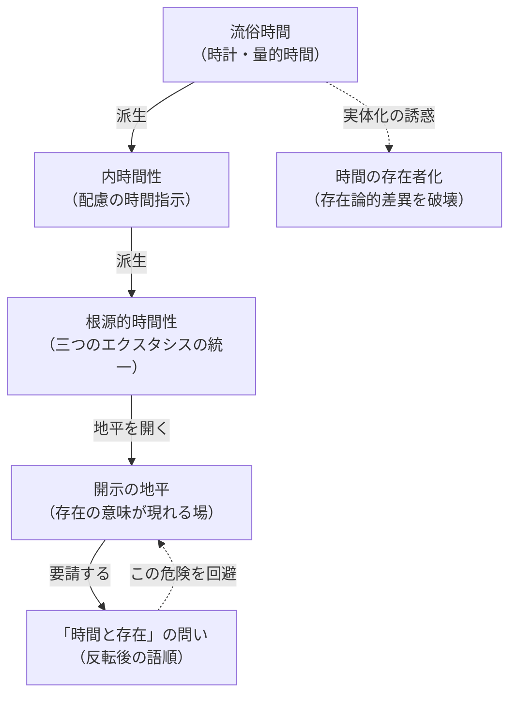

## 反転の必然：時間は「存在者」ではなく地平である

*内的完結稿 — 第一部 第三編 / 第3章 タイトル順の反転：存在と時間／時間と存在 / 節 id: P1-III-03-02*

---

### 流俗時間批判の到達点を確認する

『存在と時間』の既刊部分は、時間についての日常的理解を徹底的に解体することを通じて、固有の時間概念を鍛え上げてきた。日常的・科学的に了解されている時間——すなわち「いま」が等質に連続し、目盛りによって量られる時計の時間——は、**流俗時間**（vulgäre Zeitlichkeit）と呼ばれる。流俗時間は、ダザイン（現存在：「そこに存在する」という仕方でみずからの存在が問題となっている存在者）が世界内部的な存在者との関わり——配慮——に没入するとき、本来的な時間性を平板化した派生形態として出来する。「いつ」「それまで」「あの時」という内時間性の語法は、配慮の構造から読み取られる時間的指示に由来しており、時計の針はそのような指示を外的な尺度へと定着させたものにすぎない。

この批判は単なる否定ではない。流俗時間が派生形態である以上、より根源的な時間性がその「派生元」として要請される。根源的な**時間性**（Zeitlichkeit）とは、将来・既在・現在という三つの**エクスタシス**（ecstases：字義どおりには「外へ立ち出ること」、ダザインが自己の外へと繰り出す仕方で存在の地平を開く三契機）の統一的な動きとして記述された。ダザインは死へと先駆し（将来）、被投性として自己を引き受け（既在）、状況のなかで決断する（現在）——この三つのエクスタシスが同時に、しかも相互浸透的に働くことが、本来的な時間性の構造である。良心の呼び声に応え、決断性において自己を取り戻す運動は、まさにこの三契機の統一として初めて可能となる。

---

### 「時間を主語に据える」ことの危険

ここで問われるべき一つの哲学的危険がある。節タイトルに示されるように、本稿は「時間と存在」という反転した語順を論じる。しかし、時間を主語へと引き上げることは、直ちに次の誤解を招く危険を孕む——時間もまた一種の存在者として実体化されるのではないか、という誤解である。

内面的経過としての時間、すなわち意識の流れや持続として捉えられた時間もまた、この危険から自由ではない。そのような時間は、外的な時計時間とは区別されるとはいえ、依然として「流れる何か」「経過する何か」として、あたかも存在者に準じた仕方で語られてしまう。哲学史において時間が「魂の伸び」として語られるとき、あるいは「純粋持続」として記述されるとき、共通して忍び込む問題は、時間を一種の「もの」へと実体化する傾向である。これは存在論的に言えば、**存在論的差異**——存在と存在者との根本的な区別——を無視することに相当する。存在者が「ある」ということと、「存在それ自体」とは同一ではない。時間を存在者として扱うとき、その実体化は存在論的差異を踏み越え、問いそのものを破壊する。

---

### 反転の論理的動機

では、なぜ「存在と時間」という方向から「時間と存在」へと反転する必要があるのか。その論理的動機は、既刊部分の概念運動そのもののうちに胚胎している。

『存在と時間』の探究は、存在の意味を問うためにダザインという存在者を出発点とした。ダザインの存在様式を分析することで、存在の意味を解明する地平を開こうとする——これが基礎的存在論の戦略であった。しかし、分析が進むにつれて明白になったのは、ダザインの開示性そのものが時間性によって可能にされているという事実である。世界性が開かれるのも、配慮の構造が成り立つのも、歴史性として自己の過去を引き受けることができるのも、また常人として自己を喪失し本来性へと取り戻されることができるのも、すべて時間性のエクスタシスが開く地平においてである。つまり、存在の開示そのものが、時間を「その地平」として必要とするのである。

ここに反転の必然がある。「存在と時間」という語順は、存在をまず問い、その意味の地平として時間が現れるという探究の運動を示す。これに対して「時間と存在」という反転した語順は、時間の方がより根源的に問われなければならないという事態——時間が存在の開示を可能にする地平として機能しているという事態——を指し示す。この反転は恣意的な修辞ではなく、前半の分析が論理的に要請する転換である。

---

### 反転後の「時間」とは何か

以上の論理的動機を踏まえれば、「時間と存在」という語順で語られる時間が、時計の時間でも内面的経過でもないことは明らかである。流俗時間は存在者との配慮的関わりのなかで生じる派生物であり、内面的経過としての時間は存在者的実体化の危険を逃れられない。

反転後の「時間」とは、**開示のエクスタシス**である。将来・既在・現在という三つのエクスタシスは、ダザインが存在の意味を「向こうに立ち出て受け取る」場所——地平——を開く。この地平においてのみ、存在は開示され、問われ、語られることができる。時間は「流れる何か」ではなく、開示が起こる場としての構造的運動である。それを「存在者」として記述することは、地平を存在者の列へと格下げすることを意味し、存在論的差異を消去する。

したがって、「時間と存在」という問いへの反転は、前半の分析が自らの論理として要請する帰結であり、時間を存在者の地位から解放して「開示の地平」として語り直すための、必然的な概念上の身振りである。それは既刊部分が準備した概念的土台の上に立ち、そこから踏み出す一歩にほかならない。
