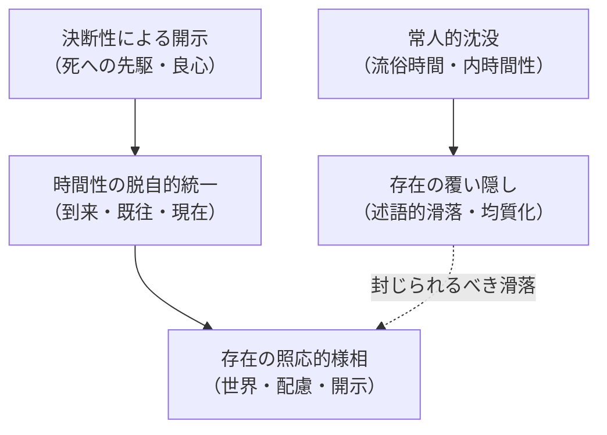

## 第二路線：時間から存在へ

*内的完結稿 — 第一部 第三編 / 第3章 タイトル順の反転：存在と時間／時間と存在 / 節 id: P1-III-03-03*

---

### 「存在」という述語の滑落を防ぐこと

「存在する」という動詞は、日常語のなかで際限なく滑落する。石も存在し、数も存在し、国家も存在する。この無制限な適用可能性こそが、存在論的問いを困難にしてきた第一の障壁である。「存在」を単なる述語として流通させるかぎり、私たちはつねにすでに何らかの存在者についての陳述へと引きずり込まれてしまい、存在そのものを問う足場を失う。

第一編・第二編が示してきた道はこの滑落を封じるための迂回路であった。ダザイン（人間的現存在）の存在構造を手がかりに、世界性・被投性・配慮という連関を解明することで、存在が一義的に固定されるべきものではなく、開示の様相において初めて語りうる事態であることが明らかになった。いまや第二路線が問うのは、同じ問いのさらに根底にある問いである。時間性という地盤から出発したとき、存在はいかなる構造においてのみ語りえるのか。

### 開示が残すものと、存在理解が覆い隠すもの

ここで二つの方向を対置しておかなければならない。

一方に、存在理解が覆い隠すものがある。常人（das Man）のうちに沈み込んだダザインは、道具的存在者の使用可能性や眼前存在者の客観的持続性を「存在の自明なあり方」として受け取る。流俗的な時間理解、すなわち「今」の連続として表象される内時間性は、存在を変化する事物の持続という図式のもとで均質化してしまう。良心の呼び声を聞かず、死へと先駆しない限り、ダザインは自らの時間性をこのような平坦な「時間の流れ」として了解し続ける。そこでは存在論的差異——存在と存在者との差異——は視野に入らない。存在理解はむしろ存在そのものを隠蔽する方向へと働く。

他方に、開示が残すものがある。決断性において自己の固有な可能性へと引き受けるダザインは、時間性の三つの脱自的な次元——到来・既往・現在——が統一的に作動することを体験する。この脱自的統一こそが、世界が「地平」として開ける条件であり、配慮（Sorge）が統一的な構造として成立する根拠である。歴史性はこの開示の様相の内に刻まれており、ダザインが繰り返し（Wiederholung）によって自らの遺産を引き受けるとき、存在は単なる「今ある」という事実性を超えた、呼びかけと応答の連鎖として現れる。

こうして対置が浮かび上がる。覆い隠された場所には均質な時間と述語としての存在があり、開示された場所には時間性の脱自的統一と、それに照応する存在の様相がある。

### 照応・世界・配慮においてのみ語りうる存在

では時間性を手がかりにしたとき、存在はいかなるかたちにおいてのみ語りうるか。答えは三重の照応として描かれる。

第一に、**照応**（Entsprechung）の次元において。時間性の到来的次元は、ダザインが自己の可能性へと向かう運動であり、この運動に照応して存在は「呼びかけに応えられうるもの」として現れる。存在は固定した実体ではなく、呼びかけと応答のあいだに生じる出来事として、時間性に照らされてのみ語りうる。

第二に、**世界**（Welt）の次元において。世界性は、道具連関と有意味性の全体として、時間性の現在的次元に根ざしている。ダザインが配慮しつつ何かのそばで存在するとき、世界は「地平」として先立って開かれている。存在論的差異はここで際立つ。世界は存在者の総和ではなく、存在が開かれる様相としての場であり、時間性なしにはそもそも問題化すらできない。

第三に、**配慮**（Sorge）の次元において。配慮の全構造——「すでにあること」（被投性）・「先駆」・「現に傍らにあること」——は時間性の三次元と構造的に対応している。配慮を時間性の観点から読み返すとき、存在は「ある一つの様相に固定された何か」ではなく、被投性・企投・現前の緊張の内にのみ成立するものとして捉えられる。

これら三つの次元はいずれも「時間性なしには語りえない」という点で一致している。時間性を排した場所で存在を語ろうとするや否や、存在は再び述語として滑落するか、あるいは眼前存在者の持続として均質化されるかのどちらかである。

### タイトルの反転が指し示す同一の問い

こうして「時間と存在」というタイトルは、「存在と時間」の単純な逆転ではないことが明確になる。『存在と時間』が「ダザインの存在分析を通じて時間性へ」という下降の道を辿ったとすれば、「時間と存在」は「時間性という地盤から存在そのものへ」という遡行の道を指し示す。しかしこの二つの道は別々の問いではない。それらは同一の問いに対する二つの入射角にほかならない。

第一路線が問うたのは「ダザインはいかにして存在を理解しうるか」であり、その答えは「時間性の脱自的統一において」であった。第二路線が問うのは「その時間性に照らしたとき、存在はいかなる様相においてのみ語りうるか」であり、その答えが本節の核心命題として示された。すなわち——**時間性を手がかりにすると、存在は照応・世界・配慮のかたちにおいてのみ、存在論的に語りうる**。

この命題は第一部第一編・第二編の概念運動の論理的帰結である。既刊部分が丁寧に積み上げてきた存在論的差異、世界性、時間性の分析は、いまここで収斂し、続く第三編・第二部が展開すべき問いの輪郭をくっきりと浮かび上がらせる。問いは問いとして完結しない。それは次の問いへの論理的必然として引き渡されるのである。
