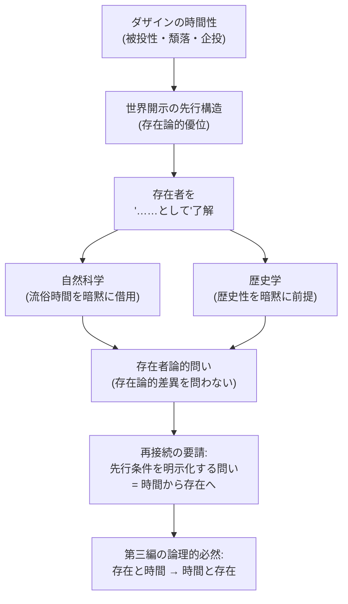

## 存在論と存在者論の再接続

*内的完結稿 — 第一部 第三編 / 第3章　タイトル順の反転：存在と時間／時間と存在 / 節 id: P1-III-03-04*

---

### 緊張の所在——二つの優位をめぐる問い

哲学の歴史において、存在論（Ontologie）と存在者論（Ontik）のあいだには、ある根深い緊張が走っている。「存在論的優位」とは、存在者をそれとして開示する構造——すなわちダザイン（現存在、ここに在ること、人間の在り方そのもの）の在り方の構造——を問う方向性を指す。他方、「存在者論的優位」とは、現に目の前にある事物・事実・関係を問題にする、自然科学や歴史学に代表される諸問いの方向性を指す。この二つの方向はしばしば無関係と見なされてきた。存在者論的な問いは「事実についての問い」であり、存在論的な問いは「いわば抽象的な枠組みについての問い」だという分割線が引かれてきたのである。

しかし『存在と時間』が第一部第一・第二編を通じて積み上げてきた考察は、この分割線がはじめから根拠を欠いていることを示した。問いを問いとして成立させるためには、問われるべき存在者が既に何らかの仕方で「存在者として」開示されていなければならない。この「既に……として」という先行構造こそが、両者の緊張を時間的視座のもとで再配置することを要請する。

---

### 時間性による再配置——「先行」の意味を解きほぐす

存在論的差異（ontologische Differenz）——存在者と存在そのものの区別——は、単なる概念の取り決めではない。ダザインがみずからの在り方として「世界内存在」であり、世界性のなかで道具や他者や自然を「……として」了解しながら配慮（Sorge、気遣いながら関わること）を遂行するとき、その了解の運動はつねに時間的に構成されている。ダザインは、既に投げ込まれていた過去的次元（被投性）から、現に世界内に巻き込まれながら（頽落）、いまだ来たらない可能性へと企投する（企投性）——この三重の時間性（Zeitlichkeit）こそが、世界開示の根本条件である。

ここで重要なのは、この時間性が存在論的差異をそのつど可能にするという点である。「存在者を存在者として見出す」とは、存在者の単なる現前を確認することではない。それは、世界の了解に基づいて存在者に意味の地平をあらかじめ賦与しながら——すなわち存在論的に先行しながら——初めて可能になる。時間性はこの「先行」を支える根拠であり、存在論的優位と存在者論的優位の緊張は、この先行構造のなかで初めて意味をもつものとして再配置される。

---

### 存在者論的問いの暗黙の依存——科学と歴史学を例として

自然科学は自然的事物を問う。歴史学は過去の出来事を問う。これらはいずれも存在者論的な問いの典型である。だが、それぞれの問いが問いとして成り立つためには、問われる対象が「自然として」あるいは「歴史的事実として」すでに開示されていなければならない。この開示はどこから来るか。

自然科学が前提する「客観的自然」は、ダザインが常人（Das Man、誰でもない誰か、平均的な公共的了解）の水準での存在了解を通じて世界を「眼前に持続する物の集合」として解釈する、その解釈の先行的産物である。科学が用いる「均質な・測定可能な・計算可能な」時間——これが「流俗時間（vulgäre Zeitlichkeit）」と呼ばれるものであるが——は、ダザインの根源的時間性が「今の連続」として平板化された姿に他ならない。つまり科学の問いは、存在論的に先行するダザインの時間的世界了解を、暗黙のうちに借用しながら成立している。

歴史学の場合はより鮮明である。歴史学が「過去の出来事」を問うとき、それが「過去として」了解されるためには、ダザインの歴史性（Geschichtlichkeit）——繰り返し（Wiederholung）と承継による、存在可能の時間的構造——が既に作動していなければならない。歴史学はダザインの歴史性を前提しながら、それを問うことはない。だからこそ歴史学の問いは、みずからの根拠を問い直すことなく存在者論のなかに留まる。

このことが示すのは、存在者論的問いの遂行それ自体が、先行する存在了解の時間的構造に「乗りかかって」いるという事態である。

---

### 再接続の論理的必然——開示から問いへ

以上の考察が示す帰結を、一つの命題として提示しよう。**時間から存在へ至る道は、存在者を存在者として見出すことの先行的条件を明らかにする道に他ならない。**

存在論と存在者論の「再接続」とは、両者を安易に融合させることではない。それは、存在者論的問いがみずからの遂行において存在論的先行了解に依存しているという事実を、時間性という根拠から明示的に取り出すことである。存在論的差異は時間性によって下から支えられており、科学・歴史学などの問いはその差異の上に成り立っているにもかかわらず、差異そのものを問いの視野に収めない。

ここに、第三編が「続書」として論理的に必然である理由が宿っている。第一・第二編は、ダザインの存在構造が時間性に根ざすことを示した。だが「時間が存在を開示する」という問いは、さらに反転を要求する——存在の方から時間へ問いを差し向けること、すなわち「時間と存在」という問いの方向が不可欠になる。存在論と存在者論の再接続とは、この反転が単なる思弁的操作ではなく、存在者を見出す人間的営みのあらゆる場面に根ざした必然であることの確認に他ならない。

この図が示すように、存在者論的問いはその出発点においてすでに存在論的時間性の圏内にある。それを問い返す運動が、タイトルの反転——「存在と時間」から「時間と存在」へ——として結晶する。
