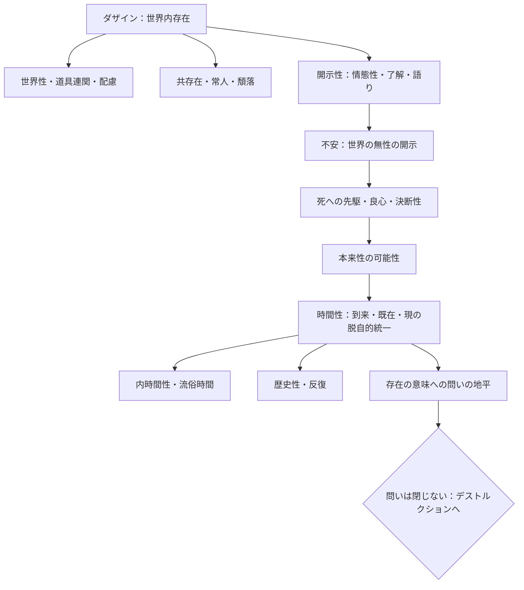

## 第一部の止まり方：問いは閉じない

*内的完結稿 — 第一部 第三編 / 第3章 タイトルの反転：存在と時間／時間と存在 / 節 id: P1-III-05*

---

### デストルクションは準備なしには成立しない

『存在と時間』序論が告知した「存在論的伝統のデストルクション（解体）」——これは単なる批判的廃棄ではなく、伝統が積み重ねた諸概念の起源へ遡行し、そこに生きている問いを掘り起こす積極的な作業である。しかし、ここで問わなければならない。序論の時点でデストルクションを宣言するだけでは、それは空疎な身振りにとどまらないか。

答えはノーである。デストルクションが実質的な作業となるためには、何に対してそれを行うのかを明確にする地盤が先に整えられていなければならない。第一部第一編・第二編で展開されてきた分析——ダザイン（そこに在ること、すなわち世界に投げ出されて存在する人間の在り方）の根本的な構造の解明——は、まさにその地盤を準備するものであった。世界内存在、道具連関、世界性、配慮、開示性、現、共存在、常人への頽落、不安、死への先駆、良心の呼び声、決断性、そして時間性——これらの分析を経てはじめて、伝統的な存在論が何を見ておらず、何をどのように覆い隠してきたかを具体的に問いかけることができる。デストルクションの刃は、研がれた問いでなければ伝統の表皮を割けない。

---

### 第二部は付録ではなく内的必然である

第二部の構想——カント、デカルト、アリストテレスへの遡行——を、第一部が一段落したあとに外側から付け加えられた補論や付録として読む誘惑がある。だが、これは誤った読み方である。

時間性の分析が示したように、ダザインの存在は根底において時間的に構成されている。時熟（時間性が現在・既在・到来という脱自的な統一として開く運動）こそがダザインの存在を可能にする地平であり、存在の意味への問いはこの時間的地平を介して初めて前進できる。ところが伝統的な存在論は、この地平を主題的に問うことなく、むしろそれを遮蔽してきた。内時間性——ダザインが時間性に基づいて「いま」「以前」「以後」として時間を数えるその在り方——が抽象化され、「流俗時間」（日常に通用する均質な時間の系列）として固定されたとき、存在論的差異（存在と存在者との差異）は視野から消え去り、存在者の次元に引き下げられた諸概念が存在の規定として流通するようになった。

だとすれば、この遮蔽がいかにして生じたかを辿ることは、時間性の分析そのものに内在する要請である。第二部は、時間性という地平が明確になったからこそ必要となる後続作業ではなく、「存在と時間」という問いが自己展開するうちに論理的に呼び出す内面的必然なのである。歴史性の分析が示すとおり、ダザインは歴史的に受け渡されてきた解釈の連関の中に投げられており、伝統の遮蔽を引き受けながらそれを明示的に取り戻すこと——反復（ヴィーダーホールング）——が本来的な歴史性の在り方である。第二部はその反復の具体的な履行にほかならない。

---

### 第一部の小結：問いの地形図

ここで第一部の概念連関を一望しておくことは、問いがどこまで到達したかを確認するために有用である。

この地形図が示すのは、一つの問いが次の問いを要請するという連鎖的な構造である。ダザインの分析は「存在とは何か」に答えを与えるのでなく、その問いが有意味に立てられるための地平（時間性）を開示することに成功した。だが、開示されたその地平は、なぜ長い哲学の歴史のなかで問われてこなかったのか。この疑問が残る限り、問いは閉じない。

---

### 問いは閉じないことが達成である

第一部の止まり方は、結論に到達することによって閉じるのではなく、問いを新たな次元で正確に再定式化することによって止まる。この止まり方こそが誠実さの証である。存在の意味への問いは、答えを提出することで解消されるたぐいの問いではない。それはむしろ、問われるたびにより深い地盤へと問いを送り返す。

第三編は「答え」で終わらず、伝統がその地平をどう覆い隠したかを解体することを要請する——この一句が意味するのは、未完を告白することではない。デストルクションの要請そのものが、ここまでの分析の全体が生み出した論理的帰結であり、第一部の問いが次段階へと自己を委ねる姿である。問いが閉じないことは失敗ではなく、存在論的差異をまともに引き受けた問いの在り方そのものなのである。
