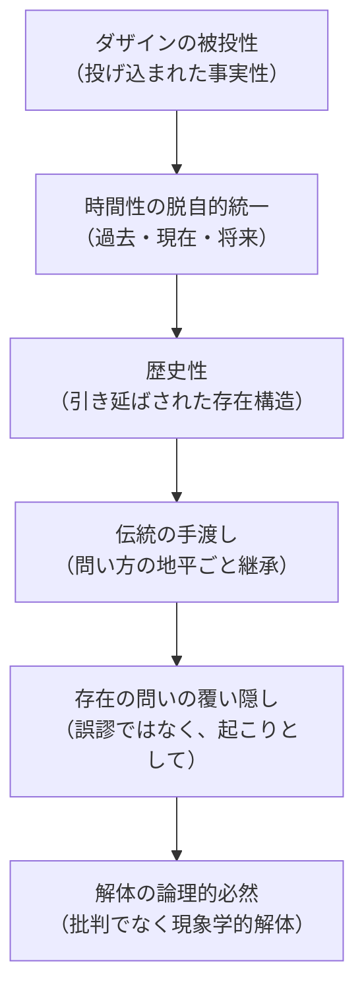

## なぜ歴史か：覆い隠しは「教説」ではなく「起こり」である

*内的完結稿 — 第一部 第三編 / 第4章　第二部へ：歴史の解体の論理的場所 / 節 id: P1-III-04-01*

---

### 問いの立て直し——伝統は誰の誤りか

存在の問いが問われないまま長く放置されてきたのは、なぜか。この問いに対して、ある哲学者たちの誤謬や怠惰を名指しすることは容易である。しかし、そのような「犯人探し」は、覆い隠しそのものの構造を見落とす。『存在と時間』が第一編から一貫して示してきたのは、ダザイン（現存在、すなわち「ここに在ること」においてみずからの存在を問題にしうる存在者）は、その日常的あり方において常人（das Man）の解釈に先立たれている、という事態である。常人の解釈は特定の個人が発明したものではない。それはダザインが共同存在として世界へ投げ入れられるや否や、すでに語りかけてくる了解の地平である。誤りは意見として訂正できる。しかし常人の了解は、個々の命題のレベルではなく、世界内存在の構造として機能している。そこに覆い隠しの根がある。

### 歴史性——伝統の存在論的意味

ダザインの時間性が、過去・現在・将来の脱自的統一として開示されるとき、その「過去」は単なる「もはやない時点」ではない。それはダザインが自己をどこから引き受けるかという「被投性（Geworfenheit）」の地平そのものである。歴史性とはこの被投性が時間的に引き延ばされた構造であり、ダザインが「自己の時代」を生きるとはつねにすでに伝えられた了解可能性の内で生きることを意味する。

伝統（Tradition）は、この歴史性の一つの様態である。伝統は存在者についての知識を伝えるだけでなく、何を問いに値するものとして扱うかという問い方の枠組みごと伝える。存在の問いが「自明なもの」として脇へ押しやられてきたのは、誰かがそれを禁じたからではなく、伝統が存在者的な問い（存在者とはいかなる性質をもつか）の枠組みを当然のものとして手渡し、存在論的な問い（存在者がそもそも在ることとはいかなる事態か）をその枠組みの内に同化させてしまったからである。覆い隠しは教説の内容ではなく、問い方の地平が歴史的に固まってゆく「起こり」そのものである。

### 解体——批判ではなく現象学的な掘り起こし

第三編の論述が示してきたのは、流俗時間（日常的に使用される、「今」の連続として均質に流れる時間了解）と内時間性（ダザインが配慮の構造においてみずから時間を数えることで生じる時間経験）が、根源的な時間性を覆い隠すかたちで成立している、という事態であった。この覆い隠しは積極的な構造をもつ。すなわち、流俗時間はダザインの脱自的な時間性から派生しつつ、その派生元を隠蔽する。それは嘘ではなく、ダザインの存在様式に根ざした「起こり」である。

ここから解体（Destruktion）の意味が定まる。解体とは伝統を否定し廃棄することではない。そうではなく、伝統が手渡してきた諸概念を、それが成立した現象的地盤へ向けて掘り返すことである。批判は対象の誤りを外側から指摘する。現象学的解体は、その誤りがいかなる存在構造において「正しく見えるようになったのか」を内側から照らし出す。覆い隠しが「起こり」であるかぎり、それを解くことも「起こり」でなければならない。ダザインが決断性（みずからの最も固有な可能性へと決意して引き受けること）において良心の呼び声を聞き、死への先駆によって自己を開示するとき、それは単なる実存的な自覚ではなく、歴史的に積み重なった了解の地平を透過して存在の問いへと立ち返る運動でもある。

### 第二部の論理的場所

以上の論述は、第二部の必然性を準備する。第一部が現存在分析を通じて存在一般の問いへの地平（時間性）を確保したとすれば、第二部が引き受けるのは、その地平そのものが歴史的に覆われてきた経緯の解体である。その仕事は、特定の哲学者の「誤謬を暴く」批判史ではありえない。それは、存在論の諸概念が成立した現象的土台へ、時間性の分析によって獲得された透視力をもって遡行する作業である。覆い隠しが起こりであるかぎり、解体もまたダザインの歴史的存在様式に属する起こりとして遂行されなければならない。これが、第一部の既刊部分が論理的に要求する、続く問いの場所である。
