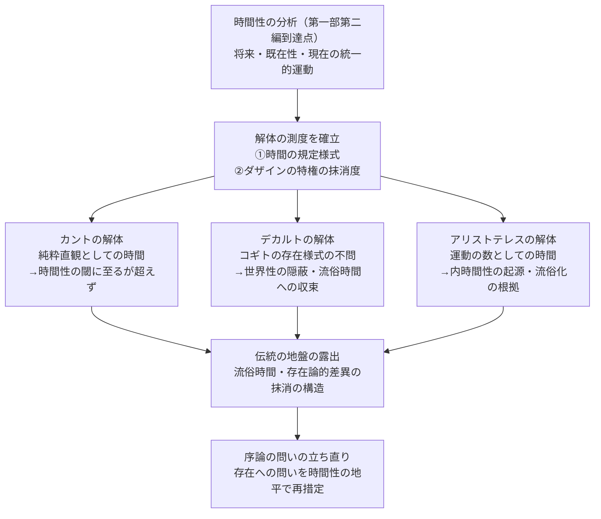

## 解体の測度：時間性の問題に即して

*内的完結稿 — 第一部 第三編 / 第4章　第二部へ：歴史の解体の論理的場所 / 節 id: P1-III-04-02*

---

### 測度を立てるとはいかなることか

解体（Destruktion）とは、伝統を否定することではない。それは伝統の地盤を掘り崩し、その地盤がいかなる問いを抑圧してきたかを白日の下に晒す作業である。しかし掘り崩しには水準器が必要だ。何を基準として、ある存在論が問いの抑圧に加担していると判断できるのか。その測度（Maßstab）は、既刊第一部が到達した地点、すなわち時間性（Zeitlichkeit）の分析から与えられる。

時間性とは、ダザイン（Dasein、「そこ・に・ある」という存在様式を指す）が、死への先駆と良心の呼び声に応じた決断性（Entschlossenheit）のなかで、自己の存在を将来・既在性・現在の三契機として統一的に引き受ける運動のことである。ダザインはこの運動において歴史性（Geschichtlichkeit）を帯び、自己の被投性を反復しながら可能性へと向かう。この時間的・歴史的な運動こそが存在への問いを可能にする唯一の地平であるとするなら、ある存在論がこの運動をどのように扱ったか――あるいは扱わずに済ませたか――が、解体の測度となる。

具体的には、二つの問いを各存在論に向けることができる。第一に、「時間はいかに規定されているか」。第二に、「その規定においてダザインの存在論的特権、すなわち存在を問う者としてのダザインの固有性は、どのように扱われ、あるいは抹消されているか」。この二問を尺度として、伝統的な存在論の堆積を層序学的に読み解くのが、第二部が引き受けるべき課題である。

---

### カント・デカルト・アリストテレスという逆順の必然

第二部の順序がカントから始まり、デカルトを経て、アリストテレスへと遡行する理由は、単なる歴史年代の逆転ではない。それは解体の論理が要請する内的な順序である。

カントは、時間を感性的直観の純粋形式として規定した。この規定は、時間が主観の側に属することを示すという意味で、時間の問いをダザインへと接近させる一歩を踏み出している。しかし同時に、この純粋形式としての時間は、ダザインが死への先駆と決断のなかで自己を時熟させる（zeitigen）という具体的な存在運動から切り離されている。カントの時間論は、時間性の問いの閾まで届きながら、ダザインの歴史的実存という次元を視野に収めることができなかった。解体はまずこの閾を確認することから始める。

デカルトにおいては、問いはさらに根本的な層に達する。コギトとして析出された主観は、自己の存在様式を問わない。延長と思惟の二実体という構図のなかで、ダザインが世界に配慮的（sorgehaft）に関わりながら存在するという世界性（Weltlichkeit）の構造は、あらかじめ隠蔽されている。時間もまた、この枠組みのなかでは、事物の持続として測られる流俗時間（vulgäre Zeit）の地平に収まらざるをえない。デカルトの解体は、近代的主観性の出発点にダザインの存在論的特権を抹消する隠れた決断が働いていることを暴き出す。

そしてアリストテレスへの遡行が最後に置かれるのは、時間の流俗的規定の根が最も深くそこに埋まっているからである。アリストテレスの時間規定――「運動における前・後の数」――は、内時間性（Innerzeitigkeit）という、世界内部の事物を計時する時間の在り方を存在論的に定式化したものである。この規定は確かに、ダザインの「今」意識を手がかりにしているが、その「今」を発語するダザインそのものの存在様式には問いが向けられない。流俗時間の概念が成立した歴史的な場所を押さえることで、解体は時間の問いの地層全体を照らし出す。この意味で、アリストテレスの時間論の解体は、伝統全体の地盤を露出させる最終作業であり、それゆえに最後に置かれる。

---

### 第一部第三編を閉じるにあたって――問いの立ち直り

第二部の三つの解体が完了するとき、何が明らかになっているはずか。それは、西洋存在論の伝統が一貫して、ダザインの時間性から湧き出る存在への問いをその起源において封じ込め、時間を流俗化し、存在とダザインとの存在論的差異（ontologische Differenz）を存在者の水準で処理してきたという事実である。常人（das Man）の支配する日常性のなかで存在の問いが埋没するのと同じ構造が、存在論の歴史の次元でも反復されていた。

だとすれば、第二部の終了後に序論の問い――存在の意味とは何か――は、いかに立ち直るか。それは問いが廃棄されて新しい答えが置かれるのではない。問い自体が、その問いを問う者の時間的・歴史的な存在様式とともに、はじめて透明に問われ直す地平に立つ、ということである。存在への問いは、ダザインの時間性の地平においてのみ真に問うことができる。解体はその地平を伝統の瓦礫のなかから回収する作業であり、回収された地平の上に問いが再び立つとき、問いは単なる「いまだ答えられていない問い」ではなく、問い続けることそのものが存在の理解に参与するという、問いの本来的な位置を獲得する。

第一部第三編が到達したのは、この「問いの立ち直り」が論理的に必然であるという確信の開示である。それをいかに埋め尽くすかは、第二部という名の作業を待つ。しかし本稿が与えうるのは、その作業が単なる歴史研究ではなく、時間性を測度とした存在論的批判であることの、概念的な根拠を確定することまでである。

---

