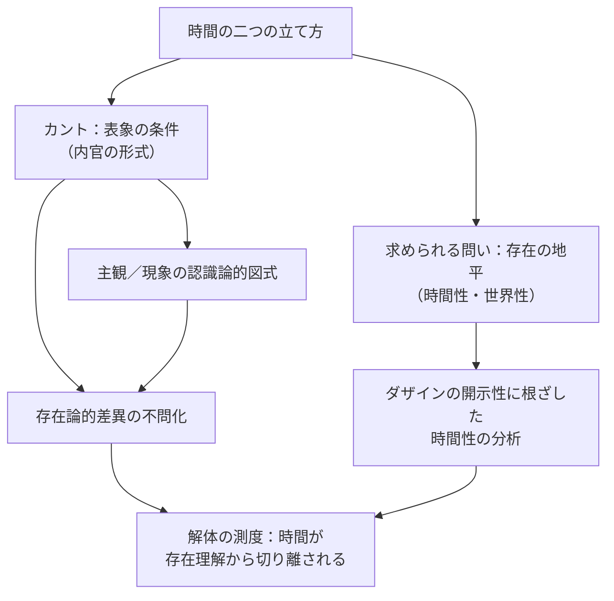

## 問題の所在：超越論的時間と世界内存在

*内的完結稿 — 第二部 時間性の問題に即した存在論の歴史の現象学的解体 / 第1章 カントにおける時間 / 節 id: P2-01-01*

---

### 解体という課題の位置

『存在と時間』の第一部は、ダザイン（現存在）の分析論を通じて、存在の意味を時間性のうちに根拠づける試みであった。時間性とは、ダザインが自己の存在を引き受けながら将来へと企投し、既在性として自らを担い、現在において世界内存在として世界を開示するその統一的な運動を指す。この時間性は、ダザインが「世界のなかに」いることの構造、すなわち世界性そのものと切り離すことができない。

しかし西洋哲学の伝統は、この問いの地盤をしばしば見失ってきた。第二部が課題として引き受けるのは、そうした伝統のうちに堆積した存在理解の隠蔽を取り除く「現象学的解体」である。解体とは破壊ではなく、過去の存在論的企図を、それが語りえなかった問いへと遡及的に開示することにほかならない。カントはその解体が最初に向かうべき問い手として立てられる。それはカントが時間を哲学的問題として正面から引き受けながら、なおも存在論的地平を覆い隠す方向に問いを立てたからである。

---

### 「直観の形式」という定式の世界性的読解

カントは時間を「内官の形式」として、すなわち諸表象を内的に秩序づける主観のアプリオリな形式として規定した。この定式は、時間が主観の外にあるいかなる物自体にも帰属せず、あくまで現象の可能性の条件であることを主張する。

この定式を、世界性の語彙で受け取り直してみよう。ダザインが世界内存在として存在するとき、その「世界のなかに」ということはすでに一定の時間的構造を含んでいる。ダザインは手許の道具連関のなかで、いま何かを「しながら」、のちに何かを「するために」、すでに何かを「してきた」という仕方で存在している。この「しながら・するために・してきた」という三重の時間的あり方は、世界性の開示そのものに内蔵されている。カントが時間を「内官の形式」と呼ぶとき、彼は世界を現象として成立させる条件を問うているのであり、そこには世界の開示という事態への接近が潜在していると読むことができる。

しかしカントの定式は決定的な転換を経ている。時間は、ダザインが配慮（世界内存在における他の事物・他者への関わりの総体）のうちで時間的に存在するその地盤としてではなく、表象を秩序づける主観の形式として定められる。開示という事態は、主観が対象を表象するという認識論的図式に置き換えられてしまう。

---

### 超越論的対象と現象の区別が封鎖するもの

カントにおいて、現象と超越論的対象（物自体）との区別は認識の限界を画する。現象とは感性的直観に与えられ、悟性のカテゴリーによって規定されたものである。物自体は認識の届かぬ彼方に措かれる。この図式のなかで時間は、現象が現象として成立するための条件として機能し、現象の存在そのものを問う地平としては機能しない。

存在論的差異という視点からこの点を見直すならば、次のことが明らかになる。存在論的差異とは、存在者と存在の間の区別、すなわち「何かがある」という存在事実と、その「ある」という存在の意味との区別である。カントの枠組みでは、時間は存在者が現象として与えられる条件であって、存在者の存在が何を意味するかを問う地平ではない。超越論的対象と現象の区別は、認識の射程を確定する議論であって、存在者の存在を問うという意味での存在論的問いを引き受けるものではない。換言すれば、カントにおける問いは「いかにして現象は知られるか」であって、「なぜ存在者は存在するのか、存在の意味は時間においていかに開示されるか」ではない。

---

### 解体の測度：収奪の構造

こうして解体の測度が明らかになる。カントの超越論的時間論は、時間を存在の地平としてではなく、表象の可能性の条件として立てる。この立て方は、時間性がダザインの世界内存在として存在することのうちに根ざしているという事実を隠蔽する。時間は主観の形式へと内側に引き込まれ、ダザインが配慮において開示する世界の時間的構造——手許の道具が「そのときに」使われ、「のちに」放置され、「すでに」摩耗しているというあの構造——はもはや問いの射程に収まらない。

この事態を「収奪」と呼ぶことができる。すなわち、世界内存在としてのダザインが自己の時間性のうちで開示してきた時間の意味が、主観の内的形式という認識論的語彙によって引き取られ、存在論的問いの次元から剥奪される。カントは時間を哲学の中心問題に据えながら、時間を存在の問いへの道として展開することを——問いの立て方そのものの内的制約によって——果たしえなかった。

このことは、カントの失敗を告発するためにではなく、存在と時間の問いがいかなる隠蔽を乗り越えなければならないかを積極的に照らし出すために確認される。超越論的時間論の限界を解体を通じて露わにすることは、ダザインの時間性が真に存在の意味への問いの地平として機能しうるという主張を、伝統の内側から論理的に裏打ちする作業にほかならない。
