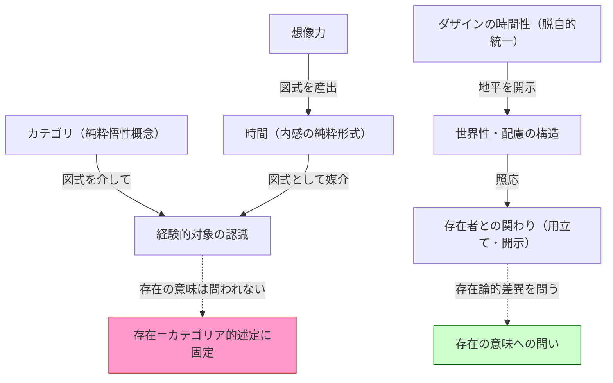

## 図式と想像力：時間の「産出」と存在理解

*内的完結稿 — 第二部 時間性の問題に即した存在論の歴史の現象学的解体 / 第1章 カントにおける時間 / 節 id: P2-01-02*

---

### カテゴリと時間の結合——配慮の構造との対照

カントが純粋悟性概念（カテゴリ）と感性的直観とを結合させるために採用した装置、それが図式論である。図式（Schema）とは、純粋悟性概念を現象に「適用」するための媒介規則であり、その媒介の地盤として時間が選ばれる。なぜ時間か。カントの答えは端的である——時間は内感の純粋形式であり、あらゆる表象に普遍的に伴う。したがって時間の規定（図式）は、一方では直観の感性的性格を保ちながら、他方では概念の普遍性に呼応できる、という二重の資格をもつ。

しかしここで問い直さなければならないのは、この「結合」の構造が何を前提しているか、という点である。カントの図式論においては、カテゴリと直観とはそれぞれ独立した起源をもち、事後的に接合される。接合の役を担う時間は、いわば「橋」として機能するにとどまる。橋はそれ自体として通路であるが、橋が架かる以前に両岸はすでに対立項として確定されている。

これを、『存在と時間』第一部が開示したダザインの構造と対照するとき、根本的な差異が浮かびあがる。ダザインにおける配慮（Sorge）は、世界内存在として存在者と関わる際、理論的な「認識」に先行する用立て（Zuhanden-sein）の了解を包含している。道具的存在者が使用の連関のなかで開示されるとき、ダザインは概念と直観とを事後的に接合しているのではない。むしろ世界性の開示そのものが、存在者との照応を可能にする地平をあらかじめ与えている。この照応は、カテゴリ的規則と感性的素材との外的架橋ではなく、ダザインの時間性が脱自的に（過去・現在・将来を統一的に）開いている地平の内部で生じる。つまり配慮の構造においては、「橋を架ける」以前に地平そのものがすでに開かれているのである。カントの図式論が見落とすのは、まさにこの地平の開示性という次元である。

---

### 想像力の中心性とダザインの「できること」

カントの図式論においてとりわけ注目されるのは、想像力（Einbildungskraft）の位置づけである。図式を産出するのは超越論的想像力であり、それは感性でも悟性でもない第三の能力として、二者の媒介を担う。純粋統覚と純粋直観という二つの源泉の「根」として、想像力は認識の統一を可能にする。

この洞察は、存在論的に読み直す誘惑を喚起する。想像力が時間を「産出」するという記述は、時間を受動的に与えられた枠組みとしてではなく、何らかの能動的な働きと結びつける契機を含んでいるからである。しかしカントにおいてこの能動性は、あくまでも認識の成立条件という枠内に留まる。想像力は経験的対象の認識を可能にするために機能するのであって、ダザインが「できること（Seinkönnen）」として自己の存在可能を引き受ける、という存在論的な次元とは異なる。

ダザインのできることは、死への先駆的決断性において最も鋭く照らし出される。そこでダザインは、最終的な可能性としての死に向かって自己を投企することで、自己の存在を全体として引き受ける。この引き受けは、何らかの認識規則を「産出」することではなく、存在の意味を問いながら自己の存在そのものを賭けることである。良心の呼び声に応え、常人（das Man）の没落から呼び戻される決断性は、認識能力の構成問題ではなく、存在の開示の問題である。

カントの想像力が担う「産出」は、この意味での開示性に届いていない。想像力は確かに受動的感受性を超えた働きをもつが、その働きの目的地は認識可能な対象の構成であり、存在の意味への問いではない。ここに、想像力の中心性とダザインの存在論とのすれ違いがある。

---

### 時間の形式化と「存在」の固定

図式論が時間を媒介の地盤として選ぶことには、もう一つの帰結がある。時間は、カントのこの文脈において、徹底的に形式化される。時間は継起・同時・持続といった純粋な時間規定（図式）として、カテゴリに対応する系列を構成する。この形式化された時間は、外的事象の計測に用いられる「今の系列」としての流俗的時間理解と、根底において通底している。

『存在と時間』において流俗時間（vulgäres Zeitverständnis）と呼ばれるのは、時間を今という点の連続として捉え、ダザインの時間性の脱自的統一から抽象された水準に留まる理解である。カントが選び取った時間は、この流俗時間の哲学的精密化であるとも言える。継起・同時・持続という形式規定は、今の系列を秩序づける規則に他ならず、将来への先駆や過去の反復として現れるダザインの本来的時間性を原理的に捉えられない。

この時間の形式化は、存在の意味の問いに直接の影響を及ぼす。カテゴリが図式を通じて経験に適用されるという構図においては、「存在」もまた一つのカテゴリ的規定として機能する。すなわち存在は、「なにかがある」という論理的・命題的用法において固定される。存在論的差異（存在と存在者との差異）が問われないまま、存在は存在者の述定可能性の条件として捉えられるにとどまる。

こうして時間の形式化は、存在をカテゴリア的用法に封じ込める道筋を整える。図式は概念と直観の橋として時間を置くが、その橋の上で問われるのは存在者の認識可能性であって、存在の意味ではない。この点にこそ、カントの時間論を現象学的に解体する必然性が宿っている。存在の意味を問うためには、時間性をダザインの存在構造の根底として露わにする道をたどらなければならない——それが既刊第一部の到達点であり、この解体が論理的に指し示す地平である。

