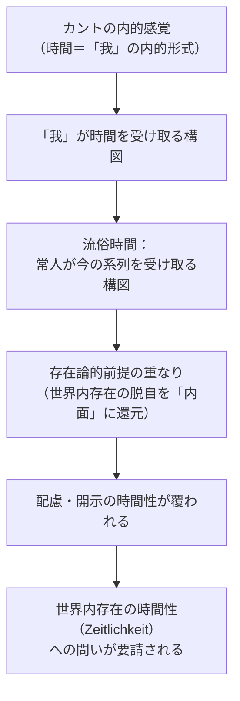

## 内的感覚とダザイン：「自己」への回収

*内的完結稿 — 第二部 時間性の問題に即した存在論の歴史の現象学的解体 / 第1章 カントにおける時間 / 節 id: P2-01-03*

---

### 「我」が時間を受け取るという構図

カントにおいて時間は、外界の諸事物に貼りつく属性ではなく、感性的直観の形式として「我」の側に帰属する。現象としての対象はすべて時間という形式のもとに整序され、「我」はその整序を受容することによって内的経験を成立させる。この構図において決定的なのは、時間が「我」に対して与えられるという非対称性である。すなわち時間は、「我」が能動的に産出するのでも、また外部から受動的に押しつけられるのでもなく、感性的受容の条件として「我」の内側に前もって用意されている。

この構図は、一見すると日常的な時間理解とはほど遠い精緻な認識論的装置に見える。しかし注意深く照らし合わせるならば、『存在と時間』が解体した流俗時間の構造と奇妙な重なりを示す。流俗時間（日常的な「今・今・今」の系列として時間を理解する仕方）においては、ダザインは時間を自己の外にある出来事の器として、いわば「傍らを流れゆく何か」として把握する。常人（das Man）——自己を固有性から切り離し、「だれでもないもの」として存在する様態——が時間を理解するとき、時間はつねに「与えられるもの」として、あるいは「費やされるもの」として現れる。カントの「我」もまた、時間を受け取る主体として定位されており、その受け取りの形式的構造は、常人が時計の目盛りを受け取る構造と同型の非対称性を保持している。カントが定式化した内的感覚の構図は、流俗時間の存在論的前提を哲学的に洗練させた版にほかならない、という問いがここで浮上する。

### 流俗時間批判の射程：カント的前提の解体

流俗時間批判は、単に日常的な無思慮な時間理解を咎めるものではない。それは時間を「今の系列」として捉える傾向が、存在論的にどこから来るかを問う。『存在と時間』の分析が明らかにするのは、流俗時間が世界内存在（ダザインが世界の内に存在するという根本構造）の時間性を覆い隠すことで成立するという事実である。ダザインの時間性（Zeitlichkeit）は、到来・既在・現在という三つの契機の統一的な脱自（エクスタシス）として理解される。ここで「脱自」とは、ダザインが自己の外へと出て行くことで、はじめて自己へと帰還するという運動を指す。死への先駆、良心の呼び声、決断性——これらはすべて、ダザインが時間性の三つの契機を固有に引き受ける場面として第一部第二編で析出された。

カント的な内的感覚の構図は、この脱自の運動を「我」の内部に収める。時間の秩序は感性の内的形式であり、「我」はその内部で表象を整序する。かくして時間性の脱自的な「外へ出る」運動は、「我」の内側で完結するものとして再記述される。これは解体的に言えば、世界内存在の開示（ダザインが世界と共に自己を開く出来事）を認識主体の内面表象に還元することにあたる。配慮（Sorge）——ダザインが世界の事物や他者と関わりながら自己を投げかける根本構造——の時間的意味は、こうして「我」の内的感覚の問題として再吸収され、その存在論的な射程を失う。

### カントが明らかにしたものと、覆われたもの

ここで単純な否定は誤りである。カントが時間を直観の形式として位置づけたことは、時間を外部の客観的秩序に還元する素朴な時間論から確かに一歩を踏み出している。時間が「我」の側の構造として関わってくるという洞察は、ダザインと時間の内的連関を問う存在論的探究にとっての先行的な示唆を含む。その点でカントの分析は覆われたものを照らす光でもある。

しかし覆われたものは依然として覆われている。「我」が時間形式を担うとしても、その「我」がいかなる存在様式において時間と関わるかは問われていない。「我」はカントにおいては認識論的主体として、すなわち表象を整序する機能として現れる。それは世界の内に被投的に投げ出され、他者とともに配慮しながら、死への存在として自己を引き受けるダザインではない。内的感覚が照らすのは認識主体の内面であり、ダザインの配慮的な自己関係——世界性の開示のただ中で自己を視る視線——ではない。

かくして内的感覚としての時間は、ダザインの配慮的・視線的自己関係を、認識主体の内面へ還元する。この還元を解体することが、第二部の問いが示す論理的必然である。時間性の問題に即した存在論の歴史の解体とは、覆われたものを再び開示へと引き戻す作業にほかならず、カントの分析はその解体の出発点として、正確にその限界において機能する。世界内存在の時間性を問うことは、カントが踏み込まなかった場所へと歩を進めることであり、それは同時に、カントが踏み固めた地盤の存在論的前提を問い直すことでもある。
